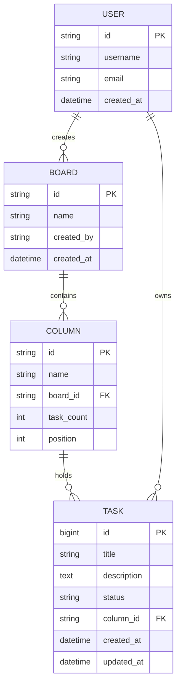

# SpringBoot Low Level Design - DEMO-222

## 1. Objective

This document provides the low-level design for implementing drag and drop functionality in a Kanban board system. The system allows users to drag tasks from "In Progress" column to "Done" column, automatically updating task status and column counts. The implementation ensures cross-browser compatibility and real-time status synchronization across the application.

## 2. SpringBoot Backend Details

### 2.1 Controller Layer

#### REST API Endpoints

| Operation | Method | URL | Request Body | Response Body |
|-----------|--------|-----|--------------|---------------|
| Update Task Status | PUT | `/api/v1/tasks/{taskId}/status` | `{"status": "DONE", "columnId": "done-column"}` | `{"taskId": "123", "status": "DONE", "updatedAt": "2024-01-01T10:00:00Z"}` |
| Get Task Details | GET | `/api/v1/tasks/{taskId}` | N/A | `{"taskId": "123", "title": "Task Title", "status": "IN_PROGRESS", "columnId": "in-progress"}` |
| Get Column Statistics | GET | `/api/v1/columns/{columnId}/stats` | N/A | `{"columnId": "done", "taskCount": 5, "lastUpdated": "2024-01-01T10:00:00Z"}` |
| Bulk Update Column Counts | PUT | `/api/v1/columns/bulk-update` | `{"updates": [{"columnId": "in-progress", "increment": -1}, {"columnId": "done", "increment": 1}]}` | `{"success": true, "updatedColumns": ["in-progress", "done"]}` |

#### Controller Classes

| Class Name | Responsibility | Methods |
|------------|----------------|----------|
| `TaskController` | Handle task-related operations | `updateTaskStatus()`, `getTaskDetails()` |
| `ColumnController` | Manage column statistics and operations | `getColumnStats()`, `bulkUpdateColumnCounts()` |
| `KanbanBoardController` | Orchestrate board-level operations | `moveTask()`, `getBoardState()` |

#### Exception Handlers

```java
@ControllerAdvice
public class KanbanExceptionHandler {
    
    @ExceptionHandler(TaskNotFoundException.class)
    public ResponseEntity<ErrorResponse> handleTaskNotFound(TaskNotFoundException ex) {
        return ResponseEntity.status(HttpStatus.NOT_FOUND)
            .body(new ErrorResponse("TASK_NOT_FOUND", ex.getMessage()));
    }
    
    @ExceptionHandler(InvalidStatusTransitionException.class)
    public ResponseEntity<ErrorResponse> handleInvalidStatusTransition(InvalidStatusTransitionException ex) {
        return ResponseEntity.status(HttpStatus.BAD_REQUEST)
            .body(new ErrorResponse("INVALID_STATUS_TRANSITION", ex.getMessage()));
    }
    
    @ExceptionHandler(ColumnNotFoundException.class)
    public ResponseEntity<ErrorResponse> handleColumnNotFound(ColumnNotFoundException ex) {
        return ResponseEntity.status(HttpStatus.NOT_FOUND)
            .body(new ErrorResponse("COLUMN_NOT_FOUND", ex.getMessage()));
    }
}
```

### 2.2 Service Layer

#### Business Logic Implementation

```java
@Service
@Transactional
public class TaskService {
    
    @Autowired
    private TaskRepository taskRepository;
    
    @Autowired
    private ColumnService columnService;
    
    @Autowired
    private NotificationService notificationService;
    
    public TaskDto moveTaskToColumn(Long taskId, String newStatus, String columnId) {
        Task task = validateAndGetTask(taskId);
        String oldStatus = task.getStatus();
        String oldColumnId = task.getColumnId();
        
        validateStatusTransition(oldStatus, newStatus);
        
        task.setStatus(newStatus);
        task.setColumnId(columnId);
        task.setUpdatedAt(LocalDateTime.now());
        
        Task updatedTask = taskRepository.save(task);
        
        // Update column counts atomically
        columnService.updateColumnCounts(oldColumnId, columnId);
        
        // Send real-time notification
        notificationService.notifyTaskMoved(updatedTask, oldStatus, newStatus);
        
        return TaskMapper.toDto(updatedTask);
    }
}
```

#### Service Layer Architecture

- **TaskService**: Core business logic for task operations
- **ColumnService**: Manages column statistics and validations
- **NotificationService**: Handles real-time updates via WebSocket
- **ValidationService**: Centralized validation logic

#### Dependency Injection Configuration

```java
@Configuration
public class ServiceConfiguration {
    
    @Bean
    @Primary
    public TaskService taskService() {
        return new TaskServiceImpl();
    }
    
    @Bean
    public ColumnService columnService() {
        return new ColumnServiceImpl();
    }
}
```

#### Validation Rules

| Field Name | Validation | Error Message | Annotation |
|------------|------------|---------------|------------|
| taskId | Not null, positive | "Task ID must be a positive number" | `@NotNull @Positive` |
| status | Valid enum value | "Status must be one of: TO_DO, IN_PROGRESS, DONE" | `@ValidTaskStatus` |
| columnId | Not blank, valid format | "Column ID must be non-empty and valid" | `@NotBlank @ValidColumnId` |

### 2.3 Repository / Data Access Layer

#### Entity Models

| Entity | Fields | Constraints |
|--------|--------|-------------|
| `Task` | id, title, description, status, columnId, createdAt, updatedAt | id: Primary Key, status: Enum, columnId: Foreign Key |
| `Column` | id, name, boardId, taskCount, position | id: Primary Key, boardId: Foreign Key, taskCount: Non-negative |
| `Board` | id, name, createdBy, createdAt | id: Primary Key, createdBy: Foreign Key |

#### Repository Interfaces

```java
@Repository
public interface TaskRepository extends JpaRepository<Task, Long> {
    
    @Query("SELECT t FROM Task t WHERE t.columnId = :columnId")
    List<Task> findByColumnId(@Param("columnId") String columnId);
    
    @Query("SELECT COUNT(t) FROM Task t WHERE t.columnId = :columnId")
    Long countByColumnId(@Param("columnId") String columnId);
    
    @Modifying
    @Query("UPDATE Task t SET t.status = :newStatus, t.columnId = :newColumnId, t.updatedAt = :updatedAt WHERE t.id = :taskId")
    int updateTaskStatus(@Param("taskId") Long taskId, 
                        @Param("newStatus") String newStatus, 
                        @Param("newColumnId") String newColumnId, 
                        @Param("updatedAt") LocalDateTime updatedAt);
}
```

#### Custom Queries

```java
@Repository
public interface ColumnRepository extends JpaRepository<Column, String> {
    
    @Modifying
    @Query("UPDATE Column c SET c.taskCount = c.taskCount + :increment WHERE c.id = :columnId")
    int incrementTaskCount(@Param("columnId") String columnId, @Param("increment") int increment);
    
    @Query("SELECT c FROM Column c WHERE c.boardId = :boardId ORDER BY c.position")
    List<Column> findByBoardIdOrderByPosition(@Param("boardId") String boardId);
}
```

### 2.4 Configuration

#### Application Properties

```properties
# Database Configuration
spring.datasource.url=jdbc:postgresql://localhost:5432/kanban_db
spring.datasource.username=${DB_USERNAME:kanban_user}
spring.datasource.password=${DB_PASSWORD:kanban_pass}
spring.jpa.hibernate.ddl-auto=validate
spring.jpa.show-sql=false

# WebSocket Configuration
kanban.websocket.endpoint=/ws
kanban.websocket.allowed-origins=http://localhost:3000,https://kanban.example.com

# Validation Configuration
kanban.validation.max-tasks-per-column=100
kanban.validation.allowed-status-transitions=TO_DO->IN_PROGRESS,IN_PROGRESS->DONE,IN_PROGRESS->TO_DO

# Performance Configuration
spring.jpa.properties.hibernate.jdbc.batch_size=20
spring.jpa.properties.hibernate.order_inserts=true
spring.jpa.properties.hibernate.order_updates=true
```

#### Spring Configuration Classes

```java
@Configuration
@EnableWebSocket
public class WebSocketConfig implements WebSocketConfigurer {
    
    @Override
    public void registerWebSocketHandlers(WebSocketHandlerRegistry registry) {
        registry.addHandler(new KanbanWebSocketHandler(), "/ws")
                .setAllowedOrigins("*")
                .withSockJS();
    }
}

@Configuration
@EnableJpaRepositories(basePackages = "com.kanban.repository")
public class DatabaseConfig {
    
    @Bean
    @Primary
    public DataSource dataSource() {
        HikariConfig config = new HikariConfig();
        config.setMaximumPoolSize(20);
        config.setMinimumIdle(5);
        config.setConnectionTimeout(30000);
        return new HikariDataSource(config);
    }
}
```

#### Bean Definitions

```java
@Configuration
public class KanbanBeanConfig {
    
    @Bean
    public TaskMapper taskMapper() {
        return new TaskMapperImpl();
    }
    
    @Bean
    public WebSocketSessionManager sessionManager() {
        return new WebSocketSessionManager();
    }
}
```

### 2.5 Security

#### Authentication Mechanism

```java
@Configuration
@EnableWebSecurity
public class SecurityConfig {
    
    @Bean
    public SecurityFilterChain filterChain(HttpSecurity http) throws Exception {
        http.csrf().disable()
            .authorizeHttpRequests(auth -> auth
                .requestMatchers("/api/v1/tasks/**").authenticated()
                .requestMatchers("/api/v1/columns/**").authenticated()
                .requestMatchers("/ws/**").authenticated()
                .anyRequest().permitAll()
            )
            .oauth2ResourceServer(oauth2 -> oauth2.jwt());
        return http.build();
    }
}
```

#### Authorization Rules

- Users can only modify tasks they own or have permission to edit
- Board-level permissions control column operations
- WebSocket connections require valid JWT tokens

#### JWT Token Handling

```java
@Component
public class JwtAuthenticationFilter extends OncePerRequestFilter {
    
    @Override
    protected void doFilterInternal(HttpServletRequest request, 
                                  HttpServletResponse response, 
                                  FilterChain filterChain) throws ServletException, IOException {
        String token = extractTokenFromRequest(request);
        if (token != null && jwtTokenProvider.validateToken(token)) {
            Authentication auth = jwtTokenProvider.getAuthentication(token);
            SecurityContextHolder.getContext().setAuthentication(auth);
        }
        filterChain.doFilter(request, response);
    }
}
```

### 2.6 Error Handling

#### Global Exception Handler

```java
@ControllerAdvice
public class GlobalExceptionHandler {
    
    @ExceptionHandler(ValidationException.class)
    public ResponseEntity<ErrorResponse> handleValidation(ValidationException ex) {
        return ResponseEntity.badRequest()
            .body(ErrorResponse.builder()
                .code("VALIDATION_ERROR")
                .message(ex.getMessage())
                .timestamp(LocalDateTime.now())
                .build());
    }
    
    @ExceptionHandler(DataIntegrityViolationException.class)
    public ResponseEntity<ErrorResponse> handleDataIntegrity(DataIntegrityViolationException ex) {
        return ResponseEntity.status(HttpStatus.CONFLICT)
            .body(ErrorResponse.builder()
                .code("DATA_CONFLICT")
                .message("Operation conflicts with existing data")
                .timestamp(LocalDateTime.now())
                .build());
    }
}
```

#### Custom Exceptions

```java
public class TaskNotFoundException extends RuntimeException {
    public TaskNotFoundException(Long taskId) {
        super("Task not found with ID: " + taskId);
    }
}

public class InvalidStatusTransitionException extends RuntimeException {
    public InvalidStatusTransitionException(String fromStatus, String toStatus) {
        super(String.format("Invalid status transition from %s to %s", fromStatus, toStatus));
    }
}
```

#### HTTP Status Mapping

| Exception Type | HTTP Status | Error Code |
|----------------|-------------|------------|
| TaskNotFoundException | 404 NOT_FOUND | TASK_NOT_FOUND |
| InvalidStatusTransitionException | 400 BAD_REQUEST | INVALID_STATUS_TRANSITION |
| ColumnNotFoundException | 404 NOT_FOUND | COLUMN_NOT_FOUND |
| ValidationException | 400 BAD_REQUEST | VALIDATION_ERROR |
| DataIntegrityViolationException | 409 CONFLICT | DATA_CONFLICT |

## 3. Database Design

### ER Model (Mermaid)



### Table Schema

| Table | Columns | Data Types | Constraints |
|-------|---------|------------|-------------|
| `tasks` | id, title, description, status, column_id, created_at, updated_at | BIGINT, VARCHAR(255), TEXT, VARCHAR(50), VARCHAR(100), TIMESTAMP, TIMESTAMP | PK(id), FK(column_id), NOT NULL(title, status) |
| `columns` | id, name, board_id, task_count, position | VARCHAR(100), VARCHAR(255), VARCHAR(100), INTEGER, INTEGER | PK(id), FK(board_id), NOT NULL(name), CHECK(task_count >= 0) |
| `boards` | id, name, created_by, created_at | VARCHAR(100), VARCHAR(255), VARCHAR(100), TIMESTAMP | PK(id), FK(created_by), NOT NULL(name) |
| `users` | id, username, email, created_at | VARCHAR(100), VARCHAR(100), VARCHAR(255), TIMESTAMP | PK(id), UNIQUE(username, email) |

### Database Validations

```sql
-- Task status validation
ALTER TABLE tasks ADD CONSTRAINT chk_task_status 
    CHECK (status IN ('TO_DO', 'IN_PROGRESS', 'DONE'));

-- Column task count validation
ALTER TABLE columns ADD CONSTRAINT chk_task_count_positive 
    CHECK (task_count >= 0);

-- Column position validation
ALTER TABLE columns ADD CONSTRAINT chk_position_positive 
    CHECK (position >= 0);

-- Unique column position per board
ALTER TABLE columns ADD CONSTRAINT uk_board_position 
    UNIQUE (board_id, position);
```

## 4. Non Functional Requirements

### Performance

- **Response Time**: API calls should complete within 200ms for 95% of requests
- **Throughput**: Support 1000 concurrent drag-and-drop operations
- **Database Optimization**: Use connection pooling with HikariCP (max 20 connections)
- **Caching**: Implement Redis caching for frequently accessed board states
- **Batch Operations**: Use batch updates for column count modifications

### Security

- **Authentication**: JWT-based authentication with 1-hour token expiry
- **Authorization**: Role-based access control (RBAC) for board operations
- **Data Validation**: Server-side validation for all input parameters
- **SQL Injection Prevention**: Use parameterized queries and JPA repositories
- **CORS Configuration**: Restrict origins to authorized domains

### Logging and Monitoring

```java
@Component
public class TaskAuditLogger {
    
    private static final Logger logger = LoggerFactory.getLogger(TaskAuditLogger.class);
    
    public void logTaskStatusChange(Long taskId, String oldStatus, String newStatus, String userId) {
        logger.info("Task status changed - TaskId: {}, OldStatus: {}, NewStatus: {}, UserId: {}", 
                   taskId, oldStatus, newStatus, userId);
    }
    
    public void logColumnCountUpdate(String columnId, int oldCount, int newCount) {
        logger.info("Column count updated - ColumnId: {}, OldCount: {}, NewCount: {}", 
                   columnId, oldCount, newCount);
    }
}
```

## 5. Dependencies

### Maven Dependencies

```xml
<dependencies>
    <!-- Spring Boot Starters -->
    <dependency>
        <groupId>org.springframework.boot</groupId>
        <artifactId>spring-boot-starter-web</artifactId>
    </dependency>
    <dependency>
        <groupId>org.springframework.boot</groupId>
        <artifactId>spring-boot-starter-data-jpa</artifactId>
    </dependency>
    <dependency>
        <groupId>org.springframework.boot</groupId>
        <artifactId>spring-boot-starter-security</artifactId>
    </dependency>
    <dependency>
        <groupId>org.springframework.boot</groupId>
        <artifactId>spring-boot-starter-websocket</artifactId>
    </dependency>
    <dependency>
        <groupId>org.springframework.boot</groupId>
        <artifactId>spring-boot-starter-validation</artifactId>
    </dependency>
    
    <!-- Database -->
    <dependency>
        <groupId>org.postgresql</groupId>
        <artifactId>postgresql</artifactId>
        <scope>runtime</scope>
    </dependency>
    <dependency>
        <groupId>com.zaxxer</groupId>
        <artifactId>HikariCP</artifactId>
    </dependency>
    
    <!-- JWT -->
    <dependency>
        <groupId>org.springframework.security</groupId>
        <artifactId>spring-security-oauth2-resource-server</artifactId>
    </dependency>
    <dependency>
        <groupId>org.springframework.security</groupId>
        <artifactId>spring-security-oauth2-jose</artifactId>
    </dependency>
    
    <!-- Caching -->
    <dependency>
        <groupId>org.springframework.boot</groupId>
        <artifactId>spring-boot-starter-data-redis</artifactId>
    </dependency>
    
    <!-- Mapping -->
    <dependency>
        <groupId>org.mapstruct</groupId>
        <artifactId>mapstruct</artifactId>
        <version>1.5.3.Final</version>
    </dependency>
    
    <!-- Testing -->
    <dependency>
        <groupId>org.springframework.boot</groupId>
        <artifactId>spring-boot-starter-test</artifactId>
        <scope>test</scope>
    </dependency>
    <dependency>
        <groupId>org.testcontainers</groupId>
        <artifactId>postgresql</artifactId>
        <scope>test</scope>
    </dependency>
</dependencies>
```

## 6. Assumptions

1. **Browser Compatibility**: The frontend will handle cross-browser drag-and-drop compatibility using modern HTML5 APIs
2. **Real-time Updates**: WebSocket connections are established for real-time board updates across multiple users
3. **Task Ownership**: Tasks have associated user ownership for authorization purposes
4. **Status Transitions**: Only specific status transitions are allowed (TO_DO → IN_PROGRESS → DONE, with rollback capability)
5. **Column Limits**: Each column has a configurable maximum task limit to prevent performance issues
6. **Concurrent Operations**: The system handles concurrent drag-and-drop operations using optimistic locking
7. **Data Consistency**: Column task counts are maintained through database triggers and application-level validation
8. **Session Management**: User sessions are managed through JWT tokens with appropriate expiry and refresh mechanisms
9. **Error Recovery**: Failed drag-and-drop operations will automatically revert UI state and show appropriate error messages
10. **Audit Trail**: All task movements are logged for audit and debugging purposes