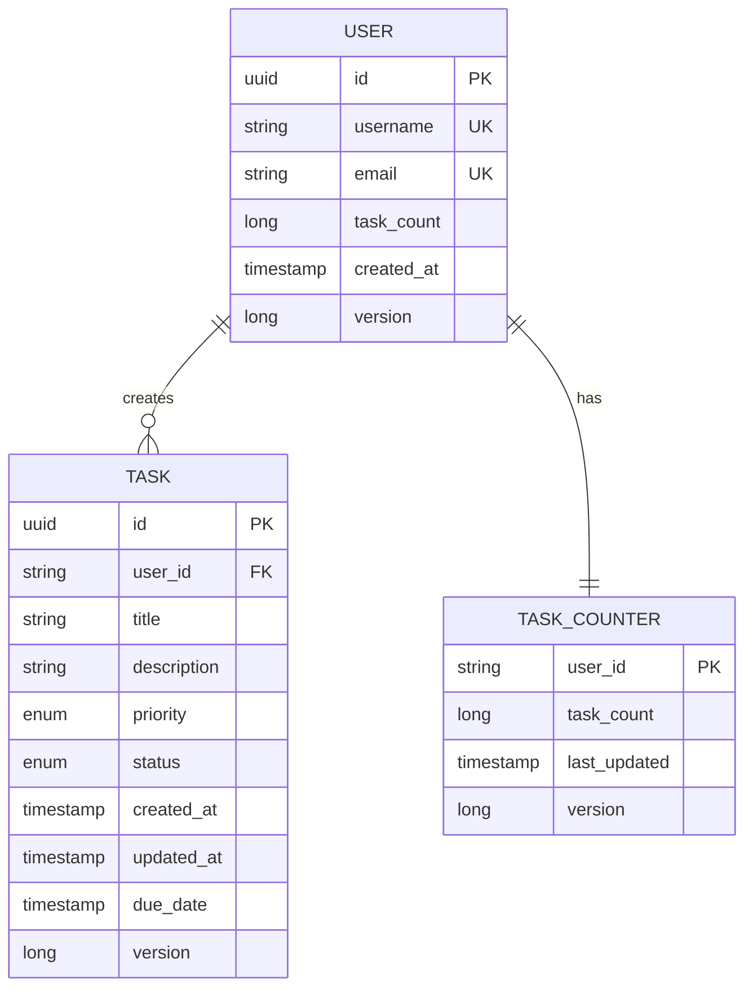

# SpringBoot Low Level Design - DEMO-757

## 1. Objective

This document outlines the low-level design for implementing a high-performance task management system that supports creation of at least 10,000 tasks per user. The system must maintain optimal performance with large task volumes and handle concurrent task creation operations efficiently. The implementation focuses on database scalability, performance optimization, and robust concurrent processing capabilities.

## 2. SpringBoot Backend Details

### 2.1 Controller Layer

#### REST API Endpoints

| Operation | Method | URL | Request Body | Response Body |
|-----------|--------|-----|--------------|---------------|
| Create Task | POST | /api/v1/tasks | TaskCreateRequest | TaskResponse |
| Get User Tasks | GET | /api/v1/users/{userId}/tasks | - | List<TaskResponse> |
| Get Task Count | GET | /api/v1/users/{userId}/tasks/count | - | TaskCountResponse |
| Get Task by ID | GET | /api/v1/tasks/{taskId} | - | TaskResponse |
| Update Task | PUT | /api/v1/tasks/{taskId} | TaskUpdateRequest | TaskResponse |
| Delete Task | DELETE | /api/v1/tasks/{taskId} | - | ResponseEntity<Void> |
| Bulk Create Tasks | POST | /api/v1/tasks/bulk | List<TaskCreateRequest> | BulkTaskResponse |

#### Controller Classes

| Class Name | Responsibility | Methods |
|------------|----------------|---------|
| TaskController | Handle task-related HTTP requests | createTask(), getUserTasks(), getTaskCount(), getTaskById(), updateTask(), deleteTask(), bulkCreateTasks() |
| UserController | Handle user-related operations | getUserProfile(), getUserTaskStatistics() |
| HealthController | System health and performance monitoring | getSystemHealth(), getPerformanceMetrics() |

#### Exception Handlers

```java
@ControllerAdvice
public class GlobalExceptionHandler {
    
    @ExceptionHandler(TaskLimitExceededException.class)
    public ResponseEntity<ErrorResponse> handleTaskLimitExceeded(TaskLimitExceededException ex) {
        return ResponseEntity.status(HttpStatus.BAD_REQUEST)
            .body(new ErrorResponse("TASK_LIMIT_EXCEEDED", ex.getMessage()));
    }
    
    @ExceptionHandler(ConcurrentTaskCreationException.class)
    public ResponseEntity<ErrorResponse> handleConcurrentCreation(ConcurrentTaskCreationException ex) {
        return ResponseEntity.status(HttpStatus.CONFLICT)
            .body(new ErrorResponse("CONCURRENT_CREATION_ERROR", ex.getMessage()));
    }
    
    @ExceptionHandler(PerformanceThresholdExceededException.class)
    public ResponseEntity<ErrorResponse> handlePerformanceThreshold(PerformanceThresholdExceededException ex) {
        return ResponseEntity.status(HttpStatus.SERVICE_UNAVAILABLE)
            .body(new ErrorResponse("PERFORMANCE_THRESHOLD_EXCEEDED", ex.getMessage()));
    }
}
```

### 2.2 Service Layer

#### Business Logic Implementation

```java
@Service
@Transactional
public class TaskService {
    
    private static final int MAX_TASKS_PER_USER = 10000;
    private static final long PERFORMANCE_THRESHOLD_MS = 200;
    
    @Autowired
    private TaskRepository taskRepository;
    
    @Autowired
    private UserRepository userRepository;
    
    @Autowired
    private TaskCounterService taskCounterService;
    
    @Autowired
    private PerformanceMonitoringService performanceService;
    
    public TaskResponse createTask(String userId, TaskCreateRequest request) {
        long startTime = System.currentTimeMillis();
        
        // Validate task limit
        validateTaskLimit(userId);
        
        // Create task with optimistic locking
        Task task = new Task();
        task.setUserId(userId);
        task.setTitle(request.getTitle());
        task.setDescription(request.getDescription());
        task.setPriority(request.getPriority());
        task.setStatus(TaskStatus.PENDING);
        task.setCreatedAt(LocalDateTime.now());
        
        Task savedTask = taskRepository.save(task);
        
        // Update task counter atomically
        taskCounterService.incrementTaskCount(userId);
        
        // Monitor performance
        long executionTime = System.currentTimeMillis() - startTime;
        performanceService.recordTaskCreationTime(executionTime);
        
        if (executionTime > PERFORMANCE_THRESHOLD_MS) {
            throw new PerformanceThresholdExceededException(
                "Task creation exceeded performance threshold: " + executionTime + "ms");
        }
        
        return TaskMapper.toResponse(savedTask);
    }
    
    private void validateTaskLimit(String userId) {
        long currentTaskCount = taskCounterService.getTaskCount(userId);
        if (currentTaskCount >= MAX_TASKS_PER_USER) {
            throw new TaskLimitExceededException(
                "User has reached maximum task limit of " + MAX_TASKS_PER_USER);
        }
    }
}
```

#### Service Layer Architecture

- **TaskService**: Core business logic for task operations
- **TaskCounterService**: Atomic task counting with Redis caching
- **PerformanceMonitoringService**: Performance tracking and alerting
- **ConcurrencyControlService**: Handles concurrent task creation
- **CacheService**: Redis-based caching for performance optimization

#### Dependency Injection Configuration

```java
@Configuration
public class ServiceConfiguration {
    
    @Bean
    @Primary
    public TaskExecutor taskExecutor() {
        ThreadPoolTaskExecutor executor = new ThreadPoolTaskExecutor();
        executor.setCorePoolSize(10);
        executor.setMaxPoolSize(50);
        executor.setQueueCapacity(1000);
        executor.setThreadNamePrefix("task-creation-");
        executor.initialize();
        return executor;
    }
    
    @Bean
    public RedisTemplate<String, Object> redisTemplate(RedisConnectionFactory connectionFactory) {
        RedisTemplate<String, Object> template = new RedisTemplate<>();
        template.setConnectionFactory(connectionFactory);
        template.setDefaultSerializer(new GenericJackson2JsonRedisSerializer());
        return template;
    }
}
```

#### Validation Rules

| Field Name | Validation | Error Message | Annotation |
|------------|------------|---------------|------------|
| title | Not null, length 1-255 | Title is required and must be between 1-255 characters | @NotBlank @Size(min=1, max=255) |
| description | Max length 1000 | Description must not exceed 1000 characters | @Size(max=1000) |
| priority | Valid enum value | Priority must be LOW, MEDIUM, or HIGH | @NotNull @Enumerated |
| userId | Not null, valid UUID | User ID is required and must be valid UUID | @NotNull @Pattern |
| dueDate | Future date | Due date must be in the future | @Future |

### 2.3 Repository / Data Access Layer

#### Entity Models

| Entity | Fields | Constraints |
|--------|--------|--------------|
| Task | id (UUID), userId (String), title (String), description (String), priority (TaskPriority), status (TaskStatus), createdAt (LocalDateTime), updatedAt (LocalDateTime), version (Long) | Primary Key: id, Index: userId, createdAt |
| User | id (UUID), username (String), email (String), taskCount (Long), createdAt (LocalDateTime), version (Long) | Primary Key: id, Unique: username, email |
| TaskCounter | userId (String), taskCount (Long), lastUpdated (LocalDateTime), version (Long) | Primary Key: userId |

#### Repository Interfaces

```java
@Repository
public interface TaskRepository extends JpaRepository<Task, UUID> {
    
    @Query("SELECT COUNT(t) FROM Task t WHERE t.userId = :userId")
    long countByUserId(@Param("userId") String userId);
    
    @Query("SELECT t FROM Task t WHERE t.userId = :userId ORDER BY t.createdAt DESC")
    Page<Task> findByUserIdOrderByCreatedAtDesc(@Param("userId") String userId, Pageable pageable);
    
    @Modifying
    @Query("DELETE FROM Task t WHERE t.userId = :userId AND t.id = :taskId")
    int deleteByUserIdAndId(@Param("userId") String userId, @Param("taskId") UUID taskId);
    
    @Query(value = "SELECT * FROM tasks WHERE user_id = :userId ORDER BY created_at DESC LIMIT :limit", nativeQuery = true)
    List<Task> findRecentTasksByUserId(@Param("userId") String userId, @Param("limit") int limit);
}

@Repository
public interface TaskCounterRepository extends JpaRepository<TaskCounter, String> {
    
    @Modifying
    @Query("UPDATE TaskCounter tc SET tc.taskCount = tc.taskCount + 1, tc.lastUpdated = CURRENT_TIMESTAMP WHERE tc.userId = :userId")
    int incrementTaskCount(@Param("userId") String userId);
    
    @Lock(LockModeType.OPTIMISTIC_FORCE_INCREMENT)
    Optional<TaskCounter> findByUserId(String userId);
}
```

#### Custom Queries

- Optimized count queries with database indexes
- Batch insert operations for bulk task creation
- Partitioned queries for large datasets
- Read replicas for performance-critical read operations

### 2.4 Configuration

#### Application Properties

```properties
# Database Configuration
spring.datasource.url=jdbc:postgresql://localhost:5432/taskdb
spring.datasource.username=${DB_USERNAME}
spring.datasource.password=${DB_PASSWORD}
spring.datasource.hikari.maximum-pool-size=50
spring.datasource.hikari.minimum-idle=10
spring.datasource.hikari.connection-timeout=30000

# JPA Configuration
spring.jpa.hibernate.ddl-auto=validate
spring.jpa.show-sql=false
spring.jpa.properties.hibernate.dialect=org.hibernate.dialect.PostgreSQLDialect
spring.jpa.properties.hibernate.jdbc.batch_size=50
spring.jpa.properties.hibernate.order_inserts=true
spring.jpa.properties.hibernate.order_updates=true

# Redis Configuration
spring.redis.host=localhost
spring.redis.port=6379
spring.redis.timeout=2000ms
spring.redis.jedis.pool.max-active=50
spring.redis.jedis.pool.max-idle=10

# Performance Configuration
app.task.max-per-user=10000
app.performance.threshold-ms=200
app.concurrency.max-threads=50

# Monitoring
management.endpoints.web.exposure.include=health,metrics,prometheus
management.endpoint.health.show-details=always
```

#### Spring Configuration Classes

```java
@Configuration
@EnableJpaRepositories
@EnableRedisRepositories
@EnableAsync
public class DatabaseConfiguration {
    
    @Bean
    @Primary
    public DataSource primaryDataSource() {
        HikariConfig config = new HikariConfig();
        config.setJdbcUrl("jdbc:postgresql://localhost:5432/taskdb");
        config.setMaximumPoolSize(50);
        config.setMinimumIdle(10);
        config.setConnectionTimeout(30000);
        config.setIdleTimeout(600000);
        config.setMaxLifetime(1800000);
        return new HikariDataSource(config);
    }
    
    @Bean
    public PlatformTransactionManager transactionManager(EntityManagerFactory emf) {
        return new JpaTransactionManager(emf);
    }
}
```

#### Bean Definitions

- Connection pooling with HikariCP
- Redis connection factory
- Async task executor
- Performance monitoring beans
- Cache configuration

### 2.5 Security

#### Authentication Mechanism

- JWT-based authentication
- OAuth2 integration for external providers
- Session management with Redis

#### Authorization Rules

- Users can only access their own tasks
- Admin users can view system-wide statistics
- Rate limiting per user for task creation

#### JWT / Token Handling

```java
@Component
public class JwtAuthenticationFilter extends OncePerRequestFilter {
    
    @Override
    protected void doFilterInternal(HttpServletRequest request, 
                                  HttpServletResponse response, 
                                  FilterChain filterChain) throws ServletException, IOException {
        
        String token = extractTokenFromRequest(request);
        if (token != null && jwtTokenProvider.validateToken(token)) {
            String userId = jwtTokenProvider.getUserIdFromToken(token);
            UsernamePasswordAuthenticationToken auth = 
                new UsernamePasswordAuthenticationToken(userId, null, Collections.emptyList());
            SecurityContextHolder.getContext().setAuthentication(auth);
        }
        
        filterChain.doFilter(request, response);
    }
}
```

### 2.6 Error Handling

#### Global Exception Handler

```java
@ControllerAdvice
public class GlobalExceptionHandler {
    
    @ExceptionHandler(TaskLimitExceededException.class)
    public ResponseEntity<ErrorResponse> handleTaskLimitExceeded(TaskLimitExceededException ex) {
        return ResponseEntity.status(HttpStatus.BAD_REQUEST)
            .body(new ErrorResponse("TASK_LIMIT_EXCEEDED", ex.getMessage(), System.currentTimeMillis()));
    }
    
    @ExceptionHandler(DataIntegrityViolationException.class)
    public ResponseEntity<ErrorResponse> handleDataIntegrityViolation(DataIntegrityViolationException ex) {
        return ResponseEntity.status(HttpStatus.CONFLICT)
            .body(new ErrorResponse("DATA_INTEGRITY_ERROR", "Concurrent modification detected", System.currentTimeMillis()));
    }
}
```

#### Custom Exceptions

- TaskLimitExceededException
- ConcurrentTaskCreationException
- PerformanceThresholdExceededException
- InvalidTaskStateException

#### HTTP Status Mapping

- 400 Bad Request: Validation errors, task limit exceeded
- 401 Unauthorized: Authentication required
- 403 Forbidden: Access denied
- 409 Conflict: Concurrent modification
- 429 Too Many Requests: Rate limit exceeded
- 503 Service Unavailable: Performance threshold exceeded

## 3. Database Design

### ER Model (Mermaid)



### Table Schema

| Table | Columns | Data Types | Constraints |
|-------|---------|------------|-------------|
| users | id, username, email, task_count, created_at, version | UUID, VARCHAR(50), VARCHAR(255), BIGINT, TIMESTAMP, BIGINT | PK(id), UK(username), UK(email), NOT NULL(username, email) |
| tasks | id, user_id, title, description, priority, status, created_at, updated_at, due_date, version | UUID, VARCHAR(36), VARCHAR(255), TEXT, VARCHAR(10), VARCHAR(20), TIMESTAMP, TIMESTAMP, TIMESTAMP, BIGINT | PK(id), FK(user_id), NOT NULL(user_id, title, priority, status) |
| task_counters | user_id, task_count, last_updated, version | VARCHAR(36), BIGINT, TIMESTAMP, BIGINT | PK(user_id), FK(user_id), NOT NULL(task_count) |

### Database Validations

- Task count cannot exceed 10,000 per user (CHECK constraint)
- Priority must be in ('LOW', 'MEDIUM', 'HIGH')
- Status must be in ('PENDING', 'IN_PROGRESS', 'COMPLETED', 'CANCELLED')
- Due date must be in the future
- Optimistic locking with version fields

## 4. Non Functional Requirements

### Performance

- **Response Time**: Task creation must complete within 200ms
- **Throughput**: Support 1000+ concurrent task creations per second
- **Scalability**: Handle 10,000 tasks per user without performance degradation
- **Database Optimization**: Implement connection pooling, query optimization, and indexing
- **Caching Strategy**: Redis caching for task counts and frequently accessed data

### Security

- **Authentication**: JWT-based authentication with token expiration
- **Authorization**: Role-based access control (RBAC)
- **Data Protection**: Encrypt sensitive data at rest and in transit
- **Rate Limiting**: Implement rate limiting to prevent abuse
- **Input Validation**: Comprehensive input validation and sanitization

### Logging and Monitoring

- **Application Logging**: Structured logging with correlation IDs
- **Performance Monitoring**: Track response times, throughput, and error rates
- **Health Checks**: Comprehensive health endpoints for system monitoring
- **Metrics Collection**: Prometheus metrics for monitoring and alerting
- **Distributed Tracing**: Implement distributed tracing for request tracking

## 5. Dependencies

### Maven Dependencies

```xml
<dependencies>
    <!-- Spring Boot Starters -->
    <dependency>
        <groupId>org.springframework.boot</groupId>
        <artifactId>spring-boot-starter-web</artifactId>
    </dependency>
    <dependency>
        <groupId>org.springframework.boot</groupId>
        <artifactId>spring-boot-starter-data-jpa</artifactId>
    </dependency>
    <dependency>
        <groupId>org.springframework.boot</groupId>
        <artifactId>spring-boot-starter-data-redis</artifactId>
    </dependency>
    <dependency>
        <groupId>org.springframework.boot</groupId>
        <artifactId>spring-boot-starter-security</artifactId>
    </dependency>
    <dependency>
        <groupId>org.springframework.boot</groupId>
        <artifactId>spring-boot-starter-validation</artifactId>
    </dependency>
    <dependency>
        <groupId>org.springframework.boot</groupId>
        <artifactId>spring-boot-starter-actuator</artifactId>
    </dependency>
    
    <!-- Database -->
    <dependency>
        <groupId>org.postgresql</groupId>
        <artifactId>postgresql</artifactId>
    </dependency>
    <dependency>
        <groupId>com.zaxxer</groupId>
        <artifactId>HikariCP</artifactId>
    </dependency>
    
    <!-- Redis -->
    <dependency>
        <groupId>redis.clients</groupId>
        <artifactId>jedis</artifactId>
    </dependency>
    
    <!-- JWT -->
    <dependency>
        <groupId>io.jsonwebtoken</groupId>
        <artifactId>jjwt-api</artifactId>
        <version>0.11.5</version>
    </dependency>
    <dependency>
        <groupId>io.jsonwebtoken</groupId>
        <artifactId>jjwt-impl</artifactId>
        <version>0.11.5</version>
    </dependency>
    
    <!-- Monitoring -->
    <dependency>
        <groupId>io.micrometer</groupId>
        <artifactId>micrometer-registry-prometheus</artifactId>
    </dependency>
    
    <!-- Testing -->
    <dependency>
        <groupId>org.springframework.boot</groupId>
        <artifactId>spring-boot-starter-test</artifactId>
        <scope>test</scope>
    </dependency>
    <dependency>
        <groupId>org.testcontainers</groupId>
        <artifactId>postgresql</artifactId>
        <scope>test</scope>
    </dependency>
</dependencies>
```

## 6. Assumptions

1. **User Authentication**: Users are pre-authenticated and user ID is available in the security context
2. **Database Setup**: PostgreSQL database is configured with appropriate indexes and partitioning
3. **Redis Availability**: Redis instance is available for caching and session management
4. **Load Balancing**: Application will be deployed behind a load balancer for high availability
5. **Monitoring Infrastructure**: Prometheus and Grafana are available for monitoring and alerting
6. **Task Lifecycle**: Tasks have a simple lifecycle (PENDING → IN_PROGRESS → COMPLETED/CANCELLED)
7. **Data Retention**: No specific data retention requirements mentioned, assuming indefinite storage
8. **Backup Strategy**: Database backup and recovery mechanisms are handled at infrastructure level
9. **Compliance**: No specific compliance requirements (GDPR, HIPAA, etc.) mentioned
10. **Integration**: No external system integrations required beyond authentication providers