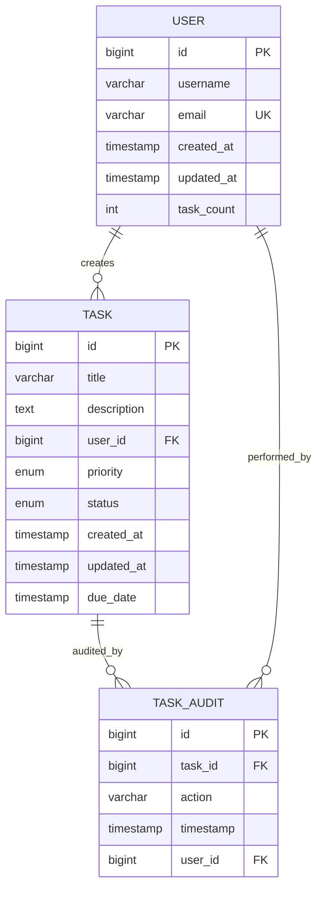

# SpringBoot Low Level Design - DEMO-757

## 1. Objective

This document outlines the SpringBoot application design to support creation of at least 10,000 tasks per user with optimal performance. The system must handle large volumes of task creation while maintaining response times under 200ms and ensuring data integrity during concurrent operations. The implementation focuses on scalable database design, efficient API endpoints, and robust concurrent processing capabilities.

## 2. SpringBoot Backend Details

### 2.1 Controller Layer

#### REST API Endpoints

| Operation | Method | URL | Request Body | Response Body |
|-----------|--------|-----|--------------|---------------|
| Create Task | POST | /api/v1/tasks | TaskCreateRequest | TaskResponse |
| Get User Tasks | GET | /api/v1/users/{userId}/tasks | - | List<TaskResponse> |
| Get Task Count | GET | /api/v1/users/{userId}/tasks/count | - | TaskCountResponse |
| Get Task by ID | GET | /api/v1/tasks/{taskId} | - | TaskResponse |
| Update Task | PUT | /api/v1/tasks/{taskId} | TaskUpdateRequest | TaskResponse |
| Delete Task | DELETE | /api/v1/tasks/{taskId} | - | ResponseEntity<Void> |
| Bulk Create Tasks | POST | /api/v1/tasks/bulk | List<TaskCreateRequest> | BulkTaskResponse |

#### Controller Classes

| Class Name | Responsibility | Methods |
|------------|----------------|---------|
| TaskController | Handle task-related HTTP requests | createTask(), getUserTasks(), getTaskCount(), getTaskById(), updateTask(), deleteTask(), bulkCreateTasks() |
| UserController | Handle user-related operations | getUserProfile(), getUserTaskStatistics() |
| HealthController | System health and performance monitoring | healthCheck(), performanceMetrics() |

#### Exception Handlers

```java
@ControllerAdvice
public class GlobalExceptionHandler {
    
    @ExceptionHandler(TaskLimitExceededException.class)
    public ResponseEntity<ErrorResponse> handleTaskLimitExceeded(TaskLimitExceededException ex) {
        return ResponseEntity.status(HttpStatus.BAD_REQUEST)
            .body(new ErrorResponse("TASK_LIMIT_EXCEEDED", ex.getMessage()));
    }
    
    @ExceptionHandler(ConcurrentTaskCreationException.class)
    public ResponseEntity<ErrorResponse> handleConcurrentCreation(ConcurrentTaskCreationException ex) {
        return ResponseEntity.status(HttpStatus.CONFLICT)
            .body(new ErrorResponse("CONCURRENT_CREATION_ERROR", ex.getMessage()));
    }
    
    @ExceptionHandler(PerformanceThresholdExceededException.class)
    public ResponseEntity<ErrorResponse> handlePerformanceThreshold(PerformanceThresholdExceededException ex) {
        return ResponseEntity.status(HttpStatus.SERVICE_UNAVAILABLE)
            .body(new ErrorResponse("PERFORMANCE_THRESHOLD_EXCEEDED", ex.getMessage()));
    }
}
```

### 2.2 Service Layer

#### Business Logic Implementation

```java
@Service
@Transactional
public class TaskService {
    
    private final TaskRepository taskRepository;
    private final UserRepository userRepository;
    private final TaskValidationService taskValidationService;
    private final PerformanceMonitoringService performanceService;
    
    @Async
    public CompletableFuture<TaskResponse> createTaskAsync(TaskCreateRequest request) {
        // Implement async task creation with performance monitoring
    }
    
    public TaskResponse createTask(TaskCreateRequest request) {
        // Validate user task limit
        // Create task with performance tracking
        // Handle concurrent creation scenarios
    }
    
    public BulkTaskResponse bulkCreateTasks(List<TaskCreateRequest> requests) {
        // Batch processing for multiple task creation
    }
}
```

#### Service Layer Architecture

- **TaskService**: Core business logic for task operations
- **TaskValidationService**: Validation rules and constraints
- **PerformanceMonitoringService**: Performance tracking and metrics
- **ConcurrencyControlService**: Handle concurrent operations
- **CacheService**: Redis-based caching for performance optimization

#### Dependency Injection Configuration

```java
@Configuration
public class ServiceConfiguration {
    
    @Bean
    @Primary
    public TaskService taskService() {
        return new TaskService();
    }
    
    @Bean
    public RedisTemplate<String, Object> redisTemplate() {
        // Redis configuration for caching
    }
    
    @Bean
    public AsyncTaskExecutor taskExecutor() {
        ThreadPoolTaskExecutor executor = new ThreadPoolTaskExecutor();
        executor.setCorePoolSize(10);
        executor.setMaxPoolSize(50);
        executor.setQueueCapacity(1000);
        return executor;
    }
}
```

#### Validation Rules

| Field Name | Validation | Error Message | Annotation |
|------------|------------|---------------|------------|
| title | NotBlank, Size(1-255) | "Task title is required and must be between 1-255 characters" | @NotBlank @Size(min=1, max=255) |
| description | Size(max=1000) | "Task description cannot exceed 1000 characters" | @Size(max=1000) |
| userId | NotNull, Positive | "Valid user ID is required" | @NotNull @Positive |
| priority | NotNull, Valid Enum | "Valid priority level is required" | @NotNull @Valid |
| dueDate | Future or Present | "Due date must be in the future or present" | @FutureOrPresent |
| taskCount | Max(10000) | "User cannot have more than 10,000 tasks" | @Max(10000) |

### 2.3 Repository / Data Access Layer

#### Entity Models

| Entity | Fields | Constraints |
|--------|--------|--------------|
| Task | id, title, description, userId, priority, status, createdAt, updatedAt, dueDate | id: Primary Key, userId: Foreign Key, title: NOT NULL |
| User | id, username, email, createdAt, updatedAt, taskCount | id: Primary Key, email: UNIQUE, taskCount: DEFAULT 0 |
| TaskAudit | id, taskId, action, timestamp, userId | id: Primary Key, taskId: Foreign Key |

#### Repository Interfaces

```java
@Repository
public interface TaskRepository extends JpaRepository<Task, Long> {
    
    @Query("SELECT COUNT(t) FROM Task t WHERE t.userId = :userId")
    Long countTasksByUserId(@Param("userId") Long userId);
    
    @Query("SELECT t FROM Task t WHERE t.userId = :userId ORDER BY t.createdAt DESC")
    Page<Task> findTasksByUserIdOrderByCreatedAtDesc(@Param("userId") Long userId, Pageable pageable);
    
    @Modifying
    @Query("UPDATE User u SET u.taskCount = u.taskCount + 1 WHERE u.id = :userId")
    void incrementUserTaskCount(@Param("userId") Long userId);
    
    @Lock(LockModeType.PESSIMISTIC_WRITE)
    @Query("SELECT u FROM User u WHERE u.id = :userId")
    User findUserByIdWithLock(@Param("userId") Long userId);
}
```

#### Custom Queries

```sql
-- Performance optimized query for task count validation
SELECT COUNT(*) FROM tasks WHERE user_id = ? AND status != 'DELETED';

-- Batch insert for bulk task creation
INSERT INTO tasks (title, description, user_id, priority, status, created_at, updated_at) 
VALUES (?, ?, ?, ?, ?, NOW(), NOW());

-- Index optimization queries
CREATE INDEX idx_tasks_user_id_status ON tasks(user_id, status);
CREATE INDEX idx_tasks_created_at ON tasks(created_at);
```

### 2.4 Configuration

#### Application Properties

```properties
# Database Configuration
spring.datasource.url=jdbc:mysql://localhost:3306/taskdb?useSSL=false&serverTimezone=UTC
spring.datasource.username=${DB_USERNAME:taskuser}
spring.datasource.password=${DB_PASSWORD:taskpass}
spring.datasource.driver-class-name=com.mysql.cj.jdbc.Driver

# JPA Configuration
spring.jpa.hibernate.ddl-auto=validate
spring.jpa.show-sql=false
spring.jpa.properties.hibernate.dialect=org.hibernate.dialect.MySQL8Dialect
spring.jpa.properties.hibernate.jdbc.batch_size=50
spring.jpa.properties.hibernate.order_inserts=true
spring.jpa.properties.hibernate.order_updates=true

# Connection Pool Configuration
spring.datasource.hikari.maximum-pool-size=50
spring.datasource.hikari.minimum-idle=10
spring.datasource.hikari.connection-timeout=30000
spring.datasource.hikari.idle-timeout=600000
spring.datasource.hikari.max-lifetime=1800000

# Redis Configuration
spring.redis.host=localhost
spring.redis.port=6379
spring.redis.timeout=2000ms
spring.redis.jedis.pool.max-active=50
spring.redis.jedis.pool.max-idle=10

# Performance Configuration
task.creation.performance.threshold=200
task.user.limit=10000
task.bulk.batch.size=100

# Async Configuration
spring.task.execution.pool.core-size=10
spring.task.execution.pool.max-size=50
spring.task.execution.pool.queue-capacity=1000
```

#### Spring Configuration Classes

```java
@Configuration
@EnableJpaRepositories
@EnableCaching
@EnableAsync
public class DatabaseConfiguration {
    
    @Bean
    @Primary
    public DataSource dataSource() {
        HikariConfig config = new HikariConfig();
        config.setJdbcUrl("jdbc:mysql://localhost:3306/taskdb");
        config.setMaximumPoolSize(50);
        config.setMinimumIdle(10);
        return new HikariDataSource(config);
    }
    
    @Bean
    public CacheManager cacheManager() {
        RedisCacheManager.Builder builder = RedisCacheManager
            .RedisCacheManagerBuilder
            .fromConnectionFactory(redisConnectionFactory())
            .cacheDefaults(cacheConfiguration());
        return builder.build();
    }
}
```

### 2.5 Security

#### Authentication Mechanism
- JWT-based authentication for API access
- User session management with Redis
- Rate limiting per user for task creation

#### Authorization Rules
- Users can only create/modify their own tasks
- Admin users can view system-wide task statistics
- API key validation for bulk operations

#### JWT / Token Handling

```java
@Component
public class JwtTokenProvider {
    
    public String createToken(String userId, List<String> roles) {
        // JWT token creation with user context
    }
    
    public boolean validateToken(String token) {
        // Token validation logic
    }
    
    public String getUserIdFromToken(String token) {
        // Extract user ID from JWT
    }
}
```

### 2.6 Error Handling

#### Global Exception Handler

```java
@ControllerAdvice
public class TaskExceptionHandler {
    
    @ExceptionHandler(TaskLimitExceededException.class)
    public ResponseEntity<ErrorResponse> handleTaskLimit(TaskLimitExceededException ex) {
        return ResponseEntity.badRequest()
            .body(ErrorResponse.builder()
                .code("TASK_LIMIT_EXCEEDED")
                .message("User has reached the maximum limit of 10,000 tasks")
                .timestamp(LocalDateTime.now())
                .build());
    }
}
```

#### Custom Exceptions

```java
public class TaskLimitExceededException extends RuntimeException {
    public TaskLimitExceededException(String message) {
        super(message);
    }
}

public class ConcurrentTaskCreationException extends RuntimeException {
    public ConcurrentTaskCreationException(String message) {
        super(message);
    }
}

public class PerformanceThresholdExceededException extends RuntimeException {
    public PerformanceThresholdExceededException(String message) {
        super(message);
    }
}
```

#### HTTP Status Mapping

| Exception | HTTP Status | Error Code |
|-----------|-------------|------------|
| TaskLimitExceededException | 400 BAD_REQUEST | TASK_LIMIT_EXCEEDED |
| ConcurrentTaskCreationException | 409 CONFLICT | CONCURRENT_CREATION_ERROR |
| PerformanceThresholdExceededException | 503 SERVICE_UNAVAILABLE | PERFORMANCE_THRESHOLD_EXCEEDED |
| ValidationException | 400 BAD_REQUEST | VALIDATION_ERROR |
| TaskNotFoundException | 404 NOT_FOUND | TASK_NOT_FOUND |

## 3. Database Design

### ER Model (Mermaid)



### Table Schema

| Table | Columns | Data Types | Constraints |
|-------|---------|------------|-------------|
| users | id, username, email, created_at, updated_at, task_count | BIGINT, VARCHAR(100), VARCHAR(255), TIMESTAMP, TIMESTAMP, INT | PK(id), UNIQUE(email), NOT NULL(username, email) |
| tasks | id, title, description, user_id, priority, status, created_at, updated_at, due_date | BIGINT, VARCHAR(255), TEXT, BIGINT, ENUM, ENUM, TIMESTAMP, TIMESTAMP, TIMESTAMP | PK(id), FK(user_id), NOT NULL(title, user_id, priority, status) |
| task_audit | id, task_id, action, timestamp, user_id | BIGINT, BIGINT, VARCHAR(50), TIMESTAMP, BIGINT | PK(id), FK(task_id), FK(user_id) |

### Database Validations

```sql
-- User task count constraint
ALTER TABLE users ADD CONSTRAINT chk_task_count CHECK (task_count >= 0 AND task_count <= 10000);

-- Task title length constraint
ALTER TABLE tasks ADD CONSTRAINT chk_title_length CHECK (LENGTH(title) > 0 AND LENGTH(title) <= 255);

-- Task priority enum constraint
ALTER TABLE tasks ADD CONSTRAINT chk_priority CHECK (priority IN ('LOW', 'MEDIUM', 'HIGH', 'CRITICAL'));

-- Task status enum constraint
ALTER TABLE tasks ADD CONSTRAINT chk_status CHECK (status IN ('PENDING', 'IN_PROGRESS', 'COMPLETED', 'CANCELLED'));

-- Performance indexes
CREATE INDEX idx_tasks_user_id_status ON tasks(user_id, status);
CREATE INDEX idx_tasks_created_at ON tasks(created_at DESC);
CREATE INDEX idx_users_email ON users(email);
```

## 4. Non Functional Requirements

### Performance

- **Response Time**: Task creation must complete within 200ms
- **Throughput**: Support 1000+ concurrent task creation requests
- **Scalability**: Handle 10,000 tasks per user without performance degradation
- **Database Optimization**: Use connection pooling, batch processing, and indexing
- **Caching Strategy**: Redis caching for frequently accessed data
- **Async Processing**: Non-blocking task creation for bulk operations

### Security

- **Authentication**: JWT-based token authentication
- **Authorization**: Role-based access control (RBAC)
- **Data Validation**: Input sanitization and validation
- **Rate Limiting**: Prevent abuse with rate limiting per user
- **Audit Trail**: Complete audit log for all task operations
- **Data Encryption**: Encrypt sensitive data at rest and in transit

### Logging and Monitoring

```java
@Component
public class PerformanceMonitor {
    
    private static final Logger logger = LoggerFactory.getLogger(PerformanceMonitor.class);
    
    @EventListener
    public void handleTaskCreation(TaskCreatedEvent event) {
        logger.info("Task created: userId={}, taskId={}, duration={}ms", 
            event.getUserId(), event.getTaskId(), event.getDuration());
        
        if (event.getDuration() > 200) {
            logger.warn("Performance threshold exceeded: duration={}ms", event.getDuration());
        }
    }
}
```

## 5. Dependencies

### Maven Dependencies

```xml
<dependencies>
    <!-- Spring Boot Starters -->
    <dependency>
        <groupId>org.springframework.boot</groupId>
        <artifactId>spring-boot-starter-web</artifactId>
    </dependency>
    <dependency>
        <groupId>org.springframework.boot</groupId>
        <artifactId>spring-boot-starter-data-jpa</artifactId>
    </dependency>
    <dependency>
        <groupId>org.springframework.boot</groupId>
        <artifactId>spring-boot-starter-data-redis</artifactId>
    </dependency>
    <dependency>
        <groupId>org.springframework.boot</groupId>
        <artifactId>spring-boot-starter-security</artifactId>
    </dependency>
    <dependency>
        <groupId>org.springframework.boot</groupId>
        <artifactId>spring-boot-starter-validation</artifactId>
    </dependency>
    <dependency>
        <groupId>org.springframework.boot</groupId>
        <artifactId>spring-boot-starter-actuator</artifactId>
    </dependency>
    
    <!-- Database -->
    <dependency>
        <groupId>mysql</groupId>
        <artifactId>mysql-connector-java</artifactId>
    </dependency>
    <dependency>
        <groupId>com.zaxxer</groupId>
        <artifactId>HikariCP</artifactId>
    </dependency>
    
    <!-- JWT -->
    <dependency>
        <groupId>io.jsonwebtoken</groupId>
        <artifactId>jjwt-api</artifactId>
        <version>0.11.5</version>
    </dependency>
    <dependency>
        <groupId>io.jsonwebtoken</groupId>
        <artifactId>jjwt-impl</artifactId>
        <version>0.11.5</version>
    </dependency>
    
    <!-- Performance Monitoring -->
    <dependency>
        <groupId>io.micrometer</groupId>
        <artifactId>micrometer-registry-prometheus</artifactId>
    </dependency>
    
    <!-- Testing -->
    <dependency>
        <groupId>org.springframework.boot</groupId>
        <artifactId>spring-boot-starter-test</artifactId>
        <scope>test</scope>
    </dependency>
    <dependency>
        <groupId>org.testcontainers</groupId>
        <artifactId>mysql</artifactId>
        <scope>test</scope>
    </dependency>
</dependencies>
```

## 6. Assumptions

1. **Database Infrastructure**: MySQL 8.0+ is available with sufficient resources to handle large datasets
2. **Redis Availability**: Redis instance is available for caching and session management
3. **Performance Requirements**: 200ms response time target is measured from API gateway to response
4. **Concurrent Users**: System should handle up to 1000 concurrent users creating tasks simultaneously
5. **Data Retention**: Task data is retained indefinitely unless explicitly deleted by users
6. **User Authentication**: External authentication system provides valid JWT tokens
7. **Monitoring Infrastructure**: Prometheus and Grafana are available for performance monitoring
8. **Load Balancing**: Application will be deployed behind a load balancer for high availability
9. **Database Scaling**: Database can be scaled horizontally if needed (read replicas)
10. **Backup Strategy**: Regular database backups are maintained by infrastructure team