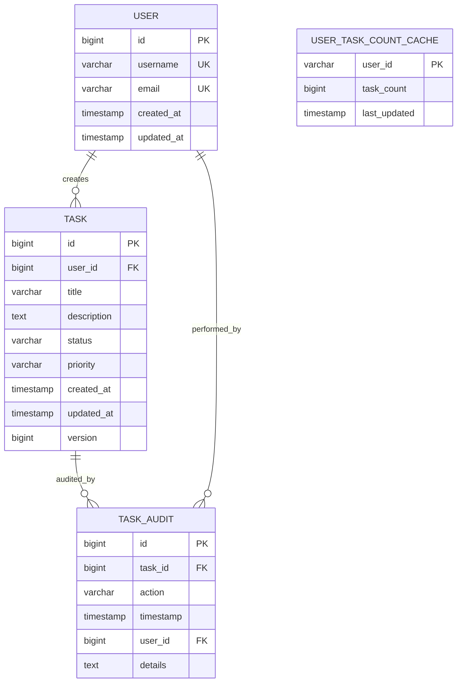

# SpringBoot Low Level Design - DEMO-757

## 1. Objective

This document provides the low-level design for implementing a high-performance task management system that supports creation of at least 10,000 tasks per user. The system ensures optimal performance with large task volumes while maintaining data integrity during concurrent operations. The implementation focuses on scalable database design, efficient API endpoints, and robust concurrent task creation handling.

## 2. SpringBoot Backend Details

### 2.1 Controller Layer

#### REST API Endpoints

| Operation | Method | URL | Request Body | Response Body |
|-----------|--------|-----|--------------|---------------|
| Create Task | POST | /api/v1/tasks | TaskCreateRequest | TaskResponse |
| Get User Tasks | GET | /api/v1/users/{userId}/tasks | - | List<TaskResponse> |
| Get Task Count | GET | /api/v1/users/{userId}/tasks/count | - | TaskCountResponse |
| Get Task by ID | GET | /api/v1/tasks/{taskId} | - | TaskResponse |
| Update Task | PUT | /api/v1/tasks/{taskId} | TaskUpdateRequest | TaskResponse |
| Delete Task | DELETE | /api/v1/tasks/{taskId} | - | ResponseEntity<Void> |
| Bulk Create Tasks | POST | /api/v1/tasks/bulk | List<TaskCreateRequest> | BulkTaskResponse |

#### Controller Classes

| Class Name | Responsibility | Methods |
|------------|----------------|---------|
| TaskController | Handle task-related HTTP requests | createTask(), getUserTasks(), getTaskCount(), getTaskById(), updateTask(), deleteTask(), bulkCreateTasks() |
| UserController | Handle user-related operations | getUserProfile(), getUserTaskStatistics() |
| HealthController | System health and performance monitoring | getSystemHealth(), getPerformanceMetrics() |

#### Exception Handlers

```java
@ControllerAdvice
public class GlobalExceptionHandler {
    
    @ExceptionHandler(TaskLimitExceededException.class)
    public ResponseEntity<ErrorResponse> handleTaskLimitExceeded(TaskLimitExceededException ex) {
        return ResponseEntity.status(HttpStatus.BAD_REQUEST)
            .body(new ErrorResponse("TASK_LIMIT_EXCEEDED", ex.getMessage()));
    }
    
    @ExceptionHandler(ConcurrentTaskCreationException.class)
    public ResponseEntity<ErrorResponse> handleConcurrentCreation(ConcurrentTaskCreationException ex) {
        return ResponseEntity.status(HttpStatus.CONFLICT)
            .body(new ErrorResponse("CONCURRENT_CREATION_ERROR", ex.getMessage()));
    }
    
    @ExceptionHandler(PerformanceThresholdExceededException.class)
    public ResponseEntity<ErrorResponse> handlePerformanceThreshold(PerformanceThresholdExceededException ex) {
        return ResponseEntity.status(HttpStatus.SERVICE_UNAVAILABLE)
            .body(new ErrorResponse("PERFORMANCE_THRESHOLD_EXCEEDED", ex.getMessage()));
    }
}
```

### 2.2 Service Layer

#### Business Logic Implementation

```java
@Service
@Transactional
public class TaskService {
    
    private static final int MAX_TASKS_PER_USER = 10000;
    private static final long PERFORMANCE_THRESHOLD_MS = 200;
    
    @Autowired
    private TaskRepository taskRepository;
    
    @Autowired
    private UserTaskCountCache userTaskCountCache;
    
    @Autowired
    private PerformanceMonitor performanceMonitor;
    
    public TaskResponse createTask(Long userId, TaskCreateRequest request) {
        long startTime = System.currentTimeMillis();
        
        // Check task limit
        validateTaskLimit(userId);
        
        // Create task with optimistic locking
        Task task = new Task();
        task.setUserId(userId);
        task.setTitle(request.getTitle());
        task.setDescription(request.getDescription());
        task.setStatus(TaskStatus.PENDING);
        task.setCreatedAt(LocalDateTime.now());
        
        Task savedTask = taskRepository.save(task);
        
        // Update cache
        userTaskCountCache.incrementCount(userId);
        
        // Monitor performance
        long executionTime = System.currentTimeMillis() - startTime;
        performanceMonitor.recordTaskCreation(executionTime);
        
        if (executionTime > PERFORMANCE_THRESHOLD_MS) {
            throw new PerformanceThresholdExceededException(
                "Task creation exceeded performance threshold: " + executionTime + "ms");
        }
        
        return TaskMapper.toResponse(savedTask);
    }
    
    private void validateTaskLimit(Long userId) {
        long currentCount = userTaskCountCache.getCount(userId);
        if (currentCount >= MAX_TASKS_PER_USER) {
            throw new TaskLimitExceededException(
                "User has reached maximum task limit of " + MAX_TASKS_PER_USER);
        }
    }
}
```

#### Service Layer Architecture

- **TaskService**: Core business logic for task operations
- **UserTaskCountCache**: Redis-based caching for task counts
- **PerformanceMonitor**: Performance tracking and alerting
- **ConcurrencyManager**: Handles concurrent task creation

#### Dependency Injection Configuration

```java
@Configuration
public class ServiceConfiguration {
    
    @Bean
    @Primary
    public TaskService taskService() {
        return new TaskService();
    }
    
    @Bean
    public UserTaskCountCache userTaskCountCache(RedisTemplate<String, Object> redisTemplate) {
        return new UserTaskCountCache(redisTemplate);
    }
    
    @Bean
    public PerformanceMonitor performanceMonitor() {
        return new PerformanceMonitor();
    }
}
```

#### Validation Rules

| Field Name | Validation | Error Message | Annotation |
|------------|------------|---------------|------------|
| title | Not null, length 1-255 | Title is required and must be between 1-255 characters | @NotBlank @Size(min=1, max=255) |
| description | Max length 1000 | Description must not exceed 1000 characters | @Size(max=1000) |
| userId | Not null, positive | User ID is required and must be positive | @NotNull @Positive |
| status | Valid enum value | Status must be a valid task status | @NotNull |
| priority | Valid enum value | Priority must be a valid priority level | @NotNull |

### 2.3 Repository / Data Access Layer

#### Entity Models

| Entity | Fields | Constraints |
|--------|--------|--------------|
| Task | id, userId, title, description, status, priority, createdAt, updatedAt, version | Primary key, foreign key to User, optimistic locking |
| User | id, username, email, createdAt, updatedAt | Primary key, unique username and email |
| TaskAudit | id, taskId, action, timestamp, userId | Audit trail for task operations |

```java
@Entity
@Table(name = "tasks", indexes = {
    @Index(name = "idx_user_id", columnList = "user_id"),
    @Index(name = "idx_created_at", columnList = "created_at"),
    @Index(name = "idx_status", columnList = "status")
})
public class Task {
    
    @Id
    @GeneratedValue(strategy = GenerationType.IDENTITY)
    private Long id;
    
    @Column(name = "user_id", nullable = false)
    private Long userId;
    
    @Column(name = "title", nullable = false, length = 255)
    private String title;
    
    @Column(name = "description", length = 1000)
    private String description;
    
    @Enumerated(EnumType.STRING)
    @Column(name = "status", nullable = false)
    private TaskStatus status;
    
    @Enumerated(EnumType.STRING)
    @Column(name = "priority")
    private TaskPriority priority;
    
    @Column(name = "created_at", nullable = false)
    private LocalDateTime createdAt;
    
    @Column(name = "updated_at")
    private LocalDateTime updatedAt;
    
    @Version
    private Long version;
}
```

#### Repository Interfaces

```java
@Repository
public interface TaskRepository extends JpaRepository<Task, Long> {
    
    @Query("SELECT COUNT(t) FROM Task t WHERE t.userId = :userId")
    long countByUserId(@Param("userId") Long userId);
    
    @Query("SELECT t FROM Task t WHERE t.userId = :userId ORDER BY t.createdAt DESC")
    Page<Task> findByUserIdOrderByCreatedAtDesc(@Param("userId") Long userId, Pageable pageable);
    
    @Modifying
    @Query("UPDATE Task t SET t.status = :status WHERE t.id = :taskId AND t.version = :version")
    int updateTaskStatus(@Param("taskId") Long taskId, @Param("status") TaskStatus status, @Param("version") Long version);
    
    @Query(value = "SELECT user_id, COUNT(*) as task_count FROM tasks GROUP BY user_id HAVING COUNT(*) > :threshold", nativeQuery = true)
    List<Object[]> findUsersExceedingTaskThreshold(@Param("threshold") int threshold);
}
```

#### Custom Queries

```java
@Repository
public class TaskRepositoryCustomImpl implements TaskRepositoryCustom {
    
    @PersistenceContext
    private EntityManager entityManager;
    
    @Override
    public List<Task> findTasksWithOptimizedQuery(Long userId, int limit) {
        return entityManager.createQuery(
            "SELECT t FROM Task t WHERE t.userId = :userId " +
            "ORDER BY t.createdAt DESC", Task.class)
            .setParameter("userId", userId)
            .setMaxResults(limit)
            .setHint(QueryHints.HINT_FETCH_SIZE, "1000")
            .getResultList();
    }
}
```

### 2.4 Configuration

#### Application Properties

```properties
# Database Configuration
spring.datasource.url=jdbc:postgresql://localhost:5432/taskdb
spring.datasource.username=${DB_USERNAME:taskuser}
spring.datasource.password=${DB_PASSWORD:taskpass}
spring.datasource.driver-class-name=org.postgresql.Driver

# Connection Pool Configuration
spring.datasource.hikari.maximum-pool-size=50
spring.datasource.hikari.minimum-idle=10
spring.datasource.hikari.connection-timeout=30000
spring.datasource.hikari.idle-timeout=600000
spring.datasource.hikari.max-lifetime=1800000

# JPA Configuration
spring.jpa.hibernate.ddl-auto=validate
spring.jpa.show-sql=false
spring.jpa.properties.hibernate.dialect=org.hibernate.dialect.PostgreSQLDialect
spring.jpa.properties.hibernate.jdbc.batch_size=50
spring.jpa.properties.hibernate.order_inserts=true
spring.jpa.properties.hibernate.order_updates=true

# Redis Configuration
spring.redis.host=localhost
spring.redis.port=6379
spring.redis.timeout=2000ms
spring.redis.jedis.pool.max-active=50
spring.redis.jedis.pool.max-idle=10

# Performance Configuration
app.task.max-per-user=10000
app.performance.threshold-ms=200
app.performance.monitoring.enabled=true

# Logging Configuration
logging.level.com.example.taskservice=INFO
logging.level.org.hibernate.SQL=WARN
logging.pattern.console=%d{yyyy-MM-dd HH:mm:ss} - %msg%n
```

#### Spring Configuration Classes

```java
@Configuration
@EnableJpaRepositories(basePackages = "com.example.taskservice.repository")
@EnableRedisRepositories
public class DatabaseConfiguration {
    
    @Bean
    @Primary
    public DataSource dataSource() {
        HikariConfig config = new HikariConfig();
        config.setJdbcUrl("jdbc:postgresql://localhost:5432/taskdb");
        config.setMaximumPoolSize(50);
        config.setMinimumIdle(10);
        config.setConnectionTimeout(30000);
        return new HikariDataSource(config);
    }
    
    @Bean
    public RedisConnectionFactory redisConnectionFactory() {
        LettuceConnectionFactory factory = new LettuceConnectionFactory();
        factory.setHostName("localhost");
        factory.setPort(6379);
        return factory;
    }
    
    @Bean
    public RedisTemplate<String, Object> redisTemplate(RedisConnectionFactory connectionFactory) {
        RedisTemplate<String, Object> template = new RedisTemplate<>();
        template.setConnectionFactory(connectionFactory);
        template.setKeySerializer(new StringRedisSerializer());
        template.setValueSerializer(new GenericJackson2JsonRedisSerializer());
        return template;
    }
}
```

### 2.5 Security

#### Authentication Mechanism

```java
@Configuration
@EnableWebSecurity
public class SecurityConfiguration {
    
    @Bean
    public SecurityFilterChain filterChain(HttpSecurity http) throws Exception {
        http.csrf().disable()
            .authorizeHttpRequests(authz -> authz
                .requestMatchers("/api/v1/health").permitAll()
                .requestMatchers("/api/v1/tasks/**").authenticated()
                .anyRequest().authenticated()
            )
            .oauth2ResourceServer(oauth2 -> oauth2.jwt());
        return http.build();
    }
}
```

#### Authorization Rules

- Users can only access their own tasks
- Admin users can access all tasks for monitoring
- Rate limiting applied per user for task creation

#### JWT Token Handling

```java
@Component
public class JwtAuthenticationFilter extends OncePerRequestFilter {
    
    @Override
    protected void doFilterInternal(HttpServletRequest request, 
                                  HttpServletResponse response, 
                                  FilterChain filterChain) throws ServletException, IOException {
        String token = extractToken(request);
        if (token != null && jwtTokenProvider.validateToken(token)) {
            Authentication auth = jwtTokenProvider.getAuthentication(token);
            SecurityContextHolder.getContext().setAuthentication(auth);
        }
        filterChain.doFilter(request, response);
    }
}
```

### 2.6 Error Handling

#### Global Exception Handler

```java
@ControllerAdvice
public class GlobalExceptionHandler {
    
    @ExceptionHandler(TaskLimitExceededException.class)
    public ResponseEntity<ErrorResponse> handleTaskLimitExceeded(TaskLimitExceededException ex) {
        return ResponseEntity.status(HttpStatus.BAD_REQUEST)
            .body(new ErrorResponse("TASK_LIMIT_EXCEEDED", ex.getMessage(), System.currentTimeMillis()));
    }
    
    @ExceptionHandler(DataIntegrityViolationException.class)
    public ResponseEntity<ErrorResponse> handleDataIntegrityViolation(DataIntegrityViolationException ex) {
        return ResponseEntity.status(HttpStatus.CONFLICT)
            .body(new ErrorResponse("DATA_INTEGRITY_ERROR", "Concurrent modification detected", System.currentTimeMillis()));
    }
    
    @ExceptionHandler(OptimisticLockingFailureException.class)
    public ResponseEntity<ErrorResponse> handleOptimisticLocking(OptimisticLockingFailureException ex) {
        return ResponseEntity.status(HttpStatus.CONFLICT)
            .body(new ErrorResponse("OPTIMISTIC_LOCK_ERROR", "Resource was modified by another user", System.currentTimeMillis()));
    }
}
```

#### Custom Exceptions

```java
public class TaskLimitExceededException extends RuntimeException {
    public TaskLimitExceededException(String message) {
        super(message);
    }
}

public class ConcurrentTaskCreationException extends RuntimeException {
    public ConcurrentTaskCreationException(String message) {
        super(message);
    }
}

public class PerformanceThresholdExceededException extends RuntimeException {
    public PerformanceThresholdExceededException(String message) {
        super(message);
    }
}
```

#### HTTP Status Mapping

| Exception | HTTP Status | Error Code |
|-----------|-------------|------------|
| TaskLimitExceededException | 400 Bad Request | TASK_LIMIT_EXCEEDED |
| ConcurrentTaskCreationException | 409 Conflict | CONCURRENT_CREATION_ERROR |
| PerformanceThresholdExceededException | 503 Service Unavailable | PERFORMANCE_THRESHOLD_EXCEEDED |
| ValidationException | 400 Bad Request | VALIDATION_ERROR |
| OptimisticLockingFailureException | 409 Conflict | OPTIMISTIC_LOCK_ERROR |

## 3. Database Design

### ER Model (Mermaid)



### Table Schema

| Table | Columns | Data Types | Constraints |
|-------|---------|------------|-------------|
| users | id, username, email, created_at, updated_at | BIGINT, VARCHAR(50), VARCHAR(100), TIMESTAMP, TIMESTAMP | PK(id), UK(username), UK(email) |
| tasks | id, user_id, title, description, status, priority, created_at, updated_at, version | BIGINT, BIGINT, VARCHAR(255), TEXT, VARCHAR(20), VARCHAR(20), TIMESTAMP, TIMESTAMP, BIGINT | PK(id), FK(user_id), INDEX(user_id, created_at) |
| task_audit | id, task_id, action, timestamp, user_id, details | BIGINT, BIGINT, VARCHAR(50), TIMESTAMP, BIGINT, TEXT | PK(id), FK(task_id), FK(user_id) |

### Database Validations

```sql
-- Task limit constraint
CREATE OR REPLACE FUNCTION check_task_limit()
RETURNS TRIGGER AS $$
BEGIN
    IF (SELECT COUNT(*) FROM tasks WHERE user_id = NEW.user_id) >= 10000 THEN
        RAISE EXCEPTION 'User has reached maximum task limit of 10000';
    END IF;
    RETURN NEW;
END;
$$ LANGUAGE plpgsql;

CREATE TRIGGER task_limit_trigger
    BEFORE INSERT ON tasks
    FOR EACH ROW
    EXECUTE FUNCTION check_task_limit();

-- Performance monitoring
CREATE INDEX CONCURRENTLY idx_tasks_user_created 
    ON tasks(user_id, created_at DESC);
    
CREATE INDEX CONCURRENTLY idx_tasks_status 
    ON tasks(status) WHERE status IN ('PENDING', 'IN_PROGRESS');
```

## 4. Non Functional Requirements

### Performance

- **Response Time**: Task creation must complete within 200ms
- **Throughput**: Support 1000+ concurrent task creations per second
- **Scalability**: Handle 10,000 tasks per user without performance degradation
- **Database Optimization**: Use connection pooling, query optimization, and indexing
- **Caching Strategy**: Redis-based caching for task counts and frequently accessed data

### Security

- **Authentication**: JWT-based authentication for all API endpoints
- **Authorization**: Role-based access control (RBAC)
- **Data Protection**: Encrypt sensitive data at rest and in transit
- **Rate Limiting**: Implement rate limiting to prevent abuse
- **Audit Trail**: Complete audit logging for all task operations

### Logging and Monitoring

```java
@Component
public class PerformanceMonitor {
    
    private final MeterRegistry meterRegistry;
    private final Timer taskCreationTimer;
    
    public PerformanceMonitor(MeterRegistry meterRegistry) {
        this.meterRegistry = meterRegistry;
        this.taskCreationTimer = Timer.builder("task.creation.time")
            .description("Task creation execution time")
            .register(meterRegistry);
    }
    
    public void recordTaskCreation(long executionTimeMs) {
        taskCreationTimer.record(executionTimeMs, TimeUnit.MILLISECONDS);
        
        if (executionTimeMs > 200) {
            log.warn("Task creation exceeded performance threshold: {}ms", executionTimeMs);
        }
    }
}
```

## 5. Dependencies

### Maven Dependencies

```xml
<dependencies>
    <!-- Spring Boot Starters -->
    <dependency>
        <groupId>org.springframework.boot</groupId>
        <artifactId>spring-boot-starter-web</artifactId>
    </dependency>
    <dependency>
        <groupId>org.springframework.boot</groupId>
        <artifactId>spring-boot-starter-data-jpa</artifactId>
    </dependency>
    <dependency>
        <groupId>org.springframework.boot</groupId>
        <artifactId>spring-boot-starter-data-redis</artifactId>
    </dependency>
    <dependency>
        <groupId>org.springframework.boot</groupId>
        <artifactId>spring-boot-starter-security</artifactId>
    </dependency>
    <dependency>
        <groupId>org.springframework.boot</groupId>
        <artifactId>spring-boot-starter-oauth2-resource-server</artifactId>
    </dependency>
    <dependency>
        <groupId>org.springframework.boot</groupId>
        <artifactId>spring-boot-starter-validation</artifactId>
    </dependency>
    <dependency>
        <groupId>org.springframework.boot</groupId>
        <artifactId>spring-boot-starter-actuator</artifactId>
    </dependency>
    
    <!-- Database -->
    <dependency>
        <groupId>org.postgresql</groupId>
        <artifactId>postgresql</artifactId>
    </dependency>
    <dependency>
        <groupId>com.zaxxer</groupId>
        <artifactId>HikariCP</artifactId>
    </dependency>
    
    <!-- Redis -->
    <dependency>
        <groupId>io.lettuce</groupId>
        <artifactId>lettuce-core</artifactId>
    </dependency>
    
    <!-- Monitoring -->
    <dependency>
        <groupId>io.micrometer</groupId>
        <artifactId>micrometer-registry-prometheus</artifactId>
    </dependency>
    
    <!-- Testing -->
    <dependency>
        <groupId>org.springframework.boot</groupId>
        <artifactId>spring-boot-starter-test</artifactId>
        <scope>test</scope>
    </dependency>
    <dependency>
        <groupId>org.testcontainers</groupId>
        <artifactId>postgresql</artifactId>
        <scope>test</scope>
    </dependency>
    <dependency>
        <groupId>org.testcontainers</groupId>
        <artifactId>junit-jupiter</artifactId>
        <scope>test</scope>
    </dependency>
</dependencies>
```

## 6. Assumptions

1. **User Management**: User authentication and management system already exists
2. **Database Infrastructure**: PostgreSQL database with appropriate hardware specifications
3. **Redis Infrastructure**: Redis cluster available for caching with high availability
4. **Monitoring Infrastructure**: Prometheus and Grafana setup for metrics collection
5. **Load Balancer**: Application deployed behind a load balancer for high availability
6. **Task Definition**: Tasks are simple entities with title, description, status, and priority
7. **Concurrent Access**: Multiple users may create tasks simultaneously without conflicts
8. **Data Retention**: No automatic archiving or deletion of old tasks implemented
9. **File Attachments**: Task attachments are not included in this implementation
10. **Notification System**: Task notifications are handled by a separate service
