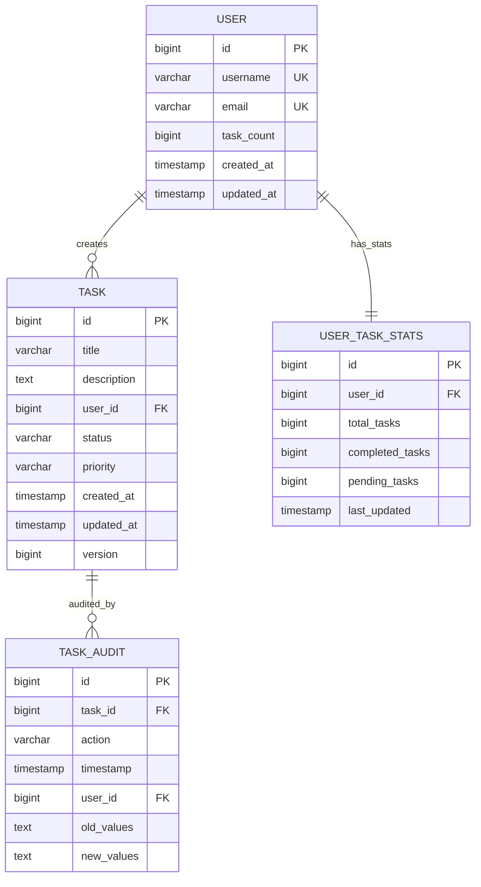

# SpringBoot Low Level Design - DEMO-757

## 1. Objective

This document provides the low-level design for implementing a high-performance task management system that supports creation of at least 10,000 tasks per user. The system ensures optimal performance with large task volumes while maintaining data integrity during concurrent operations. The implementation focuses on scalable architecture patterns and efficient database operations to meet the 200ms performance target for task creation.

## 2. SpringBoot Backend Details

### 2.1 Controller Layer

#### REST API Endpoints

| Operation | Method | URL | Request Body | Response Body |
|-----------|--------|-----|--------------|---------------|
| Create Task | POST | /api/v1/tasks | TaskCreateRequest | TaskResponse |
| Get User Tasks | GET | /api/v1/users/{userId}/tasks | - | PagedTaskResponse |
| Get Task Count | GET | /api/v1/users/{userId}/tasks/count | - | TaskCountResponse |
| Get Task by ID | GET | /api/v1/tasks/{taskId} | - | TaskResponse |
| Update Task | PUT | /api/v1/tasks/{taskId} | TaskUpdateRequest | TaskResponse |
| Delete Task | DELETE | /api/v1/tasks/{taskId} | - | ResponseEntity<Void> |
| Bulk Create Tasks | POST | /api/v1/tasks/bulk | List<TaskCreateRequest> | BulkTaskResponse |

#### Controller Classes

| Class Name | Responsibility | Methods |
|------------|----------------|----------|
| TaskController | Handle task-related HTTP requests | createTask(), getUserTasks(), getTaskCount(), getTaskById(), updateTask(), deleteTask(), bulkCreateTasks() |
| UserTaskController | Handle user-specific task operations | getUserTaskStatistics(), getUserTasksByStatus() |
| HealthController | System health and performance monitoring | getSystemHealth(), getTaskCreationMetrics() |

#### Exception Handlers

```java
@RestControllerAdvice
public class GlobalExceptionHandler {
    
    @ExceptionHandler(TaskLimitExceededException.class)
    public ResponseEntity<ErrorResponse> handleTaskLimitExceeded(TaskLimitExceededException ex) {
        return ResponseEntity.status(HttpStatus.BAD_REQUEST)
            .body(new ErrorResponse("TASK_LIMIT_EXCEEDED", ex.getMessage()));
    }
    
    @ExceptionHandler(ConcurrentTaskCreationException.class)
    public ResponseEntity<ErrorResponse> handleConcurrentCreation(ConcurrentTaskCreationException ex) {
        return ResponseEntity.status(HttpStatus.CONFLICT)
            .body(new ErrorResponse("CONCURRENT_CREATION_ERROR", ex.getMessage()));
    }
    
    @ExceptionHandler(PerformanceThresholdExceededException.class)
    public ResponseEntity<ErrorResponse> handlePerformanceThreshold(PerformanceThresholdExceededException ex) {
        return ResponseEntity.status(HttpStatus.SERVICE_UNAVAILABLE)
            .body(new ErrorResponse("PERFORMANCE_THRESHOLD_EXCEEDED", ex.getMessage()));
    }
}
```

### 2.2 Service Layer

#### Business Logic Implementation

```java
@Service
@Transactional
public class TaskService {
    
    private final TaskRepository taskRepository;
    private final UserRepository userRepository;
    private final TaskValidationService validationService;
    private final PerformanceMonitoringService performanceService;
    private final CacheManager cacheManager;
    
    @Async("taskExecutor")
    public CompletableFuture<TaskResponse> createTaskAsync(TaskCreateRequest request) {
        // Implementation with performance monitoring
    }
    
    @Retryable(value = {ConcurrentTaskCreationException.class}, maxAttempts = 3)
    public TaskResponse createTask(TaskCreateRequest request) {
        // Optimistic locking implementation
    }
    
    public PagedTaskResponse getUserTasks(Long userId, Pageable pageable) {
        // Efficient pagination with caching
    }
}
```

#### Service Layer Architecture

- **TaskService**: Core business logic for task operations
- **TaskValidationService**: Validation rules and constraints
- **PerformanceMonitoringService**: Performance tracking and metrics
- **CacheService**: Redis-based caching for frequently accessed data
- **NotificationService**: Async notifications for task events

#### Dependency Injection Configuration

```java
@Configuration
@EnableAsync
@EnableCaching
public class ServiceConfiguration {
    
    @Bean("taskExecutor")
    public TaskExecutor taskExecutor() {
        ThreadPoolTaskExecutor executor = new ThreadPoolTaskExecutor();
        executor.setCorePoolSize(10);
        executor.setMaxPoolSize(50);
        executor.setQueueCapacity(1000);
        executor.setThreadNamePrefix("task-exec-");
        return executor;
    }
    
    @Bean
    public CacheManager cacheManager() {
        RedisCacheManager.Builder builder = RedisCacheManager
            .RedisCacheManagerBuilder
            .fromConnectionFactory(redisConnectionFactory())
            .cacheDefaults(cacheConfiguration());
        return builder.build();
    }
}
```

#### Validation Rules

| Field Name | Validation | Error Message | Annotation |
|------------|------------|---------------|------------|
| title | NotBlank, Size(1-255) | "Task title is required and must be between 1-255 characters" | @NotBlank @Size(min=1, max=255) |
| description | Size(max=2000) | "Task description cannot exceed 2000 characters" | @Size(max=2000) |
| userId | NotNull, Positive | "Valid user ID is required" | @NotNull @Positive |
| priority | NotNull, Valid Enum | "Valid priority level is required" | @NotNull @ValidEnum |
| dueDate | Future or Present | "Due date must be in the future or present" | @FutureOrPresent |
| taskCount | Max(10000) | "User cannot have more than 10,000 tasks" | @TaskLimitValidation |

### 2.3 Repository / Data Access Layer

#### Entity Models

| Entity | Fields | Constraints |
|--------|--------|-------------|
| Task | id, title, description, userId, status, priority, createdAt, updatedAt, version | Primary Key, Optimistic Locking |
| User | id, username, email, taskCount, createdAt, updatedAt | Primary Key, Unique constraints |
| TaskAudit | id, taskId, action, timestamp, userId | Audit trail for task operations |

```java
@Entity
@Table(name = "tasks", indexes = {
    @Index(name = "idx_user_id", columnList = "user_id"),
    @Index(name = "idx_created_at", columnList = "created_at"),
    @Index(name = "idx_status", columnList = "status")
})
public class Task {
    @Id
    @GeneratedValue(strategy = GenerationType.IDENTITY)
    private Long id;
    
    @Column(nullable = false, length = 255)
    private String title;
    
    @Column(length = 2000)
    private String description;
    
    @Column(name = "user_id", nullable = false)
    private Long userId;
    
    @Enumerated(EnumType.STRING)
    private TaskStatus status;
    
    @Enumerated(EnumType.STRING)
    private TaskPriority priority;
    
    @CreationTimestamp
    @Column(name = "created_at")
    private LocalDateTime createdAt;
    
    
    @UpdateTimestamp
    @Column(name = "updated_at")
    private LocalDateTime updatedAt;
    
    @Version
    private Long version;
}
```

#### Repository Interfaces

```java
@Repository
public interface TaskRepository extends JpaRepository<Task, Long>, JpaSpecificationExecutor<Task> {
    
    @Query("SELECT COUNT(t) FROM Task t WHERE t.userId = :userId")
    Long countTasksByUserId(@Param("userId") Long userId);
    
    @Query(value = "SELECT * FROM tasks WHERE user_id = :userId ORDER BY created_at DESC LIMIT :limit OFFSET :offset", 
           nativeQuery = true)
    List<Task> findUserTasksPaginated(@Param("userId") Long userId, 
                                     @Param("limit") int limit, 
                                     @Param("offset") int offset);
    
    @Modifying
    @Query("UPDATE Task t SET t.status = :status WHERE t.id IN :taskIds")
    int bulkUpdateTaskStatus(@Param("taskIds") List<Long> taskIds, 
                            @Param("status") TaskStatus status);
    
    @Lock(LockModeType.OPTIMISTIC)
    @Query("SELECT t FROM Task t WHERE t.id = :taskId")
    Optional<Task> findByIdWithLock(@Param("taskId") Long taskId);
}
```

#### Custom Queries

```java
@Repository
public class TaskRepositoryCustomImpl implements TaskRepositoryCustom {
    
    @PersistenceContext
    private EntityManager entityManager;
    
    public List<Task> findTasksWithPerformanceOptimization(Long userId, TaskSearchCriteria criteria) {
        CriteriaBuilder cb = entityManager.getCriteriaBuilder();
        CriteriaQuery<Task> query = cb.createQuery(Task.class);
        Root<Task> root = query.from(Task.class);
        
        // Optimized query with proper indexing
        List<Predicate> predicates = new ArrayList<>();
        predicates.add(cb.equal(root.get("userId"), userId));
        
        if (criteria.getStatus() != null) {
            predicates.add(cb.equal(root.get("status"), criteria.getStatus()));
        }
        
        query.where(predicates.toArray(new Predicate[0]));
        query.orderBy(cb.desc(root.get("createdAt")));
        
        return entityManager.createQuery(query)
            .setMaxResults(criteria.getLimit())
            .setFirstResult(criteria.getOffset())
            .getResultList();
    }
}
```

### 2.4 Configuration

#### Application Properties

```properties
# Database Configuration
spring.datasource.url=jdbc:postgresql://localhost:5432/taskdb
spring.datasource.username=${DB_USERNAME}
spring.datasource.password=${DB_PASSWORD}
spring.datasource.hikari.maximum-pool-size=50
spring.datasource.hikari.minimum-idle=10
spring.datasource.hikari.connection-timeout=30000
spring.datasource.hikari.idle-timeout=600000
spring.datasource.hikari.max-lifetime=1800000

# JPA Configuration
spring.jpa.hibernate.ddl-auto=validate
spring.jpa.show-sql=false
spring.jpa.properties.hibernate.dialect=org.hibernate.dialect.PostgreSQLDialect
spring.jpa.properties.hibernate.jdbc.batch_size=50
spring.jpa.properties.hibernate.order_inserts=true
spring.jpa.properties.hibernate.order_updates=true
spring.jpa.properties.hibernate.jdbc.batch_versioned_data=true

# Redis Configuration
spring.redis.host=localhost
spring.redis.port=6379
spring.redis.timeout=2000ms
spring.redis.jedis.pool.max-active=50
spring.redis.jedis.pool.max-idle=10

# Performance Configuration
app.task.max-per-user=10000
app.task.creation-timeout=200ms
app.task.bulk-size=100

# Async Configuration
spring.task.execution.pool.core-size=10
spring.task.execution.pool.max-size=50
spring.task.execution.pool.queue-capacity=1000
```

#### Spring Configuration Classes

```java
@Configuration
@EnableJpaRepositories(basePackages = "com.demo.repository")
@EnableTransactionManagement
public class DatabaseConfiguration {
    
    @Bean
    @Primary
    public DataSource dataSource() {
        HikariConfig config = new HikariConfig();
        config.setJdbcUrl(environment.getProperty("spring.datasource.url"));
        config.setUsername(environment.getProperty("spring.datasource.username"));
        config.setPassword(environment.getProperty("spring.datasource.password"));
        config.setMaximumPoolSize(50);
        config.setMinimumIdle(10);
        return new HikariDataSource(config);
    }
    
    @Bean
    public PlatformTransactionManager transactionManager(EntityManagerFactory emf) {
        JpaTransactionManager transactionManager = new JpaTransactionManager();
        transactionManager.setEntityManagerFactory(emf);
        return transactionManager;
    }
}
```

#### Bean Definitions

```java
@Configuration
public class ApplicationConfiguration {
    
    @Bean
    @ConfigurationProperties(prefix = "app.task")
    public TaskConfiguration taskConfiguration() {
        return new TaskConfiguration();
    }
    
    @Bean
    public PerformanceMonitor performanceMonitor() {
        return new PerformanceMonitor();
    }
    
    @Bean
    public TaskLimitValidator taskLimitValidator(TaskConfiguration config) {
        return new TaskLimitValidator(config.getMaxPerUser());
    }
}
```

### 2.5 Security

#### Authentication Mechanism

```java
@Configuration
@EnableWebSecurity
@EnableGlobalMethodSecurity(prePostEnabled = true)
public class SecurityConfiguration {
    
    @Bean
    public SecurityFilterChain filterChain(HttpSecurity http) throws Exception {
        http.csrf().disable()
            .sessionManagement().sessionCreationPolicy(SessionCreationPolicy.STATELESS)
            .and()
            .authorizeHttpRequests(authz -> authz
                .requestMatchers("/api/v1/tasks/**").authenticated()
                .requestMatchers("/actuator/health").permitAll()
                .anyRequest().authenticated()
            )
            .oauth2ResourceServer().jwt();
        return http.build();
    }
}
```

#### Authorization Rules

- Users can only create/modify their own tasks
- Admin users can view all tasks
- Rate limiting: 100 requests per minute per user
- Task creation limit: 10,000 per user

#### JWT / Token Handling

```java
@Component
public class JwtAuthenticationFilter extends OncePerRequestFilter {
    
    @Override
    protected void doFilterInternal(HttpServletRequest request, 
                                  HttpServletResponse response, 
                                  FilterChain filterChain) throws ServletException, IOException {
        String token = extractToken(request);
        if (token != null && jwtTokenProvider.validateToken(token)) {
            Authentication auth = jwtTokenProvider.getAuthentication(token);
            SecurityContextHolder.getContext().setAuthentication(auth);
        }
        filterChain.doFilter(request, response);
    }
}
```

### 2.6 Error Handling

#### Global Exception Handler

```java
@RestControllerAdvice
public class GlobalExceptionHandler {
    
    private static final Logger logger = LoggerFactory.getLogger(GlobalExceptionHandler.class);
    
    @ExceptionHandler(TaskLimitExceededException.class)
    public ResponseEntity<ErrorResponse> handleTaskLimitExceeded(TaskLimitExceededException ex) {
        logger.warn("Task limit exceeded: {}", ex.getMessage());
        return ResponseEntity.status(HttpStatus.BAD_REQUEST)
            .body(ErrorResponse.builder()
                .code("TASK_LIMIT_EXCEEDED")
                .message(ex.getMessage())
                .timestamp(LocalDateTime.now())
                .build());
    }
    
    @ExceptionHandler(PerformanceThresholdExceededException.class)
    public ResponseEntity<ErrorResponse> handlePerformanceThreshold(PerformanceThresholdExceededException ex) {
        logger.error("Performance threshold exceeded: {}", ex.getMessage());
        return ResponseEntity.status(HttpStatus.SERVICE_UNAVAILABLE)
            .body(ErrorResponse.builder()
                .code("PERFORMANCE_THRESHOLD_EXCEEDED")
                .message("Service temporarily unavailable due to high load")
                .timestamp(LocalDateTime.now())
                .build());
    }
}
```

#### Custom Exceptions

```java
public class TaskLimitExceededException extends RuntimeException {
    public TaskLimitExceededException(String message) {
        super(message);
    }
}

public class ConcurrentTaskCreationException extends RuntimeException {
    public ConcurrentTaskCreationException(String message) {
        super(message);
    }
}

public class PerformanceThresholdExceededException extends RuntimeException {
    public PerformanceThresholdExceededException(String message) {
        super(message);
    }
}
```

#### HTTP Status Mapping

| Exception | HTTP Status | Error Code |
|-----------|-------------|------------|
| TaskLimitExceededException | 400 Bad Request | TASK_LIMIT_EXCEEDED |
| ConcurrentTaskCreationException | 409 Conflict | CONCURRENT_CREATION_ERROR |
| PerformanceThresholdExceededException | 503 Service Unavailable | PERFORMANCE_THRESHOLD_EXCEEDED |
| ValidationException | 400 Bad Request | VALIDATION_ERROR |
| TaskNotFoundException | 404 Not Found | TASK_NOT_FOUND |

## 3. Database Design

### ER Model (Mermaid)



### Table Schema

| Table | Columns | Data Types | Constraints |
|-------|---------|------------|-------------|
| users | id, username, email, task_count, created_at, updated_at | BIGINT, VARCHAR(50), VARCHAR(100), BIGINT, TIMESTAMP, TIMESTAMP | PK(id), UK(username), UK(email), CHECK(task_count <= 10000) |
| tasks | id, title, description, user_id, status, priority, created_at, updated_at, version | BIGINT, VARCHAR(255), TEXT, BIGINT, VARCHAR(20), VARCHAR(20), TIMESTAMP, TIMESTAMP, BIGINT | PK(id), FK(user_id), INDEX(user_id, created_at), INDEX(status) |
| task_audit | id, task_id, action, timestamp, user_id, old_values, new_values | BIGINT, BIGINT, VARCHAR(50), TIMESTAMP, BIGINT, TEXT, TEXT | PK(id), FK(task_id), FK(user_id), INDEX(task_id, timestamp) |
| user_task_stats | id, user_id, total_tasks, completed_tasks, pending_tasks, last_updated | BIGINT, BIGINT, BIGINT, BIGINT, BIGINT, TIMESTAMP | PK(id), FK(user_id), UK(user_id) |

### Database Validations

```sql
-- Task limit constraint
ALTER TABLE users ADD CONSTRAINT chk_task_limit CHECK (task_count <= 10000);

-- Task status validation
ALTER TABLE tasks ADD CONSTRAINT chk_task_status 
    CHECK (status IN ('PENDING', 'IN_PROGRESS', 'COMPLETED', 'CANCELLED'));

-- Task priority validation
ALTER TABLE tasks ADD CONSTRAINT chk_task_priority 
    CHECK (priority IN ('LOW', 'MEDIUM', 'HIGH', 'URGENT'));

-- Performance indexes
CREATE INDEX CONCURRENTLY idx_tasks_user_created ON tasks(user_id, created_at DESC);
CREATE INDEX CONCURRENTLY idx_tasks_status_priority ON tasks(status, priority);
CREATE INDEX CONCURRENTLY idx_task_audit_timestamp ON task_audit(timestamp DESC);
```

## 4. Non Functional Requirements

### Performance

- **Task Creation Response Time**: ≤ 200ms for single task creation
- **Bulk Task Creation**: ≤ 2 seconds for 100 tasks
- **Task Retrieval**: ≤ 100ms for paginated results (50 tasks per page)
- **Concurrent Users**: Support 1000+ concurrent users
- **Database Connection Pool**: 50 connections with HikariCP
- **Caching Strategy**: Redis for frequently accessed data with 5-minute TTL

### Security

- **Authentication**: JWT-based authentication with 24-hour token expiry
- **Authorization**: Role-based access control (RBAC)
- **Rate Limiting**: 100 requests per minute per user
- **Data Encryption**: TLS 1.3 for data in transit, AES-256 for sensitive data at rest
- **Input Validation**: Comprehensive validation using Bean Validation API
- **SQL Injection Prevention**: Parameterized queries and JPA

### Logging and Monitoring

```java
@Component
public class PerformanceMonitoringAspect {
    
    private static final Logger logger = LoggerFactory.getLogger(PerformanceMonitoringAspect.class);
    private final MeterRegistry meterRegistry;
    
    @Around("@annotation(MonitorPerformance)")
    public Object monitorPerformance(ProceedingJoinPoint joinPoint) throws Throwable {
        Timer.Sample sample = Timer.start(meterRegistry);
        try {
            Object result = joinPoint.proceed();
            sample.stop(Timer.builder("task.operation.duration")
                .tag("method", joinPoint.getSignature().getName())
                .tag("status", "success")
                .register(meterRegistry));
            return result;
        } catch (Exception e) {
            sample.stop(Timer.builder("task.operation.duration")
                .tag("method", joinPoint.getSignature().getName())
                .tag("status", "error")
                .register(meterRegistry));
            throw e;
        }
    }
}
```

- **Application Logs**: Structured JSON logging with correlation IDs
- **Performance Metrics**: Micrometer with Prometheus integration
- **Health Checks**: Spring Boot Actuator endpoints
- **Alerting**: Performance threshold alerts for response times > 200ms

## 5. Dependencies

### Maven Dependencies

```xml
<dependencies>
    <!-- Spring Boot Starters -->
    <dependency>
        <groupId>org.springframework.boot</groupId>
        <artifactId>spring-boot-starter-web</artifactId>
    </dependency>
    <dependency>
        <groupId>org.springframework.boot</groupId>
        <artifactId>spring-boot-starter-data-jpa</artifactId>
    </dependency>
    <dependency>
        <groupId>org.springframework.boot</groupId>
        <artifactId>spring-boot-starter-data-redis</artifactId>
    </dependency>
    <dependency>
        <groupId>org.springframework.boot</groupId>
        <artifactId>spring-boot-starter-security</artifactId>
    </dependency>
    <dependency>
        <groupId>org.springframework.boot</groupId>
        <artifactId>spring-boot-starter-oauth2-resource-server</artifactId>
    </dependency>
    <dependency>
        <groupId>org.springframework.boot</groupId>
        <artifactId>spring-boot-starter-validation</artifactId>
    </dependency>
    <dependency>
        <groupId>org.springframework.boot</groupId>
        <artifactId>spring-boot-starter-actuator</artifactId>
    </dependency>
    
    <!-- Database -->
    <dependency>
        <groupId>org.postgresql</groupId>
        <artifactId>postgresql</artifactId>
    </dependency>
    <dependency>
        <groupId>com.zaxxer</groupId>
        <artifactId>HikariCP</artifactId>
    </dependency>
    
    <!-- Caching -->
    <dependency>
        <groupId>org.springframework.boot</groupId>
        <artifactId>spring-boot-starter-cache</artifactId>
    </dependency>
    <dependency>
        <groupId>redis.clients</groupId>
        <artifactId>jedis</artifactId>
    </dependency>
    
    <!-- Monitoring -->
    <dependency>
        <groupId>io.micrometer</groupId>
        <artifactId>micrometer-registry-prometheus</artifactId>
    </dependency>
    
    <!-- Async Processing -->
    <dependency>
        <groupId>org.springframework</groupId>
        <artifactId>spring-context</artifactId>
    </dependency>
    
    <!-- Testing -->
    <dependency>
        <groupId>org.springframework.boot</groupId>
        <artifactId>spring-boot-starter-test</artifactId>
        <scope>test</scope>
    </dependency>
    <dependency>
        <groupId>org.testcontainers</groupId>
        <artifactId>postgresql</artifactId>
        <scope>test</scope>
    </dependency>
    <dependency>
        <groupId>org.testcontainers</groupId>
        <artifactId>junit-jupiter</artifactId>
        <scope>test</scope>
    </dependency>
</dependencies>
```

## 6. Assumptions

1. **User Authentication**: Assumes JWT-based authentication is already implemented and user context is available in security context.

2. **Database Performance**: Assumes PostgreSQL database with proper indexing and connection pooling configuration for optimal performance.

3. **Caching Infrastructure**: Assumes Redis is available for caching frequently accessed data and session management.

4. **Monitoring Infrastructure**: Assumes Prometheus and Grafana are available for metrics collection and visualization.

5. **Load Balancing**: Assumes application will be deployed behind a load balancer for horizontal scaling.

6. **Task Complexity**: Assumes tasks are relatively simple entities without complex relationships or heavy computational requirements.

7. **Data Retention**: Assumes task audit data will be archived after 1 year to maintain database performance.

8. **Network Latency**: Assumes low-latency network between application and database (< 10ms) for optimal performance.

9. **Concurrent Access Patterns**: Assumes read-heavy workload with 80% reads and 20% writes for caching strategy optimization.

10. **Deployment Environment**: Assumes containerized deployment with Kubernetes for auto-scaling and resource management.