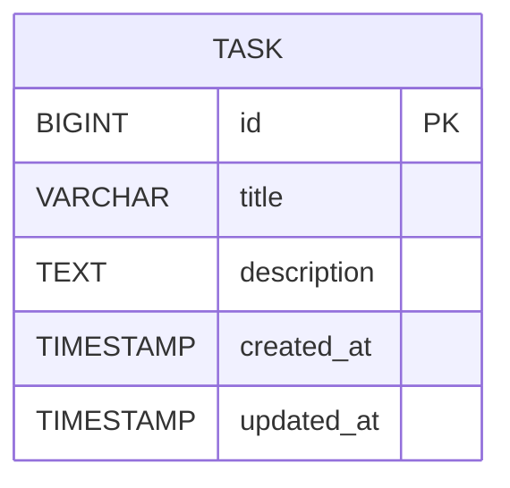

# SpringBoot Low Level Design - DEMO-759

## 1. Objective

This document outlines the low-level design for implementing robust input validation to handle malformed or unexpected input data gracefully in a SpringBoot application. The system will ensure stability by providing helpful feedback when encountering null, undefined, special characters, whitespace-only, or extremely long input data. The implementation will prevent system crashes and maintain data integrity through comprehensive validation mechanisms.

## 2. SpringBoot Backend Details

### 2.1 Controller Layer

#### REST API Endpoints

| Operation | Method | URL | Request Body | Response Body |
|-----------|--------|-----|--------------|---------------|
| Create Task | POST | /api/tasks | TaskCreateRequest | TaskResponse |
| Update Task | PUT | /api/tasks/{id} | TaskUpdateRequest | TaskResponse |
| Get Task | GET | /api/tasks/{id} | - | TaskResponse |
| List Tasks | GET | /api/tasks | - | List<TaskResponse> |

#### Controller Classes

| Class Name | Responsibility | Methods |
|------------|----------------|---------|
| TaskController | Handle HTTP requests for task operations | createTask(), updateTask(), getTask(), listTasks() |
| GlobalExceptionHandler | Handle validation and system exceptions | handleValidationException(), handleConstraintViolation() |

#### Exception Handlers

```java
@RestControllerAdvice
public class GlobalExceptionHandler {
    
    @ExceptionHandler(MethodArgumentNotValidException.class)
    public ResponseEntity<ErrorResponse> handleValidationException(MethodArgumentNotValidException ex);
    
    @ExceptionHandler(ConstraintViolationException.class)
    public ResponseEntity<ErrorResponse> handleConstraintViolation(ConstraintViolationException ex);
    
    @ExceptionHandler(InvalidInputException.class)
    public ResponseEntity<ErrorResponse> handleInvalidInput(InvalidInputException ex);
}
```

### 2.2 Service Layer

#### Business Logic Implementation

```java
@Service
public class TaskService {
    
    @Autowired
    private TaskRepository taskRepository;
    
    @Autowired
    private InputValidationService inputValidationService;
    
    public TaskResponse createTask(TaskCreateRequest request) {
        inputValidationService.validateTaskInput(request);
        Task task = mapToEntity(request);
        Task savedTask = taskRepository.save(task);
        return mapToResponse(savedTask);
    }
}
```

#### Service Layer Architecture

- **TaskService**: Core business logic for task operations
- **InputValidationService**: Centralized input validation logic
- **TaskMappingService**: Entity-DTO mapping operations

#### Dependency Injection Configuration

```java
@Configuration
public class ServiceConfiguration {
    
    @Bean
    public InputValidationService inputValidationService() {
        return new InputValidationService();
    }
}
```

#### Validation Rules

| Field Name | Validation | Error Message | Annotation |
|------------|------------|---------------|------------|
| title | NotNull, NotBlank, Size(max=255) | Title is required | @NotNull @NotBlank @Size(max=255) |
| title | Custom whitespace validation | Title cannot be empty or contain only whitespace | @ValidTitle |
| description | Size(max=10000) | Description exceeds maximum length of 10000 characters | @Size(max=10000) |
| title | Special character handling | Special characters properly encoded | @ValidSpecialChars |

### 2.3 Repository / Data Access Layer

#### Entity Models

| Entity | Fields | Constraints |
|--------|--------|--------------|
| Task | id (Long), title (String), description (String), createdAt (LocalDateTime), updatedAt (LocalDateTime) | title: NOT NULL, MAX 255 chars; description: MAX 10000 chars |

```java
@Entity
@Table(name = "tasks")
public class Task {
    
    @Id
    @GeneratedValue(strategy = GenerationType.IDENTITY)
    private Long id;
    
    @Column(name = "title", nullable = false, length = 255)
    @NotNull
    @Size(max = 255)
    private String title;
    
    @Column(name = "description", length = 10000)
    @Size(max = 10000)
    private String description;
    
    @Column(name = "created_at")
    private LocalDateTime createdAt;
    
    @Column(name = "updated_at")
    private LocalDateTime updatedAt;
}
```

#### Repository Interfaces

```java
@Repository
public interface TaskRepository extends JpaRepository<Task, Long> {
    
    List<Task> findByTitleContainingIgnoreCase(String title);
    
    @Query("SELECT t FROM Task t WHERE LENGTH(t.title) > :maxLength")
    List<Task> findTasksWithLongTitles(@Param("maxLength") int maxLength);
}
```

#### Custom Queries

- Find tasks by title (case-insensitive)
- Find tasks with titles exceeding specified length
- Validate special character encoding in stored data

### 2.4 Configuration

#### Application Properties

```properties
# application.yml
spring:
  datasource:
    url: jdbc:h2:mem:testdb
    driver-class-name: org.h2.Driver
    username: sa
    password: password
  
  jpa:
    hibernate:
      ddl-auto: create-drop
    show-sql: true
    properties:
      hibernate:
        format_sql: true

# Validation Configuration
validation:
  title:
    max-length: 255
    min-length: 1
  description:
    max-length: 10000
  
# Logging Configuration
logging:
  level:
    com.example.taskmanager: DEBUG
    org.springframework.web: DEBUG
```

#### Spring Configuration Classes

```java
@Configuration
@EnableJpaRepositories
@EnableWebMvc
public class ApplicationConfiguration {
    
    @Bean
    public Validator validator() {
        return Validation.buildDefaultValidatorFactory().getValidator();
    }
    
    @Bean
    public MessageSource messageSource() {
        ResourceBundleMessageSource messageSource = new ResourceBundleMessageSource();
        messageSource.setBasename("validation-messages");
        return messageSource;
    }
}
```

#### Bean Definitions

- Validator bean for custom validation
- MessageSource for internationalized error messages
- Custom validation annotations

### 2.5 Security

#### Authentication Mechanism
- Basic HTTP authentication for API endpoints
- Input sanitization to prevent injection attacks

#### Authorization Rules
- All authenticated users can create/update tasks
- Input validation applies to all user roles

#### JWT / Token Handling
- Not applicable for this specific requirement
- Focus on input validation security

### 2.6 Error Handling

#### Global Exception Handler

```java
@RestControllerAdvice
public class GlobalExceptionHandler {
    
    @ExceptionHandler(MethodArgumentNotValidException.class)
    public ResponseEntity<ErrorResponse> handleValidationException(MethodArgumentNotValidException ex) {
        List<String> errors = ex.getBindingResult()
            .getFieldErrors()
            .stream()
            .map(FieldError::getDefaultMessage)
            .collect(Collectors.toList());
        
        ErrorResponse errorResponse = new ErrorResponse("Validation failed", errors);
        return ResponseEntity.badRequest().body(errorResponse);
    }
    
    @ExceptionHandler(InvalidInputException.class)
    public ResponseEntity<ErrorResponse> handleInvalidInput(InvalidInputException ex) {
        ErrorResponse errorResponse = new ErrorResponse(ex.getMessage(), Collections.emptyList());
        return ResponseEntity.badRequest().body(errorResponse);
    }
}
```

#### Custom Exceptions

```java
public class InvalidInputException extends RuntimeException {
    public InvalidInputException(String message) {
        super(message);
    }
}

public class TitleValidationException extends InvalidInputException {
    public TitleValidationException(String message) {
        super(message);
    }
}
```

#### HTTP Status Mapping

- 400 Bad Request: Validation failures, malformed input
- 422 Unprocessable Entity: Business logic validation failures
- 500 Internal Server Error: System errors

## 3. Database Design

### ER Model (Mermaid)



### Table Schema

| Table | Columns | Data Types | Constraints |
|-------|---------|------------|-------------|
| tasks | id | BIGINT | PRIMARY KEY, AUTO_INCREMENT |
| tasks | title | VARCHAR(255) | NOT NULL |
| tasks | description | TEXT(10000) | NULL |
| tasks | created_at | TIMESTAMP | DEFAULT CURRENT_TIMESTAMP |
| tasks | updated_at | TIMESTAMP | DEFAULT CURRENT_TIMESTAMP ON UPDATE CURRENT_TIMESTAMP |

### Database Validations

- Title field: NOT NULL constraint, maximum 255 characters
- Description field: maximum 10000 characters
- Character encoding: UTF-8 to support special characters and emojis
- Index on title field for search performance

## 4. Non Functional Requirements

### Performance

- Input validation should complete within 100ms
- Database operations should handle concurrent validation requests
- Caching of validation rules for improved performance
- Efficient string processing for large input validation

### Security

- Input sanitization to prevent XSS and injection attacks
- Proper encoding of special characters and Unicode
- Rate limiting on API endpoints to prevent abuse
- Audit logging of validation failures

### Logging and Monitoring

- Log all validation failures with input details (sanitized)
- Monitor validation performance metrics
- Alert on unusual patterns of validation failures
- Track character encoding issues and resolution

## 5. Dependencies

### Maven Dependencies

```xml
<dependencies>
    <!-- Spring Boot Starters -->
    <dependency>
        <groupId>org.springframework.boot</groupId>
        <artifactId>spring-boot-starter-web</artifactId>
    </dependency>
    
    <dependency>
        <groupId>org.springframework.boot</groupId>
        <artifactId>spring-boot-starter-data-jpa</artifactId>
    </dependency>
    
    <dependency>
        <groupId>org.springframework.boot</groupId>
        <artifactId>spring-boot-starter-validation</artifactId>
    </dependency>
    
    <!-- Database -->
    <dependency>
        <groupId>com.h2database</groupId>
        <artifactId>h2</artifactId>
        <scope>runtime</scope>
    </dependency>
    
    <!-- Validation -->
    <dependency>
        <groupId>org.hibernate.validator</groupId>
        <artifactId>hibernate-validator</artifactId>
    </dependency>
    
    <!-- Testing -->
    <dependency>
        <groupId>org.springframework.boot</groupId>
        <artifactId>spring-boot-starter-test</artifactId>
        <scope>test</scope>
    </dependency>
    
    <!-- JSON Processing -->
    <dependency>
        <groupId>com.fasterxml.jackson.core</groupId>
        <artifactId>jackson-databind</artifactId>
    </dependency>
    
    <!-- Apache Commons for String utilities -->
    <dependency>
        <groupId>org.apache.commons</groupId>
        <artifactId>commons-lang3</artifactId>
    </dependency>
</dependencies>
```

## 6. Assumptions

1. **Character Encoding**: The system assumes UTF-8 encoding for proper handling of special characters and emojis.

2. **Input Limits**: Maximum title length is set to 255 characters and description to 10000 characters based on typical database constraints.

3. **Validation Scope**: Input validation covers HTTP request bodies, query parameters, and path variables.

4. **Error Response Format**: Standardized error response format is assumed to be acceptable across all API endpoints.

5. **Database Support**: The design assumes the database supports Unicode character storage and proper indexing.

6. **Performance Requirements**: Validation operations are assumed to be synchronous and should complete within acceptable response times.

7. **Internationalization**: Error messages can be localized, but English is the default language for validation messages.

8. **Backward Compatibility**: Existing data in the system may not conform to new validation rules and will require migration strategy.

## 7. Custom Validation Annotations

### @ValidTitle Annotation

```java
@Target({ElementType.FIELD})
@Retention(RetentionPolicy.RUNTIME)
@Constraint(validatedBy = TitleValidator.class)
public @interface ValidTitle {
    String message() default "Title cannot be empty or contain only whitespace";
    Class<?>[] groups() default {};
    Class<? extends Payload>[] payload() default {};
}

public class TitleValidator implements ConstraintValidator<ValidTitle, String> {
    
    @Override
    public boolean isValid(String title, ConstraintValidatorContext context) {
        if (title == null) {
            return false;
        }
        return !title.trim().isEmpty();
    }
}
```

### @ValidSpecialChars Annotation

```java
@Target({ElementType.FIELD})
@Retention(RetentionPolicy.RUNTIME)
@Constraint(validatedBy = SpecialCharsValidator.class)
public @interface ValidSpecialChars {
    String message() default "Special characters must be properly encoded";
    Class<?>[] groups() default {};
    Class<? extends Payload>[] payload() default {};
}

public class SpecialCharsValidator implements ConstraintValidator<ValidSpecialChars, String> {
    
    @Override
    public boolean isValid(String value, ConstraintValidatorContext context) {
        if (value == null) {
            return true;
        }
        // Validate that special characters are properly encoded
        return isValidUTF8(value);
    }
    
    private boolean isValidUTF8(String input) {
        try {
            byte[] bytes = input.getBytes(StandardCharsets.UTF_8);
            String decoded = new String(bytes, StandardCharsets.UTF_8);
            return input.equals(decoded);
        } catch (Exception e) {
            return false;
        }
    }
}
```