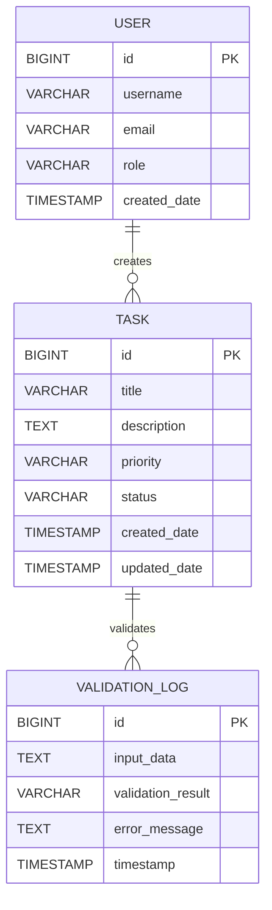

# SpringBoot Low Level Design - DEMO-759

## 1. Objective

This document outlines the low-level design for implementing robust input validation to handle malformed or unexpected input data gracefully in a SpringBoot application. The system must maintain stability and provide helpful feedback when encountering null values, special characters, whitespace-only content, or extremely long input that exceeds character limits. The implementation ensures data integrity while delivering clear error messages to users for better user experience.

## 2. SpringBoot Backend Details

### 2.1 Controller Layer

#### REST API Endpoints

| Operation | Method | URL | Request Body | Response Body |
|-----------|--------|-----|--------------|---------------|
| Create Task | POST | /api/v1/tasks | TaskCreateRequest | TaskResponse |
| Update Task | PUT | /api/v1/tasks/{id} | TaskUpdateRequest | TaskResponse |
| Validate Input | POST | /api/v1/tasks/validate | TaskValidationRequest | ValidationResponse |

#### Controller Classes

| Class Name | Responsibility | Methods |
|------------|----------------|----------|
| TaskController | Handle task-related HTTP requests | createTask(), updateTask(), validateTaskInput() |
| ValidationController | Handle input validation requests | validateInput(), checkDataIntegrity() |

#### Exception Handlers

```java
@RestControllerAdvice
public class GlobalExceptionHandler {
    
    @ExceptionHandler(ValidationException.class)
    public ResponseEntity<ErrorResponse> handleValidationException(ValidationException ex) {
        ErrorResponse error = new ErrorResponse("VALIDATION_ERROR", ex.getMessage());
        return ResponseEntity.badRequest().body(error);
    }
    
    @ExceptionHandler(DataIntegrityViolationException.class)
    public ResponseEntity<ErrorResponse> handleDataIntegrityViolation(DataIntegrityViolationException ex) {
        ErrorResponse error = new ErrorResponse("DATA_INTEGRITY_ERROR", "Invalid data format provided");
        return ResponseEntity.badRequest().body(error);
    }
}
```

### 2.2 Service Layer

#### Business Logic Implementation

```java
@Service
public class TaskService {
    
    @Autowired
    private TaskRepository taskRepository;
    
    @Autowired
    private InputValidationService validationService;
    
    public TaskResponse createTask(TaskCreateRequest request) {
        validationService.validateTaskInput(request);
        Task task = mapToEntity(request);
        Task savedTask = taskRepository.save(task);
        return mapToResponse(savedTask);
    }
}

@Service
public class InputValidationService {
    
    public void validateTaskInput(TaskCreateRequest request) {
        validateTitle(request.getTitle());
        validateDescription(request.getDescription());
    }
    
    private void validateTitle(String title) {
        if (title == null) {
            throw new ValidationException("Title is required");
        }
        if (title.trim().isEmpty()) {
            throw new ValidationException("Title cannot be empty or contain only whitespace");
        }
        if (title.length() > 255) {
            throw new ValidationException("Title cannot exceed 255 characters");
        }
    }
}
```

#### Service Layer Architecture
- TaskService: Core business logic for task operations
- InputValidationService: Centralized validation logic
- DataSanitizationService: Clean and sanitize input data

#### Dependency Injection Configuration
- All services use @Service annotation
- Repository injection via @Autowired
- Validation service injected into business services

##### Validation Rules

| Field Name | Validation | Error Message | Annotation |
|------------|------------|---------------|------------|
| title | @NotNull, @NotBlank, @Size(max=255) | Title is required / Title cannot be empty or contain only whitespace / Title cannot exceed 255 characters | @Valid |
| description | @Size(max=10000) | Description cannot exceed 10000 characters | @Valid |
| priority | @Pattern(regexp="HIGH|MEDIUM|LOW") | Priority must be HIGH, MEDIUM, or LOW | @Valid |
| dueDate | @Future | Due date must be in the future | @Valid |

### 2.3 Repository / Data Access Layer

#### Entity Models

| Entity | Fields | Constraints |
|--------|--------|-------------|
| Task | id (Long), title (String), description (String), priority (String), status (String), createdDate (LocalDateTime), updatedDate (LocalDateTime) | title: NOT NULL, MAX 255; description: MAX 10000; priority: NOT NULL |
| ValidationLog | id (Long), inputData (String), validationResult (String), errorMessage (String), timestamp (LocalDateTime) | inputData: NOT NULL; validationResult: NOT NULL |

#### Repository Interfaces

```java
@Repository
public interface TaskRepository extends JpaRepository<Task, Long> {
    
    @Query("SELECT t FROM Task t WHERE t.title LIKE %:keyword%")
    List<Task> findByTitleContaining(@Param("keyword") String keyword);
    
    @Query("SELECT COUNT(t) FROM Task t WHERE t.createdDate >= :startDate")
    Long countTasksCreatedAfter(@Param("startDate") LocalDateTime startDate);
}

@Repository
public interface ValidationLogRepository extends JpaRepository<ValidationLog, Long> {
    
    List<ValidationLog> findByValidationResultAndTimestampBetween(
        String validationResult, LocalDateTime start, LocalDateTime end);
}
```

#### Custom Queries
- Find tasks by title keyword search
- Count tasks created after specific date
- Retrieve validation logs by result and time range

### 2.4 Configuration

#### Application Properties

```properties
# application.yml
spring:
  datasource:
    url: jdbc:h2:mem:testdb
    driver-class-name: org.h2.Driver
    username: sa
    password: password
  jpa:
    hibernate:
      ddl-auto: create-drop
    show-sql: true
    properties:
      hibernate:
        format_sql: true
  validation:
    enabled: true

app:
  validation:
    max-title-length: 255
    max-description-length: 10000
    special-chars-allowed: true
    unicode-support: true
```

#### Spring Configuration Classes

```java
@Configuration
@EnableJpaRepositories
@EnableValidation
public class ApplicationConfig {
    
    @Bean
    public Validator validator() {
        return Validation.buildDefaultValidatorFactory().getValidator();
    }
    
    @Bean
    public MessageSource messageSource() {
        ResourceBundleMessageSource messageSource = new ResourceBundleMessageSource();
        messageSource.setBasename("messages");
        messageSource.setDefaultEncoding("UTF-8");
        return messageSource;
    }
}
```

#### Bean Definitions
- Validator bean for custom validation logic
- MessageSource for internationalized error messages
- Custom validation configuration beans

### 2.5 Security

#### Authentication Mechanism
- JWT token-based authentication
- Spring Security integration
- Role-based access control

#### Authorization Rules
- USER role: Can create and update own tasks
- ADMIN role: Can manage all tasks and view validation logs
- SYSTEM role: Can access validation endpoints

#### JWT / Token Handling

```java
@Component
public class JwtAuthenticationFilter extends OncePerRequestFilter {
    
    @Override
    protected void doFilterInternal(HttpServletRequest request, 
                                  HttpServletResponse response, 
                                  FilterChain filterChain) throws ServletException, IOException {
        String token = extractTokenFromRequest(request);
        if (token != null && jwtTokenProvider.validateToken(token)) {
            Authentication auth = jwtTokenProvider.getAuthentication(token);
            SecurityContextHolder.getContext().setAuthentication(auth);
        }
        filterChain.doFilter(request, response);
    }
}
```

### 2.6 Error Handling

#### Global Exception Handler

```java
@RestControllerAdvice
public class GlobalExceptionHandler {
    
    @ExceptionHandler(MethodArgumentNotValidException.class)
    public ResponseEntity<ValidationErrorResponse> handleValidationErrors(
            MethodArgumentNotValidException ex) {
        ValidationErrorResponse errorResponse = new ValidationErrorResponse();
        ex.getBindingResult().getFieldErrors().forEach(error -> {
            errorResponse.addError(error.getField(), error.getDefaultMessage());
        });
        return ResponseEntity.badRequest().body(errorResponse);
    }
    
    @ExceptionHandler(ConstraintViolationException.class)
    public ResponseEntity<ErrorResponse> handleConstraintViolation(
            ConstraintViolationException ex) {
        ErrorResponse error = new ErrorResponse("CONSTRAINT_VIOLATION", 
                                              "Data validation failed: " + ex.getMessage());
        return ResponseEntity.badRequest().body(error);
    }
}
```

#### Custom Exceptions

```java
public class ValidationException extends RuntimeException {
    public ValidationException(String message) {
        super(message);
    }
}

public class DataIntegrityException extends RuntimeException {
    public DataIntegrityException(String message, Throwable cause) {
        super(message, cause);
    }
}
```

#### HTTP Status Mapping
- 400 Bad Request: Validation errors, malformed input
- 422 Unprocessable Entity: Business logic validation failures
- 500 Internal Server Error: System errors, database issues

## 3. Database Design

### ER Model (Mermaid)



### Table Schema

| Table | Columns | Data Types | Constraints |
|-------|---------|------------|-------------|
| tasks | id, title, description, priority, status, created_date, updated_date | BIGINT, VARCHAR(255), TEXT, VARCHAR(50), VARCHAR(50), TIMESTAMP, TIMESTAMP | PK(id), NOT NULL(title, priority, status) |
| validation_logs | id, input_data, validation_result, error_message, timestamp | BIGINT, TEXT, VARCHAR(100), TEXT, TIMESTAMP | PK(id), NOT NULL(input_data, validation_result) |
| users | id, username, email, role, created_date | BIGINT, VARCHAR(100), VARCHAR(255), VARCHAR(50), TIMESTAMP | PK(id), UNIQUE(username, email) |

### Database Validations
- Title length constraint: MAX 255 characters
- Description length constraint: MAX 10000 characters
- Priority enum constraint: 'HIGH', 'MEDIUM', 'LOW'
- Status enum constraint: 'PENDING', 'IN_PROGRESS', 'COMPLETED'
- Email format validation
- Username uniqueness constraint

## 4. Non Functional Requirements

### Performance
- Input validation should complete within 100ms for standard requests
- Support concurrent validation of up to 1000 requests per second
- Database queries optimized with proper indexing
- Caching implemented for frequently accessed validation rules

### Security
- Input sanitization to prevent XSS and SQL injection
- Rate limiting on validation endpoints (100 requests per minute per user)
- Audit logging for all validation failures
- Secure handling of sensitive data in error messages

### Logging and Monitoring
- Structured logging using Logback with JSON format
- Metrics collection for validation success/failure rates
- Performance monitoring for validation response times
- Alert system for high validation failure rates

```java
@Component
public class ValidationMetrics {
    
    private final MeterRegistry meterRegistry;
    private final Counter validationSuccessCounter;
    private final Counter validationFailureCounter;
    private final Timer validationTimer;
    
    public ValidationMetrics(MeterRegistry meterRegistry) {
        this.meterRegistry = meterRegistry;
        this.validationSuccessCounter = Counter.builder("validation.success")
                .description("Number of successful validations")
                .register(meterRegistry);
        this.validationFailureCounter = Counter.builder("validation.failure")
                .description("Number of failed validations")
                .register(meterRegistry);
        this.validationTimer = Timer.builder("validation.duration")
                .description("Validation processing time")
                .register(meterRegistry);
    }
}
```

## 5. Dependencies

### Maven Dependencies

```xml
<dependencies>
    <!-- Spring Boot Starters -->
    <dependency>
        <groupId>org.springframework.boot</groupId>
        <artifactId>spring-boot-starter-web</artifactId>
    </dependency>
    <dependency>
        <groupId>org.springframework.boot</groupId>
        <artifactId>spring-boot-starter-data-jpa</artifactId>
    </dependency>
    <dependency>
        <groupId>org.springframework.boot</groupId>
        <artifactId>spring-boot-starter-validation</artifactId>
    </dependency>
    <dependency>
        <groupId>org.springframework.boot</groupId>
        <artifactId>spring-boot-starter-security</artifactId>
    </dependency>
    <dependency>
        <groupId>org.springframework.boot</groupId>
        <artifactId>spring-boot-starter-actuator</artifactId>
    </dependency>
    
    <!-- Database -->
    <dependency>
        <groupId>com.h2database</groupId>
        <artifactId>h2</artifactId>
        <scope>runtime</scope>
    </dependency>
    
    <!-- Validation -->
    <dependency>
        <groupId>org.hibernate.validator</groupId>
        <artifactId>hibernate-validator</artifactId>
    </dependency>
    
    <!-- JWT -->
    <dependency>
        <groupId>io.jsonwebtoken</groupId>
        <artifactId>jjwt-api</artifactId>
        <version>0.11.5</version>
    </dependency>
    <dependency>
        <groupId>io.jsonwebtoken</groupId>
        <artifactId>jjwt-impl</artifactId>
        <version>0.11.5</version>
        <scope>runtime</scope>
    </dependency>
    
    <!-- Monitoring -->
    <dependency>
        <groupId>io.micrometer</groupId>
        <artifactId>micrometer-registry-prometheus</artifactId>
    </dependency>
    
    <!-- Testing -->
    <dependency>
        <groupId>org.springframework.boot</groupId>
        <artifactId>spring-boot-starter-test</artifactId>
        <scope>test</scope>
    </dependency>
    <dependency>
        <groupId>org.springframework.security</groupId>
        <artifactId>spring-security-test</artifactId>
        <scope>test</scope>
    </dependency>
</dependencies>
```

## 6. Assumptions

1. **Character Encoding**: The system assumes UTF-8 encoding for all text input to properly handle special characters and unicode symbols.

2. **Database Storage**: H2 in-memory database is used for development and testing; production will use PostgreSQL or MySQL with appropriate character set configuration.

3. **Input Size Limits**: Maximum title length is set to 255 characters and description to 10,000 characters based on typical use cases; these can be configured via application properties.

4. **Special Characters**: The system allows and preserves special characters including emojis and unicode symbols unless they pose security risks (XSS patterns).

5. **Error Message Localization**: Error messages are currently in English; internationalization support can be added using Spring's MessageSource.

6. **Performance Requirements**: Validation operations are expected to handle moderate load (1000 requests/second); for higher loads, additional caching and optimization may be required.

7. **Security Context**: The application assumes a secure network environment with proper SSL/TLS termination at the load balancer level.

8. **Monitoring Infrastructure**: Prometheus and Grafana are assumed to be available for metrics collection and visualization.

9. **Logging Infrastructure**: ELK stack (Elasticsearch, Logstash, Kibana) or similar centralized logging solution is assumed for log aggregation and analysis.

10. **Development Environment**: Java 11+ and Maven 3.6+ are assumed for building and running the application.