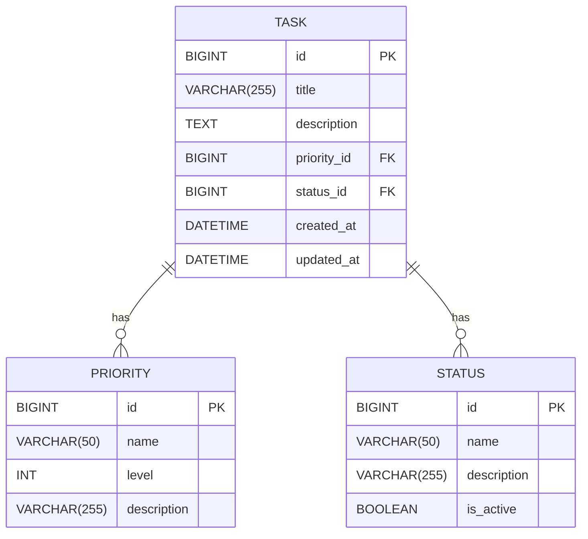

# SpringBoot Low Level Design - Handle Malformed Input Data Gracefully

## 1. Objective

This document outlines the SpringBoot implementation for handling malformed or unexpected input data gracefully in a task management system. The system must validate input data, provide meaningful error messages, and maintain stability when processing invalid requests. The implementation ensures robust input validation for task creation operations while supporting special characters and enforcing appropriate character limits.

## 2. SpringBoot Backend Details

### 2.1 Controller Layer

#### REST API Endpoints

| Operation | Method | URL | Request Body | Response Body |
|-----------|--------|-----|--------------|---------------|
| Create Task | POST | /api/tasks | TaskCreateRequest | TaskResponse / ErrorResponse |
| Validate Task Input | POST | /api/tasks/validate | TaskCreateRequest | ValidationResponse |

#### Controller Classes

| Class Name | Responsibility | Methods |
|------------|----------------|----------|
| TaskController | Handle task-related HTTP requests | createTask(), validateTaskInput() |
| GlobalExceptionHandler | Handle application-wide exceptions | handleValidationException(), handleGenericException() |

#### Exception Handlers

```java
@RestControllerAdvice
public class GlobalExceptionHandler {
    
    @ExceptionHandler(MethodArgumentNotValidException.class)
    public ResponseEntity<ErrorResponse> handleValidationException(MethodArgumentNotValidException ex);
    
    @ExceptionHandler(InvalidInputException.class)
    public ResponseEntity<ErrorResponse> handleInvalidInputException(InvalidInputException ex);
    
    @ExceptionHandler(DataIntegrityViolationException.class)
    public ResponseEntity<ErrorResponse> handleDataIntegrityException(DataIntegrityViolationException ex);
}
```

### 2.2 Service Layer

#### Business Logic Implementation

```java
@Service
public class TaskService {
    
    public TaskResponse createTask(TaskCreateRequest request);
    public ValidationResponse validateTaskInput(TaskCreateRequest request);
    private void validateTitle(String title);
    private void validateDescription(String description);
    private String sanitizeInput(String input);
}
```

#### Service Layer Architecture

- **TaskService**: Core business logic for task operations
- **ValidationService**: Dedicated service for input validation
- **SanitizationService**: Service for cleaning and sanitizing input data

#### Dependency Injection Configuration

```java
@Configuration
public class ServiceConfiguration {
    
    @Bean
    public TaskService taskService(TaskRepository taskRepository, ValidationService validationService);
    
    @Bean
    public ValidationService validationService();
    
    @Bean
    public SanitizationService sanitizationService();
}
```

#### Validation Rules

| Field Name | Validation | Error Message | Annotation |
|------------|------------|---------------|------------|
| title | NotNull, NotBlank | "Title is required" | @NotNull @NotBlank |
| title | Size(max=255) | "Title cannot exceed 255 characters" | @Size(max=255) |
| title | Pattern(no whitespace only) | "Title cannot be empty or contain only whitespace" | @Pattern |
| description | Size(max=10000) | "Description cannot exceed 10000 characters" | @Size(max=10000) |
| priority | NotNull | "Priority is required" | @NotNull |
| status | NotNull | "Status is required" | @NotNull |

### 2.3 Repository / Data Access Layer

#### Entity Models

| Entity | Fields | Constraints |
|--------|--------|-------------|
| Task | id (Long), title (String), description (String), priority (Priority), status (Status), createdAt (LocalDateTime), updatedAt (LocalDateTime) | title: NOT NULL, VARCHAR(255); description: TEXT; priority: NOT NULL; status: NOT NULL |
| Priority | id (Long), name (String), level (Integer) | name: UNIQUE, NOT NULL |
| Status | id (Long), name (String), description (String) | name: UNIQUE, NOT NULL |

#### Repository Interfaces

```java
@Repository
public interface TaskRepository extends JpaRepository<Task, Long> {
    
    List<Task> findByTitleContainingIgnoreCase(String title);
    List<Task> findByStatus(Status status);
    List<Task> findByPriority(Priority priority);
    
    @Query("SELECT t FROM Task t WHERE LENGTH(t.title) > :maxLength")
    List<Task> findTasksWithLongTitles(@Param("maxLength") int maxLength);
}

@Repository
public interface PriorityRepository extends JpaRepository<Priority, Long> {
    Optional<Priority> findByName(String name);
}

@Repository
public interface StatusRepository extends JpaRepository<Status, Long> {
    Optional<Status> findByName(String name);
}
```

#### Custom Queries

```sql
-- Find tasks with special characters in title
SELECT * FROM tasks WHERE title REGEXP '[^a-zA-Z0-9\s]';

-- Find tasks exceeding character limits
SELECT * FROM tasks WHERE CHAR_LENGTH(title) > 255 OR CHAR_LENGTH(description) > 10000;

-- Validate data integrity
SELECT COUNT(*) FROM tasks WHERE title IS NULL OR TRIM(title) = '';
```

### 2.4 Configuration

#### Application Properties

```properties
# application.yml
spring:
  datasource:
    url: jdbc:mysql://localhost:3306/taskdb
    username: ${DB_USERNAME:taskuser}
    password: ${DB_PASSWORD:taskpass}
    driver-class-name: com.mysql.cj.jdbc.Driver
  
  jpa:
    hibernate:
      ddl-auto: validate
    show-sql: false
    properties:
      hibernate:
        dialect: org.hibernate.dialect.MySQL8Dialect
        format_sql: true
  
  validation:
    enabled: true

# Custom validation properties
app:
  validation:
    title:
      max-length: 255
      min-length: 1
    description:
      max-length: 10000
    special-characters:
      allowed: true
      encoding: UTF-8
```

#### Spring Configuration Classes

```java
@Configuration
@EnableJpaRepositories
@EnableTransactionManagement
public class DatabaseConfiguration {
    
    @Bean
    @Primary
    public DataSource dataSource();
    
    @Bean
    public LocalContainerEntityManagerFactoryBean entityManagerFactory();
    
    @Bean
    public PlatformTransactionManager transactionManager();
}

@Configuration
@EnableWebMvc
public class WebConfiguration implements WebMvcConfigurer {
    
    @Override
    public void configureMessageConverters(List<HttpMessageConverter<?>> converters);
    
    @Bean
    public Validator validator();
}
```

#### Bean Definitions

```java
@Configuration
public class ValidationConfiguration {
    
    @Bean
    public LocalValidatorFactoryBean validator();
    
    @Bean
    public MethodValidationPostProcessor methodValidationPostProcessor();
    
    @Bean
    public MessageSource messageSource();
}
```

### 2.5 Security

#### Authentication Mechanism

- JWT-based authentication for API access
- Role-based authorization (USER, ADMIN)
- Input sanitization to prevent injection attacks

#### Authorization Rules

```java
@Configuration
@EnableWebSecurity
public class SecurityConfiguration {
    
    @Bean
    public SecurityFilterChain filterChain(HttpSecurity http) throws Exception {
        return http
            .authorizeHttpRequests(auth -> auth
                .requestMatchers("/api/tasks/**").hasRole("USER")
                .requestMatchers("/api/admin/**").hasRole("ADMIN")
                .anyRequest().authenticated()
            )
            .oauth2ResourceServer(oauth2 -> oauth2.jwt(Customizer.withDefaults()))
            .build();
    }
}
```

#### JWT / Token Handling

- Token validation for each request
- Automatic token refresh mechanism
- Secure token storage and transmission

### 2.6 Error Handling

#### Global Exception Handler

```java
@RestControllerAdvice
public class GlobalExceptionHandler {
    
    @ExceptionHandler(MethodArgumentNotValidException.class)
    public ResponseEntity<ErrorResponse> handleValidationException(MethodArgumentNotValidException ex) {
        List<String> errors = ex.getBindingResult()
            .getFieldErrors()
            .stream()
            .map(FieldError::getDefaultMessage)
            .collect(Collectors.toList());
        
        ErrorResponse errorResponse = ErrorResponse.builder()
            .timestamp(LocalDateTime.now())
            .status(HttpStatus.BAD_REQUEST.value())
            .error("Validation Failed")
            .message("Input validation errors occurred")
            .details(errors)
            .build();
        
        return ResponseEntity.badRequest().body(errorResponse);
    }
    
    @ExceptionHandler(InvalidInputException.class)
    public ResponseEntity<ErrorResponse> handleInvalidInputException(InvalidInputException ex) {
        ErrorResponse errorResponse = ErrorResponse.builder()
            .timestamp(LocalDateTime.now())
            .status(HttpStatus.BAD_REQUEST.value())
            .error("Invalid Input")
            .message(ex.getMessage())
            .build();
        
        return ResponseEntity.badRequest().body(errorResponse);
    }
}
```

#### Custom Exceptions

```java
public class InvalidInputException extends RuntimeException {
    public InvalidInputException(String message) {
        super(message);
    }
}

public class TaskValidationException extends RuntimeException {
    public TaskValidationException(String message, Throwable cause) {
        super(message, cause);
    }
}

public class CharacterLimitExceededException extends RuntimeException {
    public CharacterLimitExceededException(String field, int limit, int actual) {
        super(String.format("%s exceeds character limit. Maximum: %d, Actual: %d", field, limit, actual));
    }
}
```

#### HTTP Status Mapping

| Exception Type | HTTP Status | Error Code |
|----------------|-------------|------------|
| MethodArgumentNotValidException | 400 BAD_REQUEST | VALIDATION_ERROR |
| InvalidInputException | 400 BAD_REQUEST | INVALID_INPUT |
| CharacterLimitExceededException | 400 BAD_REQUEST | CHARACTER_LIMIT_EXCEEDED |
| DataIntegrityViolationException | 409 CONFLICT | DATA_INTEGRITY_ERROR |
| TaskNotFoundException | 404 NOT_FOUND | TASK_NOT_FOUND |
| InternalServerError | 500 INTERNAL_SERVER_ERROR | SYSTEM_ERROR |

## 3. Database Design

### ER Model (Mermaid)



### Table Schema

| Table | Columns | Data Types | Constraints |
|-------|---------|------------|-------------|
| tasks | id, title, description, priority_id, status_id, created_at, updated_at | BIGINT, VARCHAR(255), TEXT, BIGINT, BIGINT, DATETIME, DATETIME | PK(id), NOT NULL(title, priority_id, status_id), FK(priority_id, status_id) |
| priorities | id, name, level, description | BIGINT, VARCHAR(50), INT, VARCHAR(255) | PK(id), UNIQUE(name), NOT NULL(name, level) |
| statuses | id, name, description, is_active | BIGINT, VARCHAR(50), VARCHAR(255), BOOLEAN | PK(id), UNIQUE(name), NOT NULL(name), DEFAULT(is_active=true) |

### Database Validations

```sql
-- Title validation constraints
ALTER TABLE tasks ADD CONSTRAINT chk_title_not_empty 
    CHECK (title IS NOT NULL AND TRIM(title) != '');

ALTER TABLE tasks ADD CONSTRAINT chk_title_length 
    CHECK (CHAR_LENGTH(title) <= 255);

-- Description length constraint
ALTER TABLE tasks ADD CONSTRAINT chk_description_length 
    CHECK (description IS NULL OR CHAR_LENGTH(description) <= 10000);

-- Priority and status foreign key constraints
ALTER TABLE tasks ADD CONSTRAINT fk_task_priority 
    FOREIGN KEY (priority_id) REFERENCES priorities(id);

ALTER TABLE tasks ADD CONSTRAINT fk_task_status 
    FOREIGN KEY (status_id) REFERENCES statuses(id);

-- Indexes for performance
CREATE INDEX idx_task_title ON tasks(title);
CREATE INDEX idx_task_status ON tasks(status_id);
CREATE INDEX idx_task_priority ON tasks(priority_id);
CREATE INDEX idx_task_created_at ON tasks(created_at);
```

## 4. Non Functional Requirements

### Performance

- **Response Time**: API endpoints must respond within 200ms for 95% of requests
- **Throughput**: System must handle 1000 concurrent requests per second
- **Database Performance**: Query execution time should not exceed 100ms
- **Memory Usage**: JVM heap usage should not exceed 2GB under normal load
- **Caching**: Implement Redis caching for frequently accessed validation rules

### Security

- **Input Sanitization**: All user inputs must be sanitized to prevent XSS and injection attacks
- **Data Encryption**: Sensitive data must be encrypted at rest and in transit
- **Authentication**: JWT tokens with 24-hour expiration
- **Authorization**: Role-based access control with principle of least privilege
- **Audit Logging**: All data modification operations must be logged
- **Rate Limiting**: Implement rate limiting to prevent abuse (100 requests per minute per user)

### Logging and Monitoring

- **Application Logs**: Structured logging using Logback with JSON format
- **Error Tracking**: Integration with error tracking service (e.g., Sentry)
- **Metrics Collection**: Micrometer integration for application metrics
- **Health Checks**: Actuator endpoints for health monitoring
- **Performance Monitoring**: APM integration for performance tracking
- **Alert Configuration**: Alerts for high error rates, slow response times, and system failures

```yaml
# Logging configuration
logging:
  level:
    com.example.taskmanagement: INFO
    org.springframework.web: DEBUG
    org.hibernate.SQL: DEBUG
  pattern:
    console: "%d{yyyy-MM-dd HH:mm:ss} - %msg%n"
    file: "%d{yyyy-MM-dd HH:mm:ss} [%thread] %-5level %logger{36} - %msg%n"
  file:
    name: logs/task-management.log
    max-size: 10MB
    max-history: 30
```

## 5. Dependencies

### Maven Dependencies

```xml
<dependencies>
    <!-- Spring Boot Starters -->
    <dependency>
        <groupId>org.springframework.boot</groupId>
        <artifactId>spring-boot-starter-web</artifactId>
    </dependency>
    
    <dependency>
        <groupId>org.springframework.boot</groupId>
        <artifactId>spring-boot-starter-data-jpa</artifactId>
    </dependency>
    
    <dependency>
        <groupId>org.springframework.boot</groupId>
        <artifactId>spring-boot-starter-validation</artifactId>
    </dependency>
    
    <dependency>
        <groupId>org.springframework.boot</groupId>
        <artifactId>spring-boot-starter-security</artifactId>
    </dependency>
    
    <dependency>
        <groupId>org.springframework.boot</groupId>
        <artifactId>spring-boot-starter-oauth2-resource-server</artifactId>
    </dependency>
    
    <dependency>
        <groupId>org.springframework.boot</groupId>
        <artifactId>spring-boot-starter-actuator</artifactId>
    </dependency>
    
    <!-- Database -->
    <dependency>
        <groupId>mysql</groupId>
        <artifactId>mysql-connector-java</artifactId>
        <scope>runtime</scope>
    </dependency>
    
    <!-- Caching -->
    <dependency>
        <groupId>org.springframework.boot</groupId>
        <artifactId>spring-boot-starter-data-redis</artifactId>
    </dependency>
    
    <!-- Monitoring -->
    <dependency>
        <groupId>io.micrometer</groupId>
        <artifactId>micrometer-registry-prometheus</artifactId>
    </dependency>
    
    <!-- Testing -->
    <dependency>
        <groupId>org.springframework.boot</groupId>
        <artifactId>spring-boot-starter-test</artifactId>
        <scope>test</scope>
    </dependency>
    
    <dependency>
        <groupId>org.testcontainers</groupId>
        <artifactId>mysql</artifactId>
        <scope>test</scope>
    </dependency>
    
    <!-- Utilities -->
    <dependency>
        <groupId>org.apache.commons</groupId>
        <artifactId>commons-lang3</artifactId>
    </dependency>
    
    <dependency>
        <groupId>org.projectlombok</groupId>
        <artifactId>lombok</artifactId>
        <optional>true</optional>
    </dependency>
</dependencies>
```

## 6. Assumptions

1. **Character Encoding**: The system assumes UTF-8 encoding for all text inputs to properly handle special characters and emojis.

2. **Database Collation**: MySQL database uses utf8mb4_unicode_ci collation to support full Unicode character set including emojis.

3. **Input Sanitization**: While special characters are allowed in titles, HTML tags and script content will be sanitized to prevent XSS attacks.

4. **Performance Requirements**: The system assumes a moderate load of up to 1000 concurrent users during peak hours.

5. **Error Message Localization**: Error messages are currently implemented in English only. Future internationalization may be required.

6. **Character Limits**: The 255-character limit for titles and 10,000-character limit for descriptions are based on typical use cases and can be adjusted based on business requirements.

7. **Whitespace Handling**: Leading and trailing whitespace in titles will be automatically trimmed, but internal whitespace is preserved.

8. **Special Character Support**: The system supports Unicode characters including emojis, mathematical symbols, and international characters.

9. **Validation Timing**: Input validation occurs both at the API layer (immediate feedback) and at the service layer (business rule validation).

10. **Error Recovery**: The system assumes that malformed input errors are recoverable and should not cause system instability or data corruption.