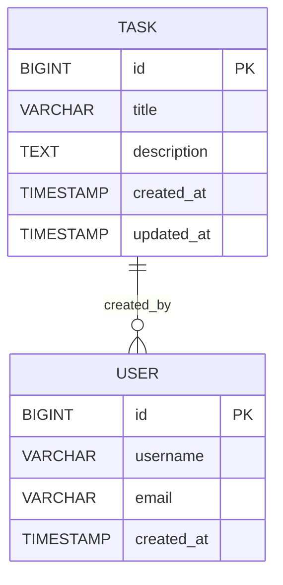

# SpringBoot Low Level Design - DEMO-759

## 1. Objective

This document outlines the low-level design for implementing robust input validation to handle malformed or unexpected input data gracefully in a SpringBoot application. The system will ensure stability by providing helpful feedback when encountering null, undefined, special characters, whitespace-only, or extremely long input data. The implementation will prevent system crashes and maintain data integrity through comprehensive validation mechanisms.

## 2. SpringBoot Backend Details

### 2.1 Controller Layer

#### REST API Endpoints

| Operation | Method | URL | Request Body | Response Body |
|-----------|--------|-----|--------------|---------------|
| Create Task | POST | /api/tasks | TaskCreateRequest | TaskResponse |
| Update Task | PUT | /api/tasks/{id} | TaskUpdateRequest | TaskResponse |
| Get Task | GET | /api/tasks/{id} | - | TaskResponse |
| List Tasks | GET | /api/tasks | - | List<TaskResponse> |

#### Controller Classes

| Class Name | Responsibility | Methods |
|------------|----------------|----------|
| TaskController | Handle HTTP requests for task operations | createTask(), updateTask(), getTask(), listTasks() |
| GlobalExceptionHandler | Handle validation and system exceptions | handleValidationException(), handleConstraintViolation() |

#### Exception Handlers

```java
@RestControllerAdvice
public class GlobalExceptionHandler {
    
    @ExceptionHandler(MethodArgumentNotValidException.class)
    public ResponseEntity<ErrorResponse> handleValidationException(MethodArgumentNotValidException ex);
    
    @ExceptionHandler(ConstraintViolationException.class)
    public ResponseEntity<ErrorResponse> handleConstraintViolation(ConstraintViolationException ex);
    
    @ExceptionHandler(InvalidInputException.class)
    public ResponseEntity<ErrorResponse> handleInvalidInput(InvalidInputException ex);
}
```

### 2.2 Service Layer

#### Business Logic Implementation

```java
@Service
public class TaskService {
    
    @Autowired
    private TaskRepository taskRepository;
    
    @Autowired
    private InputValidationService inputValidationService;
    
    public TaskResponse createTask(TaskCreateRequest request) {
        inputValidationService.validateTaskInput(request);
        Task task = mapToEntity(request);
        Task savedTask = taskRepository.save(task);
        return mapToResponse(savedTask);
    }
}
```

#### Service Layer Architecture

- **TaskService**: Core business logic for task operations
- **InputValidationService**: Specialized service for input validation
- **TaskMappingService**: Entity-DTO mapping operations

#### Dependency Injection Configuration

```java
@Configuration
public class ServiceConfiguration {
    
    @Bean
    public InputValidationService inputValidationService() {
        return new InputValidationService();
    }
}
```

#### Validation Rules

| Field Name | Validation | Error Message | Annotation |
|------------|------------|---------------|------------|
| title | NotNull, NotBlank, Size(max=255) | Title is required | @NotNull @NotBlank @Size(max=255) |
| title | Custom whitespace validation | Title cannot be empty or contain only whitespace | @ValidTitle |
| description | Size(max=10000) | Description exceeds maximum length of 10000 characters | @Size(max=10000) |
| title | Special character handling | - | @ValidSpecialCharacters |

### 2.3 Repository / Data Access Layer

#### Entity Models

| Entity | Fields | Constraints |
|--------|--------|-------------|
| Task | id (Long), title (String), description (String), createdAt (LocalDateTime), updatedAt (LocalDateTime) | title: NOT NULL, max 255 chars; description: max 10000 chars |

```java
@Entity
@Table(name = "tasks")
public class Task {
    
    @Id
    @GeneratedValue(strategy = GenerationType.IDENTITY)
    private Long id;
    
    @Column(name = "title", nullable = false, length = 255)
    @NotNull
    @Size(max = 255)
    private String title;
    
    @Column(name = "description", length = 10000)
    @Size(max = 10000)
    private String description;
    
    @Column(name = "created_at")
    private LocalDateTime createdAt;
    
    @Column(name = "updated_at")
    private LocalDateTime updatedAt;
}
```

#### Repository Interfaces

```java
@Repository
public interface TaskRepository extends JpaRepository<Task, Long> {
    
    List<Task> findByTitleContainingIgnoreCase(String title);
    
    @Query("SELECT t FROM Task t WHERE LENGTH(t.title) > :maxLength")
    List<Task> findTasksWithLongTitles(@Param("maxLength") int maxLength);
}
```

#### Custom Queries

- Find tasks by title (case-insensitive)
- Find tasks with titles exceeding specified length
- Count tasks with special characters in title

### 2.4 Configuration

#### Application Properties

```properties
# application.yml
spring:
  datasource:
    url: jdbc:h2:mem:testdb
    driver-class-name: org.h2.Driver
    username: sa
    password: password
  
  jpa:
    hibernate:
      ddl-auto: create-drop
    show-sql: true
    properties:
      hibernate:
        format_sql: true

# Validation Configuration
validation:
  title:
    max-length: 255
    min-length: 1
  description:
    max-length: 10000
  
# Logging Configuration
logging:
  level:
    com.example.task: DEBUG
    org.springframework.web: INFO
```

#### Spring Configuration Classes

```java
@Configuration
@EnableJpaRepositories
@EnableWebMvc
public class ApplicationConfiguration {
    
    @Bean
    public Validator validator() {
        return Validation.buildDefaultValidatorFactory().getValidator();
    }
    
    @Bean
    public MessageSource messageSource() {
        ResourceBundleMessageSource messageSource = new ResourceBundleMessageSource();
        messageSource.setBasename("messages");
        return messageSource;
    }
}
```

#### Bean Definitions

- Validator bean for custom validation
- MessageSource for internationalized error messages
- Custom validation annotations

### 2.5 Security

#### Authentication Mechanism
- Basic Authentication for API endpoints
- JWT token validation for secure operations

#### Authorization Rules
- All users can create and read tasks
- Only task owners can update their tasks
- Admin users can perform all operations

#### JWT / Token Handling

```java
@Component
public class JwtTokenProvider {
    
    public String generateToken(UserDetails userDetails) {
        // JWT token generation logic
    }
    
    public boolean validateToken(String token) {
        // JWT token validation logic
    }
}
```

### 2.6 Error Handling

#### Global Exception Handler

```java
@RestControllerAdvice
public class GlobalExceptionHandler {
    
    @ExceptionHandler(MethodArgumentNotValidException.class)
    public ResponseEntity<ErrorResponse> handleValidationException(MethodArgumentNotValidException ex) {
        List<String> errors = ex.getBindingResult()
            .getFieldErrors()
            .stream()
            .map(FieldError::getDefaultMessage)
            .collect(Collectors.toList());
        
        ErrorResponse errorResponse = new ErrorResponse("Validation failed", errors);
        return ResponseEntity.badRequest().body(errorResponse);
    }
}
```

#### Custom Exceptions

```java
public class InvalidInputException extends RuntimeException {
    public InvalidInputException(String message) {
        super(message);
    }
}

public class TitleValidationException extends InvalidInputException {
    public TitleValidationException(String message) {
        super(message);
    }
}
```

#### HTTP Status Mapping

| Exception Type | HTTP Status | Description |
|----------------|-------------|-------------|
| MethodArgumentNotValidException | 400 BAD_REQUEST | Validation errors |
| InvalidInputException | 400 BAD_REQUEST | Custom input validation errors |
| EntityNotFoundException | 404 NOT_FOUND | Resource not found |
| DataIntegrityViolationException | 409 CONFLICT | Database constraint violations |

## 3. Database Design

### ER Model (Mermaid)



### Table Schema

| Table | Columns | Data Types | Constraints |
|-------|---------|------------|-------------|
| tasks | id | BIGINT | PRIMARY KEY, AUTO_INCREMENT |
| tasks | title | VARCHAR(255) | NOT NULL |
| tasks | description | TEXT(10000) | NULL |
| tasks | created_at | TIMESTAMP | DEFAULT CURRENT_TIMESTAMP |
| tasks | updated_at | TIMESTAMP | DEFAULT CURRENT_TIMESTAMP ON UPDATE CURRENT_TIMESTAMP |
| tasks | created_by | BIGINT | FOREIGN KEY REFERENCES users(id) |

### Database Validations

```sql
-- Title validation constraints
ALTER TABLE tasks ADD CONSTRAINT chk_title_not_empty 
    CHECK (LENGTH(TRIM(title)) > 0);

ALTER TABLE tasks ADD CONSTRAINT chk_title_length 
    CHECK (LENGTH(title) <= 255);

-- Description length constraint
ALTER TABLE tasks ADD CONSTRAINT chk_description_length 
    CHECK (LENGTH(description) <= 10000);

-- Prevent null or whitespace-only titles
ALTER TABLE tasks ADD CONSTRAINT chk_title_content 
    CHECK (title IS NOT NULL AND TRIM(title) != '');
```

## 4. Non Functional Requirements

### Performance

- **Response Time**: API endpoints should respond within 200ms for 95% of requests
- **Throughput**: System should handle 1000 concurrent requests per second
- **Validation Performance**: Input validation should complete within 10ms
- **Database Performance**: Query execution time should not exceed 100ms

### Security

- **Input Sanitization**: All input data must be sanitized to prevent XSS attacks
- **SQL Injection Prevention**: Use parameterized queries and JPA repositories
- **Data Validation**: Implement both client-side and server-side validation
- **Error Information**: Error messages should not expose sensitive system information

### Logging and Monitoring

- **Validation Failures**: Log all validation failures with request details
- **Performance Metrics**: Monitor API response times and validation performance
- **Error Tracking**: Implement structured logging for error analysis
- **Audit Trail**: Log all task creation and modification activities

```java
@Component
public class ValidationLogger {
    
    private static final Logger logger = LoggerFactory.getLogger(ValidationLogger.class);
    
    public void logValidationFailure(String field, String value, String error) {
        logger.warn("Validation failed for field: {}, value: {}, error: {}", 
                   field, sanitizeForLogging(value), error);
    }
}
```

## 5. Dependencies

### Maven Dependencies

```xml
<dependencies>
    <!-- Spring Boot Starters -->
    <dependency>
        <groupId>org.springframework.boot</groupId>
        <artifactId>spring-boot-starter-web</artifactId>
    </dependency>
    
    <dependency>
        <groupId>org.springframework.boot</groupId>
        <artifactId>spring-boot-starter-data-jpa</artifactId>
    </dependency>
    
    <dependency>
        <groupId>org.springframework.boot</groupId>
        <artifactId>spring-boot-starter-validation</artifactId>
    </dependency>
    
    <dependency>
        <groupId>org.springframework.boot</groupId>
        <artifactId>spring-boot-starter-security</artifactId>
    </dependency>
    
    <!-- Database -->
    <dependency>
        <groupId>com.h2database</groupId>
        <artifactId>h2</artifactId>
        <scope>runtime</scope>
    </dependency>
    
    <!-- Validation -->
    <dependency>
        <groupId>org.hibernate.validator</groupId>
        <artifactId>hibernate-validator</artifactId>
    </dependency>
    
    <!-- JSON Processing -->
    <dependency>
        <groupId>com.fasterxml.jackson.core</groupId>
        <artifactId>jackson-databind</artifactId>
    </dependency>
    
    <!-- Testing -->
    <dependency>
        <groupId>org.springframework.boot</groupId>
        <artifactId>spring-boot-starter-test</artifactId>
        <scope>test</scope>
    </dependency>
    
    <!-- JWT -->
    <dependency>
        <groupId>io.jsonwebtoken</groupId>
        <artifactId>jjwt</artifactId>
        <version>0.9.1</version>
    </dependency>
</dependencies>
```

## 6. Assumptions

1. **Character Encoding**: The system assumes UTF-8 encoding for all text input to properly handle special characters and emojis.

2. **Database Support**: The database system supports Unicode characters and can store emojis and special symbols without data corruption.

3. **Client-Side Validation**: While server-side validation is comprehensive, basic client-side validation may also be implemented for better user experience.

4. **Internationalization**: Error messages are designed to support multiple languages through Spring's MessageSource mechanism.

5. **Performance Requirements**: The validation logic assumes that input validation should not significantly impact API response times.

6. **Security Context**: The system assumes that authentication and authorization mechanisms are in place to identify users creating tasks.

7. **Logging Infrastructure**: Assumes that appropriate logging infrastructure (like ELK stack) is available for monitoring and debugging.

8. **Error Handling Strategy**: The system assumes that detailed validation errors should be returned to clients for debugging purposes while avoiding exposure of sensitive system information.

## Custom Validation Annotations

```java
@Target({ElementType.FIELD})
@Retention(RetentionPolicy.RUNTIME)
@Constraint(validatedBy = TitleValidator.class)
public @interface ValidTitle {
    String message() default "Title cannot be empty or contain only whitespace";
    Class<?>[] groups() default {};
    Class<? extends Payload>[] payload() default {};
}

@Component
public class TitleValidator implements ConstraintValidator<ValidTitle, String> {
    
    @Override
    public boolean isValid(String title, ConstraintValidatorContext context) {
        if (title == null) {
            return false;
        }
        return !title.trim().isEmpty();
    }
}
```

## Request/Response DTOs

```java
public class TaskCreateRequest {
    
    @ValidTitle
    @Size(max = 255, message = "Title cannot exceed 255 characters")
    private String title;
    
    @Size(max = 10000, message = "Description cannot exceed 10000 characters")
    private String description;
    
    // getters and setters
}

public class TaskResponse {
    private Long id;
    private String title;
    private String description;
    private LocalDateTime createdAt;
    private LocalDateTime updatedAt;
    
    // getters and setters
}

public class ErrorResponse {
    private String message;
    private List<String> errors;
    private LocalDateTime timestamp;
    
    // constructors, getters and setters
}
```