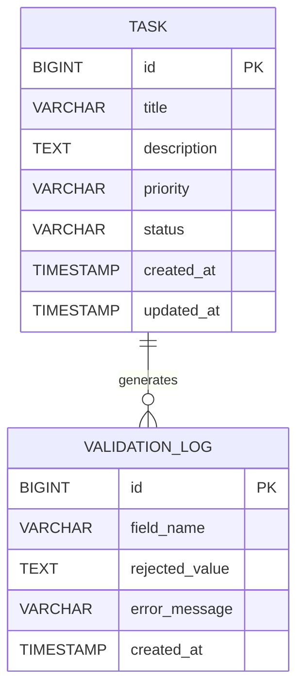

# SpringBoot Low Level Design - Handle Malformed Input Data Gracefully

## 1. Objective

This document outlines the SpringBoot implementation for handling malformed or unexpected input data gracefully in a task management system. The system must validate input data, provide meaningful error messages, and maintain stability when processing invalid requests. The implementation ensures robust input validation for task creation operations while supporting special characters and enforcing appropriate character limits.

## 2. SpringBoot Backend Details

### 2.1 Controller Layer

#### REST API Endpoints

| Operation | Method | URL | Request Body | Response Body |
|-----------|--------|-----|--------------|---------------|
| Create Task | POST | /api/tasks | TaskCreateRequest | TaskResponse / ErrorResponse |
| Validate Task Input | POST | /api/tasks/validate | TaskCreateRequest | ValidationResponse |

#### Controller Classes

| Class Name | Responsibility | Methods |
|------------|----------------|----------|
| TaskController | Handle task-related HTTP requests | createTask(), validateTaskInput() |
| GlobalExceptionHandler | Handle application-wide exceptions | handleValidationException(), handleGenericException() |

#### Exception Handlers

```java
@RestControllerAdvice
public class GlobalExceptionHandler {
    
    @ExceptionHandler(MethodArgumentNotValidException.class)
    public ResponseEntity<ErrorResponse> handleValidationException(MethodArgumentNotValidException ex);
    
    @ExceptionHandler(TaskValidationException.class)
    public ResponseEntity<ErrorResponse> handleTaskValidationException(TaskValidationException ex);
    
    @ExceptionHandler(DataIntegrityViolationException.class)
    public ResponseEntity<ErrorResponse> handleDataIntegrityException(DataIntegrityViolationException ex);
}
```

### 2.2 Service Layer

#### Business Logic Implementation

- **TaskService**: Core business logic for task operations
- **ValidationService**: Centralized validation logic for input data
- **InputSanitizationService**: Handle special characters and data sanitization

#### Service Layer Architecture

```java
@Service
public class TaskService {
    private final TaskRepository taskRepository;
    private final ValidationService validationService;
    private final InputSanitizationService sanitizationService;
    
    public TaskResponse createTask(TaskCreateRequest request);
    public ValidationResponse validateTask(TaskCreateRequest request);
}
```

#### Dependency Injection Configuration

```java
@Configuration
public class ServiceConfiguration {
    @Bean
    public ValidationService validationService();
    
    @Bean
    public InputSanitizationService inputSanitizationService();
}
```

#### Validation Rules

| Field Name | Validation | Error Message | Annotation |
|------------|------------|---------------|------------|
| title | NotNull, NotBlank | "Title is required" | @NotNull @NotBlank |
| title | Size(max=255) | "Title cannot exceed 255 characters" | @Size(max=255) |
| title | Pattern (no whitespace only) | "Title cannot be empty or contain only whitespace" | @Pattern |
| description | Size(max=10000) | "Description cannot exceed 10000 characters" | @Size(max=10000) |
| priority | NotNull | "Priority is required" | @NotNull |

### 2.3 Repository / Data Access Layer

#### Entity Models

| Entity | Fields | Constraints |
|--------|--------|-------------|
| Task | id (Long), title (String), description (String), priority (Priority), status (TaskStatus), createdAt (LocalDateTime), updatedAt (LocalDateTime) | title: NOT NULL, VARCHAR(255); description: TEXT; priority: NOT NULL |
| Priority | ENUM (LOW, MEDIUM, HIGH, CRITICAL) | - |
| TaskStatus | ENUM (TODO, IN_PROGRESS, DONE) | - |

#### Repository Interfaces

```java
@Repository
public interface TaskRepository extends JpaRepository<Task, Long> {
    List<Task> findByTitleContainingIgnoreCase(String title);
    List<Task> findByPriority(Priority priority);
    List<Task> findByStatus(TaskStatus status);
}
```

#### Custom Queries

```java
@Query("SELECT t FROM Task t WHERE t.title IS NOT NULL AND TRIM(t.title) != ''")
List<Task> findTasksWithValidTitles();

@Query("SELECT COUNT(t) FROM Task t WHERE LENGTH(t.title) > :maxLength")
long countTasksExceedingTitleLength(@Param("maxLength") int maxLength);
```

### 2.4 Configuration

#### Application Properties

```properties
# Validation Configuration
app.validation.title.max-length=255
app.validation.description.max-length=10000
app.validation.title.pattern=^(?!\s*$).+

# Database Configuration
spring.datasource.url=jdbc:h2:mem:taskdb
spring.datasource.driver-class-name=org.h2.Driver
spring.jpa.hibernate.ddl-auto=create-drop
spring.jpa.show-sql=true

# Logging Configuration
logging.level.com.example.task=DEBUG
logging.level.org.springframework.web=INFO
```

#### Spring Configuration Classes

```java
@Configuration
@EnableJpaRepositories
@EnableTransactionManagement
public class DatabaseConfiguration {
    
    @Bean
    public LocalContainerEntityManagerFactoryBean entityManagerFactory();
    
    @Bean
    public PlatformTransactionManager transactionManager();
}
```

#### Bean Definitions

```java
@Configuration
public class ValidationConfiguration {
    
    @Bean
    public Validator validator() {
        return Validation.buildDefaultValidatorFactory().getValidator();
    }
    
    @Bean
    public MessageSource messageSource() {
        ResourceBundleMessageSource messageSource = new ResourceBundleMessageSource();
        messageSource.setBasename("validation-messages");
        return messageSource;
    }
}
```

### 2.5 Security

#### Authentication Mechanism
- Basic Authentication for API endpoints
- JWT token validation for authenticated requests

#### Authorization Rules
- All users can create and validate tasks
- Admin users can access system metrics and validation reports

#### JWT / Token Handling
```java
@Component
public class JwtAuthenticationFilter extends OncePerRequestFilter {
    @Override
    protected void doFilterInternal(HttpServletRequest request, HttpServletResponse response, FilterChain filterChain);
}
```

### 2.6 Error Handling

#### Global Exception Handler

```java
@RestControllerAdvice
public class GlobalExceptionHandler {
    
    @ExceptionHandler(MethodArgumentNotValidException.class)
    public ResponseEntity<ErrorResponse> handleValidationException(MethodArgumentNotValidException ex) {
        List<String> errors = ex.getBindingResult()
            .getFieldErrors()
            .stream()
            .map(FieldError::getDefaultMessage)
            .collect(Collectors.toList());
        
        ErrorResponse errorResponse = new ErrorResponse("VALIDATION_ERROR", errors);
        return ResponseEntity.badRequest().body(errorResponse);
    }
}
```

#### Custom Exceptions

```java
public class TaskValidationException extends RuntimeException {
    private final String field;
    private final String rejectedValue;
    
    public TaskValidationException(String field, String rejectedValue, String message);
}

public class InputTooLongException extends TaskValidationException {
    public InputTooLongException(String field, int actualLength, int maxLength);
}
```

#### HTTP Status Mapping

| Exception Type | HTTP Status | Error Code |
|----------------|-------------|------------|
| MethodArgumentNotValidException | 400 BAD_REQUEST | VALIDATION_ERROR |
| TaskValidationException | 400 BAD_REQUEST | TASK_VALIDATION_ERROR |
| InputTooLongException | 413 PAYLOAD_TOO_LARGE | INPUT_TOO_LONG |
| DataIntegrityViolationException | 409 CONFLICT | DATA_INTEGRITY_ERROR |
| RuntimeException | 500 INTERNAL_SERVER_ERROR | INTERNAL_ERROR |

## 3. Database Design

### ER Model (Mermaid)



### Table Schema

| Table | Columns | Data Types | Constraints |
|-------|---------|------------|-------------|
| tasks | id, title, description, priority, status, created_at, updated_at | BIGINT, VARCHAR(255), TEXT, VARCHAR(20), VARCHAR(20), TIMESTAMP, TIMESTAMP | PK(id), NOT NULL(title, priority, status) |
| validation_logs | id, field_name, rejected_value, error_message, created_at | BIGINT, VARCHAR(100), TEXT, VARCHAR(500), TIMESTAMP | PK(id), NOT NULL(field_name, error_message) |

### Database Validations

- Title: NOT NULL, LENGTH <= 255, NOT EMPTY after TRIM
- Description: LENGTH <= 10000
- Priority: CHECK constraint for valid enum values
- Status: CHECK constraint for valid enum values
- Created/Updated timestamps: NOT NULL, DEFAULT CURRENT_TIMESTAMP

## 4. Non Functional Requirements

### Performance
- Input validation should complete within 100ms for standard requests
- Database queries should be optimized with appropriate indexes
- Connection pooling configured for concurrent request handling
- Caching implemented for validation rules and error messages

### Security
- Input sanitization to prevent XSS and SQL injection
- Rate limiting on API endpoints to prevent abuse
- Audit logging for all validation failures
- Secure handling of special characters and Unicode input

### Logging and Monitoring
- Structured logging using Logback with JSON format
- Metrics collection for validation success/failure rates
- Alert configuration for high validation failure rates
- Performance monitoring for validation processing time

## 5. Dependencies

### Maven Dependencies

```xml
<dependencies>
    <!-- Spring Boot Starters -->
    <dependency>
        <groupId>org.springframework.boot</groupId>
        <artifactId>spring-boot-starter-web</artifactId>
    </dependency>
    <dependency>
        <groupId>org.springframework.boot</groupId>
        <artifactId>spring-boot-starter-data-jpa</artifactId>
    </dependency>
    <dependency>
        <groupId>org.springframework.boot</groupId>
        <artifactId>spring-boot-starter-validation</artifactId>
    </dependency>
    <dependency>
        <groupId>org.springframework.boot</groupId>
        <artifactId>spring-boot-starter-security</artifactId>
    </dependency>
    
    <!-- Database -->
    <dependency>
        <groupId>com.h2database</groupId>
        <artifactId>h2</artifactId>
        <scope>runtime</scope>
    </dependency>
    
    <!-- Validation -->
    <dependency>
        <groupId>org.hibernate.validator</groupId>
        <artifactId>hibernate-validator</artifactId>
    </dependency>
    
    <!-- JSON Processing -->
    <dependency>
        <groupId>com.fasterxml.jackson.core</groupId>
        <artifactId>jackson-databind</artifactId>
    </dependency>
    
    <!-- Testing -->
    <dependency>
        <groupId>org.springframework.boot</groupId>
        <artifactId>spring-boot-starter-test</artifactId>
        <scope>test</scope>
    </dependency>
    
    <!-- Logging -->
    <dependency>
        <groupId>net.logstash.logback</groupId>
        <artifactId>logstash-logback-encoder</artifactId>
    </dependency>
</dependencies>
```

## 6. Assumptions

1. **Character Encoding**: The system assumes UTF-8 encoding for all text input to properly handle special characters and Unicode symbols.

2. **Database Support**: The implementation assumes the database supports Unicode storage and can handle special characters without data corruption.

3. **Client Behavior**: It is assumed that clients will handle HTTP error responses appropriately and display validation messages to users.

4. **Performance Requirements**: The system assumes that validation operations should complete within reasonable time limits (< 100ms) for good user experience.

5. **Security Context**: The implementation assumes that input sanitization is sufficient for the current threat model, but additional security measures may be needed for production environments.

6. **Internationalization**: The system assumes English error messages are sufficient, but the architecture supports future internationalization through MessageSource configuration.

7. **Monitoring Infrastructure**: It is assumed that appropriate logging and monitoring infrastructure is available to capture and analyze validation metrics and errors.