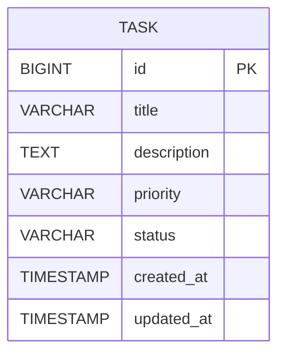

# SpringBoot Low Level Design - Handle Malformed Input Data Gracefully

## 1. Objective

This document outlines the low-level design for implementing robust input validation to handle malformed or unexpected input data gracefully in a SpringBoot application. The system will ensure stability by providing helpful feedback when encountering null, undefined, whitespace-only, special character, or extremely long input data. The implementation will prevent system crashes and maintain data integrity while delivering clear error messages to users.

## 2. SpringBoot Backend Details

### 2.1 Controller Layer

#### REST API Endpoints

| Operation | Method | URL | Request Body | Response Body |
|-----------|--------|-----|--------------|---------------|
| Create Task | POST | /api/tasks | TaskCreateRequest | TaskResponse / ErrorResponse |
| Update Task | PUT | /api/tasks/{id} | TaskUpdateRequest | TaskResponse / ErrorResponse |
| Get Task | GET | /api/tasks/{id} | - | TaskResponse / ErrorResponse |
| List Tasks | GET | /api/tasks | - | List<TaskResponse> / ErrorResponse |

#### Controller Classes

| Class Name | Responsibility | Methods |
|------------|----------------|----------|
| TaskController | Handle HTTP requests for task operations | createTask(), updateTask(), getTask(), listTasks() |
| GlobalExceptionHandler | Handle validation and system exceptions | handleValidationException(), handleConstraintViolation(), handleGenericException() |

#### Exception Handlers

```java
@RestControllerAdvice
public class GlobalExceptionHandler {
    
    @ExceptionHandler(MethodArgumentNotValidException.class)
    public ResponseEntity<ErrorResponse> handleValidationException(MethodArgumentNotValidException ex);
    
    @ExceptionHandler(ConstraintViolationException.class)
    public ResponseEntity<ErrorResponse> handleConstraintViolation(ConstraintViolationException ex);
    
    @ExceptionHandler(InvalidInputException.class)
    public ResponseEntity<ErrorResponse> handleInvalidInput(InvalidInputException ex);
    
    @ExceptionHandler(Exception.class)
    public ResponseEntity<ErrorResponse> handleGenericException(Exception ex);
}
```

### 2.2 Service Layer

#### Business Logic Implementation

```java
@Service
public class TaskService {
    
    @Autowired
    private TaskRepository taskRepository;
    
    @Autowired
    private InputValidationService inputValidationService;
    
    public TaskResponse createTask(TaskCreateRequest request) {
        // Validate input data
        inputValidationService.validateTaskInput(request);
        
        // Sanitize and process input
        Task task = mapToEntity(request);
        task = taskRepository.save(task);
        
        return mapToResponse(task);
    }
    
    public TaskResponse updateTask(Long id, TaskUpdateRequest request) {
        inputValidationService.validateTaskInput(request);
        
        Task existingTask = taskRepository.findById(id)
            .orElseThrow(() -> new TaskNotFoundException("Task not found with id: " + id));
        
        updateTaskFields(existingTask, request);
        Task updatedTask = taskRepository.save(existingTask);
        
        return mapToResponse(updatedTask);
    }
}
```

#### Service Layer Architecture

```java
@Service
public class InputValidationService {
    
    public void validateTaskInput(TaskRequest request) {
        validateTitle(request.getTitle());
        validateDescription(request.getDescription());
        validateCharacterLimits(request);
    }
    
    private void validateTitle(String title) {
        if (title == null) {
            throw new InvalidInputException("Title is required");
        }
        
        if (title.trim().isEmpty()) {
            throw new InvalidInputException("Title cannot be empty or contain only whitespace");
        }
    }
    
    private void validateCharacterLimits(TaskRequest request) {
        if (request.getTitle() != null && request.getTitle().length() > 255) {
            throw new InvalidInputException("Title exceeds maximum character limit of 255");
        }
        
        if (request.getDescription() != null && request.getDescription().length() > 10000) {
            throw new InvalidInputException("Description exceeds maximum character limit of 10000");
        }
    }
}
```

#### Dependency Injection Configuration

```java
@Configuration
@EnableJpaRepositories(basePackages = "com.example.repository")
@ComponentScan(basePackages = "com.example")
public class ApplicationConfig {
    
    @Bean
    public InputValidationService inputValidationService() {
        return new InputValidationService();
    }
    
    @Bean
    public TaskService taskService() {
        return new TaskService();
    }
}
```

#### Validation Rules

| Field Name | Validation | Error Message | Annotation |
|------------|------------|---------------|------------|
| title | @NotNull | Title is required | @NotNull(message = "Title is required") |
| title | @NotBlank | Title cannot be empty or contain only whitespace | @NotBlank(message = "Title cannot be empty or contain only whitespace") |
| title | @Size(max=255) | Title exceeds maximum character limit of 255 | @Size(max = 255, message = "Title exceeds maximum character limit of 255") |
| description | @Size(max=10000) | Description exceeds maximum character limit of 10000 | @Size(max = 10000, message = "Description exceeds maximum character limit of 10000") |
| priority | @Pattern | Invalid priority value | @Pattern(regexp = "^(LOW|MEDIUM|HIGH)$", message = "Priority must be LOW, MEDIUM, or HIGH") |

### 2.3 Repository / Data Access Layer

#### Entity Models

| Entity | Fields | Constraints |
|--------|--------|-------------|
| Task | id (Long), title (String), description (String), priority (String), status (String), createdAt (LocalDateTime), updatedAt (LocalDateTime) | title: NOT NULL, MAX 255 chars; description: MAX 10000 chars |

```java
@Entity
@Table(name = "tasks")
public class Task {
    
    @Id
    @GeneratedValue(strategy = GenerationType.IDENTITY)
    private Long id;
    
    @Column(name = "title", nullable = false, length = 255)
    @NotNull(message = "Title is required")
    @NotBlank(message = "Title cannot be empty or contain only whitespace")
    @Size(max = 255, message = "Title exceeds maximum character limit of 255")
    private String title;
    
    @Column(name = "description", length = 10000)
    @Size(max = 10000, message = "Description exceeds maximum character limit of 10000")
    private String description;
    
    @Column(name = "priority")
    @Pattern(regexp = "^(LOW|MEDIUM|HIGH)$", message = "Priority must be LOW, MEDIUM, or HIGH")
    private String priority;
    
    @Column(name = "status")
    @Pattern(regexp = "^(TODO|IN_PROGRESS|DONE)$", message = "Status must be TODO, IN_PROGRESS, or DONE")
    private String status;
    
    @Column(name = "created_at")
    @CreationTimestamp
    private LocalDateTime createdAt;
    
    
    @Column(name = "updated_at")
    @UpdateTimestamp
    private LocalDateTime updatedAt;
    
    // Constructors, getters, setters
}
```

#### Repository Interfaces

```java
@Repository
public interface TaskRepository extends JpaRepository<Task, Long> {
    
    List<Task> findByStatus(String status);
    
    List<Task> findByPriority(String priority);
    
    @Query("SELECT t FROM Task t WHERE t.title LIKE %:keyword% OR t.description LIKE %:keyword%")
    List<Task> findByTitleOrDescriptionContaining(@Param("keyword") String keyword);
    
    @Query("SELECT COUNT(t) FROM Task t WHERE t.status = :status")
    Long countByStatus(@Param("status") String status);
}
```

#### Custom Queries

```java
@Repository
public class TaskRepositoryCustomImpl {
    
    @PersistenceContext
    private EntityManager entityManager;
    
    public List<Task> findTasksWithValidation() {
        String jpql = "SELECT t FROM Task t WHERE t.title IS NOT NULL AND LENGTH(TRIM(t.title)) > 0";
        return entityManager.createQuery(jpql, Task.class).getResultList();
    }
}
```

### 2.4 Configuration

#### Application Properties

```properties
# application.yml
spring:
  application:
    name: task-management-service
  
  datasource:
    url: jdbc:h2:mem:testdb
    driver-class-name: org.h2.Driver
    username: sa
    password: password
  
  jpa:
    hibernate:
      ddl-auto: create-drop
    show-sql: true
    properties:
      hibernate:
        format_sql: true
  
  validation:
    enabled: true

# Input validation configuration
app:
  validation:
    title:
      max-length: 255
    description:
      max-length: 10000
    special-characters:
      allowed: true
      sanitize: false

logging:
  level:
    com.example: DEBUG
    org.springframework.web: DEBUG
```

#### Spring Configuration Classes

```java
@Configuration
@EnableWebMvc
@EnableJpaRepositories
public class WebConfig implements WebMvcConfigurer {
    
    @Bean
    public Validator validator() {
        return new LocalValidatorFactoryBean();
    }
    
    @Bean
    public MethodValidationPostProcessor methodValidationPostProcessor() {
        MethodValidationPostProcessor processor = new MethodValidationPostProcessor();
        processor.setValidator(validator());
        return processor;
    }
}
```

#### Bean Definitions

```java
@Configuration
public class ValidationConfig {
    
    @Bean
    @ConfigurationProperties(prefix = "app.validation")
    public ValidationProperties validationProperties() {
        return new ValidationProperties();
    }
    
    @Bean
    public InputSanitizer inputSanitizer() {
        return new InputSanitizer();
    }
}
```

### 2.5 Security

#### Authentication Mechanism

```java
@Configuration
@EnableWebSecurity
public class SecurityConfig {
    
    @Bean
    public SecurityFilterChain filterChain(HttpSecurity http) throws Exception {
        http
            .csrf().disable()
            .authorizeHttpRequests(authz -> authz
                .requestMatchers("/api/tasks/**").authenticated()
                .anyRequest().permitAll()
            )
            .httpBasic();
        
        return http.build();
    }
}
```

#### Authorization Rules

- All task operations require authentication
- Input validation occurs before authorization checks
- Malformed requests are rejected at the validation layer

### 2.6 Error Handling

#### Global Exception Handler

```java
@RestControllerAdvice
public class GlobalExceptionHandler {
    
    private static final Logger logger = LoggerFactory.getLogger(GlobalExceptionHandler.class);
    
    @ExceptionHandler(MethodArgumentNotValidException.class)
    @ResponseStatus(HttpStatus.BAD_REQUEST)
    public ErrorResponse handleValidationException(MethodArgumentNotValidException ex) {
        logger.warn("Validation error: {}", ex.getMessage());
        
        List<String> errors = ex.getBindingResult()
            .getFieldErrors()
            .stream()
            .map(FieldError::getDefaultMessage)
            .collect(Collectors.toList());
        
        return ErrorResponse.builder()
            .status(HttpStatus.BAD_REQUEST.value())
            .message("Validation failed")
            .errors(errors)
            .timestamp(LocalDateTime.now())
            .build();
    }
    
    @ExceptionHandler(ConstraintViolationException.class)
    @ResponseStatus(HttpStatus.BAD_REQUEST)
    public ErrorResponse handleConstraintViolation(ConstraintViolationException ex) {
        logger.warn("Constraint violation: {}", ex.getMessage());
        
        List<String> errors = ex.getConstraintViolations()
            .stream()
            .map(ConstraintViolation::getMessage)
            .collect(Collectors.toList());
        
        return ErrorResponse.builder()
            .status(HttpStatus.BAD_REQUEST.value())
            .message("Input validation failed")
            .errors(errors)
            .timestamp(LocalDateTime.now())
            .build();
    }
    
    @ExceptionHandler(InvalidInputException.class)
    @ResponseStatus(HttpStatus.BAD_REQUEST)
    public ErrorResponse handleInvalidInput(InvalidInputException ex) {
        logger.warn("Invalid input: {}", ex.getMessage());
        
        return ErrorResponse.builder()
            .status(HttpStatus.BAD_REQUEST.value())
            .message(ex.getMessage())
            .timestamp(LocalDateTime.now())
            .build();
    }
}
```

#### Custom Exceptions

```java
public class InvalidInputException extends RuntimeException {
    public InvalidInputException(String message) {
        super(message);
    }
    
    public InvalidInputException(String message, Throwable cause) {
        super(message, cause);
    }
}

public class TaskNotFoundException extends RuntimeException {
    public TaskNotFoundException(String message) {
        super(message);
    }
}
```

#### HTTP Status Mapping

| Exception Type | HTTP Status | Description |
|----------------|-------------|-------------|
| MethodArgumentNotValidException | 400 BAD_REQUEST | Bean validation failures |
| ConstraintViolationException | 400 BAD_REQUEST | JPA constraint violations |
| InvalidInputException | 400 BAD_REQUEST | Custom input validation failures |
| TaskNotFoundException | 404 NOT_FOUND | Resource not found |
| Exception | 500 INTERNAL_SERVER_ERROR | Unexpected system errors |

## 3. Database Design

### ER Model (Mermaid)



### Table Schema

| Table | Columns | Data Types | Constraints |
|-------|---------|------------|-------------|
| tasks | id | BIGINT | PRIMARY KEY, AUTO_INCREMENT |
| tasks | title | VARCHAR(255) | NOT NULL |
| tasks | description | TEXT(10000) | NULL |
| tasks | priority | VARCHAR(20) | CHECK (priority IN ('LOW', 'MEDIUM', 'HIGH')) |
| tasks | status | VARCHAR(20) | CHECK (status IN ('TODO', 'IN_PROGRESS', 'DONE')) |
| tasks | created_at | TIMESTAMP | NOT NULL, DEFAULT CURRENT_TIMESTAMP |
| tasks | updated_at | TIMESTAMP | NOT NULL, DEFAULT CURRENT_TIMESTAMP ON UPDATE CURRENT_TIMESTAMP |

### Database Validations

```sql
CREATE TABLE tasks (
    id BIGINT AUTO_INCREMENT PRIMARY KEY,
    title VARCHAR(255) NOT NULL,
    description TEXT(10000),
    priority VARCHAR(20) CHECK (priority IN ('LOW', 'MEDIUM', 'HIGH')),
    status VARCHAR(20) CHECK (status IN ('TODO', 'IN_PROGRESS', 'DONE')),
    created_at TIMESTAMP NOT NULL DEFAULT CURRENT_TIMESTAMP,
    updated_at TIMESTAMP NOT NULL DEFAULT CURRENT_TIMESTAMP ON UPDATE CURRENT_TIMESTAMP,
    
    CONSTRAINT chk_title_not_empty CHECK (LENGTH(TRIM(title)) > 0),
    CONSTRAINT chk_title_length CHECK (LENGTH(title) <= 255),
    CONSTRAINT chk_description_length CHECK (description IS NULL OR LENGTH(description) <= 10000)
);
```

## 4. Non Functional Requirements

### Performance

- Input validation should complete within 50ms for typical requests
- Database constraints should not impact query performance significantly
- Validation errors should be returned within 100ms
- System should handle 1000 concurrent validation requests

### Security

- Input sanitization to prevent XSS attacks
- SQL injection prevention through parameterized queries
- Input length limits to prevent DoS attacks
- Proper error messages without exposing system internals

### Logging and Monitoring

- Log all validation failures with appropriate log levels
- Monitor validation error rates and patterns
- Track performance metrics for validation operations
- Alert on unusual validation failure spikes

```java
@Component
public class ValidationMetrics {
    
    private final MeterRegistry meterRegistry;
    private final Counter validationFailures;
    private final Timer validationTimer;
    
    public ValidationMetrics(MeterRegistry meterRegistry) {
        this.meterRegistry = meterRegistry;
        this.validationFailures = Counter.builder("validation.failures")
            .description("Number of validation failures")
            .register(meterRegistry);
        this.validationTimer = Timer.builder("validation.duration")
            .description("Validation processing time")
            .register(meterRegistry);
    }
    
    public void recordValidationFailure(String validationType) {
        validationFailures.increment(Tags.of("type", validationType));
    }
    
    public Timer.Sample startValidationTimer() {
        return Timer.start(meterRegistry);
    }
}
```

## 5. Dependencies

### Maven Dependencies

```xml
<dependencies>
    <!-- Spring Boot Starters -->
    <dependency>
        <groupId>org.springframework.boot</groupId>
        <artifactId>spring-boot-starter-web</artifactId>
    </dependency>
    
    <dependency>
        <groupId>org.springframework.boot</groupId>
        <artifactId>spring-boot-starter-data-jpa</artifactId>
    </dependency>
    
    <dependency>
        <groupId>org.springframework.boot</groupId>
        <artifactId>spring-boot-starter-validation</artifactId>
    </dependency>
    
    <dependency>
        <groupId>org.springframework.boot</groupId>
        <artifactId>spring-boot-starter-security</artifactId>
    </dependency>
    
    <dependency>
        <groupId>org.springframework.boot</groupId>
        <artifactId>spring-boot-starter-actuator</artifactId>
    </dependency>
    
    <!-- Database -->
    <dependency>
        <groupId>com.h2database</groupId>
        <artifactId>h2</artifactId>
        <scope>runtime</scope>
    </dependency>
    
    <!-- Validation -->
    <dependency>
        <groupId>org.hibernate.validator</groupId>
        <artifactId>hibernate-validator</artifactId>
    </dependency>
    
    <!-- Logging -->
    <dependency>
        <groupId>org.springframework.boot</groupId>
        <artifactId>spring-boot-starter-logging</artifactId>
    </dependency>
    
    <!-- Metrics -->
    <dependency>
        <groupId>io.micrometer</groupId>
        <artifactId>micrometer-core</artifactId>
    </dependency>
    
    <!-- Testing -->
    <dependency>
        <groupId>org.springframework.boot</groupId>
        <artifactId>spring-boot-starter-test</artifactId>
        <scope>test</scope>
    </dependency>
    
    <dependency>
        <groupId>org.springframework.security</groupId>
        <artifactId>spring-security-test</artifactId>
        <scope>test</scope>
    </dependency>
</dependencies>
```

## 6. Assumptions

1. **Character Encoding**: The system assumes UTF-8 encoding for all text inputs to properly handle special characters and emojis.

2. **Database Support**: The implementation assumes the database supports Unicode characters and appropriate text field lengths.

3. **Error Response Format**: All validation errors will be returned in a standardized JSON format with consistent structure.

4. **Performance Requirements**: Input validation is expected to be lightweight and not significantly impact overall system performance.

5. **Special Characters**: The system will store and display special characters (emojis, Unicode symbols) without modification unless explicitly configured for sanitization.

6. **Concurrent Access**: The validation logic is designed to be thread-safe and handle concurrent requests without data corruption.

7. **Logging Level**: Validation failures will be logged at WARN level, while successful validations may be logged at DEBUG level for troubleshooting.

8. **Backward Compatibility**: The validation implementation should not break existing API contracts and should be backward compatible with current client applications.