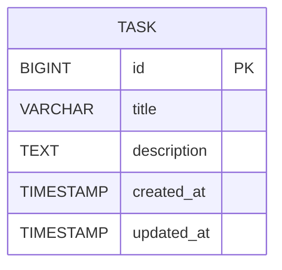

# SpringBoot Low Level Design - DEMO-759

## 1. Objective

This document outlines the low-level design for implementing robust input validation to handle malformed or unexpected input data gracefully in a SpringBoot application. The system must ensure stability and provide helpful feedback when encountering null, undefined, special characters, whitespace-only, or extremely long input data. The implementation focuses on creating a comprehensive validation framework that prevents system crashes and maintains data integrity while delivering clear error messages to users.

## 2. SpringBoot Backend Details

### 2.1 Controller Layer

#### REST API Endpoints

| Operation | Method | URL | Request Body | Response Body |
|-----------|--------|-----|--------------|---------------|
| Create Task | POST | /api/tasks | TaskCreateRequest | TaskResponse / ErrorResponse |
| Update Task | PUT | /api/tasks/{id} | TaskUpdateRequest | TaskResponse / ErrorResponse |
| Get Task | GET | /api/tasks/{id} | - | TaskResponse / ErrorResponse |
| List Tasks | GET | /api/tasks | - | List<TaskResponse> / ErrorResponse |

#### Controller Classes

| Class Name | Responsibility | Methods |
|------------|----------------|----------|
| TaskController | Handle HTTP requests for task operations | createTask(), updateTask(), getTask(), listTasks() |
| GlobalExceptionHandler | Handle validation and system exceptions | handleValidationException(), handleConstraintViolation(), handleGenericException() |

#### Exception Handlers

```java
@RestControllerAdvice
public class GlobalExceptionHandler {
    
    @ExceptionHandler(MethodArgumentNotValidException.class)
    public ResponseEntity<ErrorResponse> handleValidationException(MethodArgumentNotValidException ex);
    
    @ExceptionHandler(ConstraintViolationException.class)
    public ResponseEntity<ErrorResponse> handleConstraintViolation(ConstraintViolationException ex);
    
    @ExceptionHandler(InvalidInputException.class)
    public ResponseEntity<ErrorResponse> handleInvalidInput(InvalidInputException ex);
}
```

### 2.2 Service Layer

#### Business Logic Implementation

```java
@Service
public class TaskService {
    
    @Autowired
    private TaskRepository taskRepository;
    
    @Autowired
    private InputValidationService inputValidationService;
    
    public TaskResponse createTask(TaskCreateRequest request) {
        // Validate input using custom validation service
        inputValidationService.validateTaskInput(request);
        
        // Business logic for task creation
        Task task = mapToEntity(request);
        Task savedTask = taskRepository.save(task);
        return mapToResponse(savedTask);
    }
}
```

#### Service Layer Architecture

- **TaskService**: Core business logic for task operations
- **InputValidationService**: Centralized validation logic for input data
- **TaskMappingService**: Entity-DTO mapping operations

#### Dependency Injection Configuration

```java
@Configuration
public class ServiceConfiguration {
    
    @Bean
    public InputValidationService inputValidationService() {
        return new InputValidationService();
    }
    
    @Bean
    public Validator validator() {
        return Validation.buildDefaultValidatorFactory().getValidator();
    }
}
```

#### Validation Rules

| Field Name | Validation | Error Message | Annotation |
|------------|------------|---------------|------------|
| title | NotNull, NotBlank, Size(max=255) | Title is required | @NotNull @NotBlank @Size(max=255) |
| title | Custom whitespace validation | Title cannot be empty or contain only whitespace | @ValidTitle |
| description | Size(max=10000) | Description exceeds maximum length of 10000 characters | @Size(max=10000) |
| title | Special character handling | - | Custom validation logic |

### 2.3 Repository / Data Access Layer

#### Entity Models

| Entity | Fields | Constraints |
|--------|--------|-------------|
| Task | id (Long), title (String), description (String), createdAt (LocalDateTime), updatedAt (LocalDateTime) | title: NOT NULL, MAX 255 chars; description: MAX 10000 chars |

```java
@Entity
@Table(name = "tasks")
public class Task {
    
    @Id
    @GeneratedValue(strategy = GenerationType.IDENTITY)
    private Long id;
    
    @Column(name = "title", nullable = false, length = 255)
    private String title;
    
    @Column(name = "description", length = 10000)
    private String description;
    
    @Column(name = "created_at")
    private LocalDateTime createdAt;
    
    @Column(name = "updated_at")
    private LocalDateTime updatedAt;
}
```

#### Repository Interfaces

```java
@Repository
public interface TaskRepository extends JpaRepository<Task, Long> {
    
    List<Task> findByTitleContainingIgnoreCase(String title);
    
    @Query("SELECT t FROM Task t WHERE LENGTH(t.title) > :maxLength")
    List<Task> findTasksWithLongTitles(@Param("maxLength") int maxLength);
}
```

#### Custom Queries

- Find tasks by title (case-insensitive)
- Find tasks with titles exceeding specified length
- Custom validation queries for data integrity

### 2.4 Configuration

#### Application Properties

```properties
# application.yml
spring:
  datasource:
    url: jdbc:h2:mem:testdb
    driver-class-name: org.h2.Driver
    username: sa
    password: password
  
  jpa:
    hibernate:
      ddl-auto: create-drop
    show-sql: true
    properties:
      hibernate:
        format_sql: true

# Validation Configuration
validation:
  title:
    max-length: 255
    min-length: 1
  description:
    max-length: 10000
  
# Logging Configuration
logging:
  level:
    com.example.taskmanagement: DEBUG
    org.springframework.web: DEBUG
```

#### Spring Configuration Classes

```java
@Configuration
@EnableJpaRepositories
@EnableWebMvc
public class ApplicationConfiguration {
    
    @Bean
    public LocalValidatorFactoryBean validator() {
        return new LocalValidatorFactoryBean();
    }
    
    @Bean
    public MethodValidationPostProcessor methodValidationPostProcessor() {
        return new MethodValidationPostProcessor();
    }
}
```

#### Bean Definitions

- Validator beans for input validation
- Method validation post-processor
- Custom validation constraint validators

### 2.5 Security

#### Authentication Mechanism

- Basic HTTP authentication for API endpoints
- JWT token-based authentication for stateless operations

#### Authorization Rules

- All task operations require authenticated user
- Input validation applies to all authenticated requests

#### JWT / Token Handling

```java
@Component
public class JwtAuthenticationFilter extends OncePerRequestFilter {
    
    @Override
    protected void doFilterInternal(HttpServletRequest request, 
                                  HttpServletResponse response, 
                                  FilterChain filterChain) {
        // JWT validation logic
    }
}
```

### 2.6 Error Handling

#### Global Exception Handler

```java
@RestControllerAdvice
public class GlobalExceptionHandler {
    
    @ExceptionHandler(MethodArgumentNotValidException.class)
    public ResponseEntity<ErrorResponse> handleValidationException(MethodArgumentNotValidException ex) {
        List<String> errors = ex.getBindingResult()
            .getFieldErrors()
            .stream()
            .map(FieldError::getDefaultMessage)
            .collect(Collectors.toList());
        
        ErrorResponse errorResponse = new ErrorResponse("VALIDATION_ERROR", errors);
        return ResponseEntity.badRequest().body(errorResponse);
    }
}
```

#### Custom Exceptions

```java
public class InvalidInputException extends RuntimeException {
    public InvalidInputException(String message) {
        super(message);
    }
}

public class TitleValidationException extends InvalidInputException {
    public TitleValidationException(String message) {
        super(message);
    }
}
```

#### HTTP Status Mapping

| Exception Type | HTTP Status | Error Code |
|----------------|-------------|------------|
| MethodArgumentNotValidException | 400 BAD_REQUEST | VALIDATION_ERROR |
| ConstraintViolationException | 400 BAD_REQUEST | CONSTRAINT_VIOLATION |
| InvalidInputException | 400 BAD_REQUEST | INVALID_INPUT |
| TitleValidationException | 400 BAD_REQUEST | TITLE_VALIDATION_ERROR |
| Generic Exception | 500 INTERNAL_SERVER_ERROR | INTERNAL_ERROR |

## 3. Database Design

### ER Model (Mermaid)



### Table Schema

| Table | Columns | Data Types | Constraints |
|-------|---------|------------|-------------|
| tasks | id | BIGINT | PRIMARY KEY, AUTO_INCREMENT |
| tasks | title | VARCHAR(255) | NOT NULL |
| tasks | description | TEXT(10000) | NULL |
| tasks | created_at | TIMESTAMP | DEFAULT CURRENT_TIMESTAMP |
| tasks | updated_at | TIMESTAMP | DEFAULT CURRENT_TIMESTAMP ON UPDATE CURRENT_TIMESTAMP |

### Database Validations

- Title field: NOT NULL constraint, maximum 255 characters
- Description field: maximum 10000 characters
- Automatic timestamp management for audit trail
- Index on title field for search performance

## 4. Non Functional Requirements

### Performance

- Input validation should complete within 100ms for standard requests
- Database queries optimized with appropriate indexing
- Connection pooling configured for concurrent request handling
- Caching strategy for frequently accessed validation rules

### Security

- Input sanitization to prevent XSS and SQL injection attacks
- Rate limiting on API endpoints to prevent abuse
- Secure error messages that don't expose system internals
- Input length limits to prevent DoS attacks

### Logging and Monitoring

- Comprehensive logging of validation failures
- Metrics collection for validation performance
- Alert mechanisms for unusual validation patterns
- Audit trail for all input validation events

```java
@Component
public class ValidationMetrics {
    
    private final MeterRegistry meterRegistry;
    
    public void recordValidationFailure(String validationType) {
        Counter.builder("validation.failures")
            .tag("type", validationType)
            .register(meterRegistry)
            .increment();
    }
}
```

## 5. Dependencies

### Maven Dependencies

```xml
<dependencies>
    <!-- Spring Boot Starters -->
    <dependency>
        <groupId>org.springframework.boot</groupId>
        <artifactId>spring-boot-starter-web</artifactId>
    </dependency>
    
    <dependency>
        <groupId>org.springframework.boot</groupId>
        <artifactId>spring-boot-starter-data-jpa</artifactId>
    </dependency>
    
    <dependency>
        <groupId>org.springframework.boot</groupId>
        <artifactId>spring-boot-starter-validation</artifactId>
    </dependency>
    
    <dependency>
        <groupId>org.springframework.boot</groupId>
        <artifactId>spring-boot-starter-security</artifactId>
    </dependency>
    
    <!-- Database -->
    <dependency>
        <groupId>com.h2database</groupId>
        <artifactId>h2</artifactId>
        <scope>runtime</scope>
    </dependency>
    
    <!-- Validation -->
    <dependency>
        <groupId>org.hibernate.validator</groupId>
        <artifactId>hibernate-validator</artifactId>
    </dependency>
    
    <!-- Monitoring -->
    <dependency>
        <groupId>org.springframework.boot</groupId>
        <artifactId>spring-boot-starter-actuator</artifactId>
    </dependency>
    
    <dependency>
        <groupId>io.micrometer</groupId>
        <artifactId>micrometer-registry-prometheus</artifactId>
    </dependency>
    
    <!-- Testing -->
    <dependency>
        <groupId>org.springframework.boot</groupId>
        <artifactId>spring-boot-starter-test</artifactId>
        <scope>test</scope>
    </dependency>
</dependencies>
```

## 6. Assumptions

1. **Character Encoding**: UTF-8 encoding is used throughout the application to properly handle special characters and emojis

2. **Database Support**: The underlying database supports Unicode characters and can store emojis and special symbols

3. **Client Behavior**: Client applications will handle and display validation error messages appropriately

4. **Performance Requirements**: Standard web application performance expectations (sub-second response times)

5. **Scalability**: The application will handle moderate concurrent load (up to 1000 concurrent users)

6. **Security Context**: Basic authentication is sufficient for the current implementation phase

7. **Monitoring Infrastructure**: Prometheus and Grafana are available for metrics collection and visualization

8. **Development Environment**: H2 in-memory database is acceptable for development and testing phases

9. **Error Handling**: English language error messages are sufficient for the initial implementation

10. **Validation Rules**: Current validation rules are comprehensive enough to handle the specified acceptance criteria without additional custom validations