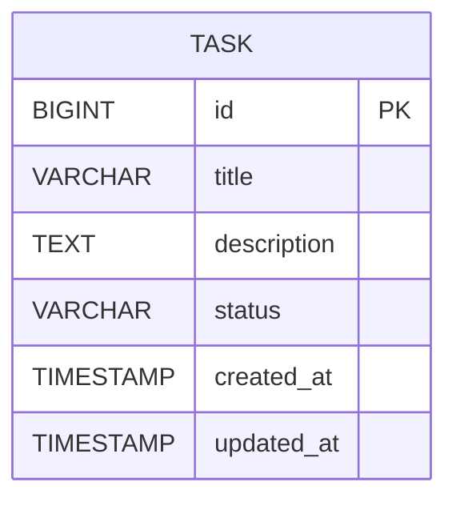

# SpringBoot Low Level Design - Handle System Errors During Task Creation

## 1. Objective

This document outlines the implementation of comprehensive error handling mechanisms for task creation operations in a SpringBoot application. The system will provide clear, user-friendly feedback when database connection failures, timeouts, or unexpected server errors occur during task creation. The implementation ensures user input preservation and proper error logging for system monitoring and debugging purposes.

## 2. SpringBoot Backend Details

### 2.1 Controller Layer

#### REST API Endpoints

| Operation | Method | URL | Request Body | Response Body |
|-----------|--------|-----|--------------|---------------|
| Create Task | POST | /api/tasks | TaskCreateRequest | TaskResponse / ErrorResponse |
| Get Task | GET | /api/tasks/{id} | None | TaskResponse / ErrorResponse |
| Update Task | PUT | /api/tasks/{id} | TaskUpdateRequest | TaskResponse / ErrorResponse |
| Delete Task | DELETE | /api/tasks/{id} | None | SuccessResponse / ErrorResponse |

#### Controller Classes

| Class Name | Responsibility | Methods |
|------------|----------------|----------|
| TaskController | Handle HTTP requests for task operations | createTask(), getTask(), updateTask(), deleteTask() |
| GlobalExceptionHandler | Handle all application exceptions globally | handleDatabaseException(), handleTimeoutException(), handleGenericException() |

#### Exception Handlers

```java
@RestControllerAdvice
public class GlobalExceptionHandler {
    
    @ExceptionHandler(DatabaseConnectionException.class)
    public ResponseEntity<ErrorResponse> handleDatabaseException(DatabaseConnectionException ex) {
        ErrorResponse error = new ErrorResponse(
            "SERVICE_UNAVAILABLE",
            "Service temporarily unavailable, please try again later",
            System.currentTimeMillis()
        );
        return ResponseEntity.status(HttpStatus.SERVICE_UNAVAILABLE).body(error);
    }
    
    @ExceptionHandler(TimeoutException.class)
    public ResponseEntity<ErrorResponse> handleTimeoutException(TimeoutException ex) {
        ErrorResponse error = new ErrorResponse(
            "REQUEST_TIMEOUT",
            "Request timed out, please try again",
            System.currentTimeMillis()
        );
        return ResponseEntity.status(HttpStatus.REQUEST_TIMEOUT).body(error);
    }
    
    @ExceptionHandler(Exception.class)
    public ResponseEntity<ErrorResponse> handleGenericException(Exception ex) {
        ErrorResponse error = new ErrorResponse(
            "INTERNAL_SERVER_ERROR",
            "An unexpected error occurred, please try again",
            System.currentTimeMillis()
        );
        return ResponseEntity.status(HttpStatus.INTERNAL_SERVER_ERROR).body(error);
    }
}
```

### 2.2 Service Layer

#### Business Logic Implementation

```java
@Service
@Transactional
public class TaskService {
    
    @Autowired
    private TaskRepository taskRepository;
    
    @Autowired
    private TaskValidator taskValidator;
    
    @Retryable(value = {TransientDataAccessException.class}, maxAttempts = 3)
    public TaskResponse createTask(TaskCreateRequest request) {
        try {
            // Validate input
            taskValidator.validateCreateRequest(request);
            
            // Create task entity
            Task task = new Task();
            task.setTitle(request.getTitle());
            task.setDescription(request.getDescription());
            task.setStatus(TaskStatus.PENDING);
            task.setCreatedAt(LocalDateTime.now());
            
            // Save to database with timeout handling
            Task savedTask = taskRepository.save(task);
            
            return TaskResponse.from(savedTask);
            
        } catch (DataAccessException ex) {
            throw new DatabaseConnectionException("Database operation failed", ex);
        } catch (QueryTimeoutException ex) {
            throw new TimeoutException("Database operation timed out", ex);
        }
    }
}
```

#### Service Layer Architecture
- TaskService: Core business logic for task operations
- TaskValidator: Input validation and business rule enforcement
- ErrorLoggingService: Centralized error logging and monitoring

#### Dependency Injection Configuration

```java
@Configuration
public class ServiceConfiguration {
    
    @Bean
    public TaskValidator taskValidator() {
        return new TaskValidator();
    }
    
    @Bean
    public ErrorLoggingService errorLoggingService() {
        return new ErrorLoggingService();
    }
}
```

#### Validation Rules

| Field Name | Validation | Error Message | Annotation |
|------------|------------|---------------|------------|
| title | Not null, length 1-200 | Title is required and must be between 1-200 characters | @NotBlank @Size(min=1, max=200) |
| description | Not null, length 1-1000 | Description is required and must be between 1-1000 characters | @NotBlank @Size(min=1, max=1000) |
| status | Valid enum value | Invalid task status | @NotNull |

### 2.3 Repository / Data Access Layer

#### Entity Models

| Entity | Fields | Constraints |
|--------|--------|-------------|
| Task | id (Long), title (String), description (String), status (TaskStatus), createdAt (LocalDateTime), updatedAt (LocalDateTime) | id: Primary Key, Auto-generated; title: Not null, max 200 chars; description: Not null, max 1000 chars |

```java
@Entity
@Table(name = "tasks")
public class Task {
    @Id
    @GeneratedValue(strategy = GenerationType.IDENTITY)
    private Long id;
    
    @Column(nullable = false, length = 200)
    private String title;
    
    @Column(nullable = false, length = 1000)
    private String description;
    
    @Enumerated(EnumType.STRING)
    @Column(nullable = false)
    private TaskStatus status;
    
    @Column(name = "created_at", nullable = false)
    private LocalDateTime createdAt;
    
    @Column(name = "updated_at")
    private LocalDateTime updatedAt;
}
```

#### Repository Interfaces

```java
@Repository
public interface TaskRepository extends JpaRepository<Task, Long> {
    
    @Query("SELECT t FROM Task t WHERE t.status = :status")
    List<Task> findByStatus(@Param("status") TaskStatus status);
    
    @Modifying
    @Query("UPDATE Task t SET t.status = :status, t.updatedAt = :updatedAt WHERE t.id = :id")
    int updateTaskStatus(@Param("id") Long id, @Param("status") TaskStatus status, @Param("updatedAt") LocalDateTime updatedAt);
}
```

#### Custom Queries
- findByStatus: Retrieve tasks by status
- updateTaskStatus: Update task status with timestamp

### 2.4 Configuration

#### Application Properties

```properties
# Database Configuration
spring.datasource.url=jdbc:postgresql://localhost:5432/taskdb
spring.datasource.username=${DB_USERNAME:taskuser}
spring.datasource.password=${DB_PASSWORD:taskpass}
spring.datasource.driver-class-name=org.postgresql.Driver

# Connection Pool Settings
spring.datasource.hikari.maximum-pool-size=20
spring.datasource.hikari.minimum-idle=5
spring.datasource.hikari.connection-timeout=30000
spring.datasource.hikari.idle-timeout=600000
spring.datasource.hikari.max-lifetime=1800000

# JPA Configuration
spring.jpa.hibernate.ddl-auto=validate
spring.jpa.show-sql=false
spring.jpa.properties.hibernate.dialect=org.hibernate.dialect.PostgreSQLDialect
spring.jpa.properties.hibernate.jdbc.time_zone=UTC

# Transaction Timeout
spring.transaction.default-timeout=30

# Retry Configuration
spring.retry.max-attempts=3
spring.retry.backoff.delay=1000

# Logging Configuration
logging.level.com.example.task=INFO
logging.level.org.springframework.retry=DEBUG
```

#### Spring Configuration Classes

```java
@Configuration
@EnableRetry
@EnableTransactionManagement
public class ApplicationConfiguration {
    
    @Bean
    public RetryTemplate retryTemplate() {
        RetryTemplate retryTemplate = new RetryTemplate();
        
        FixedBackOffPolicy backOffPolicy = new FixedBackOffPolicy();
        backOffPolicy.setBackOffPeriod(1000L);
        retryTemplate.setBackOffPolicy(backOffPolicy);
        
        SimpleRetryPolicy retryPolicy = new SimpleRetryPolicy();
        retryPolicy.setMaxAttempts(3);
        retryTemplate.setRetryPolicy(retryPolicy);
        
        return retryTemplate;
    }
}
```

### 2.5 Security

#### Authentication Mechanism
- JWT-based authentication for API access
- Role-based authorization for task operations

#### Authorization Rules
- USER role: Can create, read, update own tasks
- ADMIN role: Can perform all operations on all tasks

#### JWT / Token Handling
```java
@Component
public class JwtAuthenticationFilter extends OncePerRequestFilter {
    // JWT validation and authentication logic
}
```

### 2.6 Error Handling

#### Global Exception Handler
- Centralized exception handling using @RestControllerAdvice
- Consistent error response format across all endpoints
- Proper HTTP status code mapping

#### Custom Exceptions

```java
public class DatabaseConnectionException extends RuntimeException {
    public DatabaseConnectionException(String message, Throwable cause) {
        super(message, cause);
    }
}

public class TimeoutException extends RuntimeException {
    public TimeoutException(String message, Throwable cause) {
        super(message, cause);
    }
}
```

#### HTTP Status Mapping

| Exception Type | HTTP Status | Error Code |
|----------------|-------------|------------|
| DatabaseConnectionException | 503 Service Unavailable | SERVICE_UNAVAILABLE |
| TimeoutException | 408 Request Timeout | REQUEST_TIMEOUT |
| ValidationException | 400 Bad Request | VALIDATION_ERROR |
| Generic Exception | 500 Internal Server Error | INTERNAL_SERVER_ERROR |

## 3. Database Design

### ER Model (Mermaid)



### Table Schema

| Table | Columns | Data Types | Constraints |
|-------|---------|------------|-------------|
| tasks | id | BIGINT | PRIMARY KEY, AUTO_INCREMENT |
| tasks | title | VARCHAR(200) | NOT NULL |
| tasks | description | TEXT | NOT NULL |
| tasks | status | VARCHAR(20) | NOT NULL, CHECK (status IN ('PENDING', 'IN_PROGRESS', 'COMPLETED', 'CANCELLED')) |
| tasks | created_at | TIMESTAMP | NOT NULL, DEFAULT CURRENT_TIMESTAMP |
| tasks | updated_at | TIMESTAMP | NULL |

### Database Validations

```sql
CREATE TABLE tasks (
    id BIGSERIAL PRIMARY KEY,
    title VARCHAR(200) NOT NULL,
    description TEXT NOT NULL,
    status VARCHAR(20) NOT NULL CHECK (status IN ('PENDING', 'IN_PROGRESS', 'COMPLETED', 'CANCELLED')),
    created_at TIMESTAMP NOT NULL DEFAULT CURRENT_TIMESTAMP,
    updated_at TIMESTAMP
);

CREATE INDEX idx_tasks_status ON tasks(status);
CREATE INDEX idx_tasks_created_at ON tasks(created_at);
```

## 4. Non Functional Requirements

### Performance
- Database connection pooling with HikariCP
- Query timeout configuration (30 seconds)
- Retry mechanism for transient failures (max 3 attempts)
- Database indexing on frequently queried columns
- Connection pool monitoring and metrics

### Security
- Input validation to prevent SQL injection
- JWT token validation for API access
- Role-based access control
- Sensitive data encryption in logs
- HTTPS enforcement for all API endpoints

### Logging and Monitoring
- Structured logging with correlation IDs
- Error tracking and alerting
- Database connection monitoring
- Performance metrics collection
- Health check endpoints for system monitoring

```java
@Component
public class ErrorLoggingService {
    
    private static final Logger logger = LoggerFactory.getLogger(ErrorLoggingService.class);
    
    public void logError(String operation, Exception ex, String correlationId) {
        logger.error("Operation: {}, CorrelationId: {}, Error: {}", 
                    operation, correlationId, ex.getMessage(), ex);
    }
}
```

## 5. Dependencies

### Maven Dependencies

```xml
<dependencies>
    <!-- Spring Boot Starters -->
    <dependency>
        <groupId>org.springframework.boot</groupId>
        <artifactId>spring-boot-starter-web</artifactId>
    </dependency>
    <dependency>
        <groupId>org.springframework.boot</groupId>
        <artifactId>spring-boot-starter-data-jpa</artifactId>
    </dependency>
    <dependency>
        <groupId>org.springframework.boot</groupId>
        <artifactId>spring-boot-starter-validation</artifactId>
    </dependency>
    <dependency>
        <groupId>org.springframework.boot</groupId>
        <artifactId>spring-boot-starter-security</artifactId>
    </dependency>
    <dependency>
        <groupId>org.springframework.retry</groupId>
        <artifactId>spring-retry</artifactId>
    </dependency>
    
    <!-- Database -->
    <dependency>
        <groupId>org.postgresql</groupId>
        <artifactId>postgresql</artifactId>
        <scope>runtime</scope>
    </dependency>
    <dependency>
        <groupId>com.zaxxer</groupId>
        <artifactId>HikariCP</artifactId>
    </dependency>
    
    <!-- JWT -->
    <dependency>
        <groupId>io.jsonwebtoken</groupId>
        <artifactId>jjwt-api</artifactId>
        <version>0.11.5</version>
    </dependency>
    
    <!-- Logging -->
    <dependency>
        <groupId>net.logstash.logback</groupId>
        <artifactId>logstash-logback-encoder</artifactId>
        <version>7.2</version>
    </dependency>
    
    <!-- Testing -->
    <dependency>
        <groupId>org.springframework.boot</groupId>
        <artifactId>spring-boot-starter-test</artifactId>
        <scope>test</scope>
    </dependency>
    <dependency>
        <groupId>org.testcontainers</groupId>
        <artifactId>postgresql</artifactId>
        <scope>test</scope>
    </dependency>
</dependencies>
```

## 6. Assumptions

1. **Database Technology**: PostgreSQL is used as the primary database
2. **Authentication**: JWT-based authentication is already implemented
3. **Frontend Integration**: Frontend application can handle error responses and preserve user input
4. **Monitoring**: Application monitoring infrastructure (e.g., Prometheus, Grafana) is available
5. **Deployment**: Application is deployed in a containerized environment with proper health checks
6. **Error Recovery**: Users are expected to retry operations after receiving error messages
7. **Data Persistence**: Task data persistence requirements are met with standard ACID properties
8. **Scalability**: Current design supports moderate load; horizontal scaling may require additional considerations
