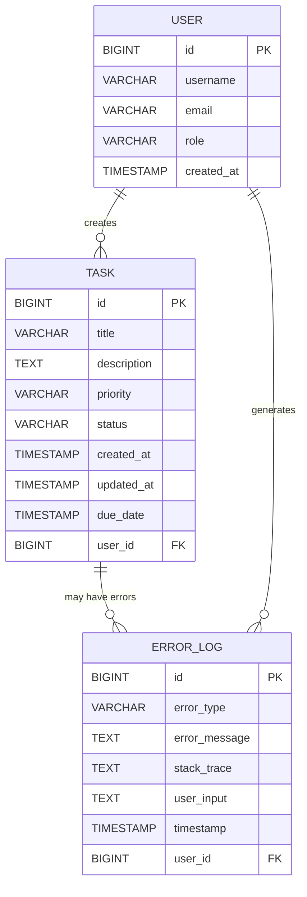

# SpringBoot Low Level Design - Handle System Errors During Task Creation

## 1. Objective

This document outlines the low-level design for implementing comprehensive system error handling during task creation in a SpringBoot application. The system will provide clear feedback to users when database connection failures, timeouts, or unexpected server errors occur during task creation operations. The implementation ensures user input preservation and proper error logging for investigation while maintaining a robust and user-friendly experience.

## 2. SpringBoot Backend Details

### 2.1 Controller Layer

#### REST API Endpoints

| Operation | Method | URL | Request Body | Response Body |
|-----------|--------|-----|--------------|---------------|
| Create Task | POST | /api/tasks | TaskCreateRequest | TaskResponse / ErrorResponse |
| Get Task | GET | /api/tasks/{id} | - | TaskResponse / ErrorResponse |
| Update Task | PUT | /api/tasks/{id} | TaskUpdateRequest | TaskResponse / ErrorResponse |
| Delete Task | DELETE | /api/tasks/{id} | - | SuccessResponse / ErrorResponse |

#### Controller Classes

| Class Name | Responsibility | Methods |
|------------|----------------|----------|
| TaskController | Handle HTTP requests for task operations | createTask(), getTask(), updateTask(), deleteTask() |
| GlobalExceptionHandler | Handle all application exceptions globally | handleDatabaseException(), handleTimeoutException(), handleGenericException() |

#### Exception Handlers

```java
@RestControllerAdvice
public class GlobalExceptionHandler {
    
    @ExceptionHandler(DatabaseConnectionException.class)
    public ResponseEntity<ErrorResponse> handleDatabaseException(DatabaseConnectionException ex) {
        ErrorResponse error = new ErrorResponse(
            "SERVICE_UNAVAILABLE",
            "Service temporarily unavailable, please try again later",
            ex.getPreservedInput()
        );
        return ResponseEntity.status(HttpStatus.SERVICE_UNAVAILABLE).body(error);
    }
    
    @ExceptionHandler(TimeoutException.class)
    public ResponseEntity<ErrorResponse> handleTimeoutException(TimeoutException ex) {
        ErrorResponse error = new ErrorResponse(
            "REQUEST_TIMEOUT",
            "Request timed out, please try again",
            ex.getPreservedInput()
        );
        return ResponseEntity.status(HttpStatus.REQUEST_TIMEOUT).body(error);
    }
    
    @ExceptionHandler(Exception.class)
    public ResponseEntity<ErrorResponse> handleGenericException(Exception ex) {
        logger.error("Unexpected error occurred", ex);
        ErrorResponse error = new ErrorResponse(
            "INTERNAL_SERVER_ERROR",
            "An unexpected error occurred, please try again",
            null
        );
        return ResponseEntity.status(HttpStatus.INTERNAL_SERVER_ERROR).body(error);
    }
}
```

### 2.2 Service Layer

#### Business Logic Implementation

```java
@Service
@Transactional
public class TaskService {
    
    @Autowired
    private TaskRepository taskRepository;
    
    @Autowired
    private ErrorHandlingService errorHandlingService;
    
    public TaskResponse createTask(TaskCreateRequest request) {
        try {
            // Validate input
            validateTaskRequest(request);
            
            // Create task entity
            Task task = mapToEntity(request);
            
            // Save with timeout handling
            Task savedTask = saveWithRetry(task, request);
            
            return mapToResponse(savedTask);
            
        } catch (DataAccessException ex) {
            throw new DatabaseConnectionException("Database connection failed", request);
        } catch (QueryTimeoutException ex) {
            throw new TimeoutException("Storage operation timed out", request);
        } catch (Exception ex) {
            errorHandlingService.logError(ex, request);
            throw new SystemException("Unexpected error during task creation", ex);
        }
    }
    
    private Task saveWithRetry(Task task, TaskCreateRequest originalRequest) {
        try {
            return taskRepository.save(task);
        } catch (Exception ex) {
            // Preserve original input for error response
            throw new DatabaseOperationException(ex.getMessage(), originalRequest, ex);
        }
    }
}
```

#### Service Layer Architecture
- TaskService: Core business logic for task operations
- ErrorHandlingService: Centralized error logging and handling
- ValidationService: Input validation and business rule enforcement

#### Dependency Injection Configuration

```java
@Configuration
public class ServiceConfiguration {
    
    @Bean
    public ErrorHandlingService errorHandlingService() {
        return new ErrorHandlingService();
    }
    
    @Bean
    public ValidationService validationService() {
        return new ValidationService();
    }
}
```

#### Validation Rules

| Field Name | Validation | Error Message | Annotation |
|------------|------------|---------------|------------|
| title | NotBlank, Size(1-100) | Title is required and must be between 1-100 characters | @NotBlank @Size(min=1, max=100) |
| description | Size(max=500) | Description must not exceed 500 characters | @Size(max=500) |
| priority | NotNull, Valid Enum | Priority must be specified (LOW, MEDIUM, HIGH) | @NotNull @ValidEnum |
| dueDate | Future | Due date must be in the future | @Future |

### 2.3 Repository / Data Access Layer

#### Entity Models

| Entity | Fields | Constraints |
|--------|--------|-------------|
| Task | id (Long), title (String), description (String), priority (Priority), status (TaskStatus), createdAt (LocalDateTime), updatedAt (LocalDateTime), dueDate (LocalDateTime) | id: @Id @GeneratedValue, title: @NotBlank @Size(max=100), priority: @Enumerated |
| ErrorLog | id (Long), errorType (String), errorMessage (String), stackTrace (String), userInput (String), timestamp (LocalDateTime) | id: @Id @GeneratedValue, errorType: @NotBlank |

#### Repository Interfaces

```java
@Repository
public interface TaskRepository extends JpaRepository<Task, Long> {
    
    @Query("SELECT t FROM Task t WHERE t.status = :status")
    List<Task> findByStatus(@Param("status") TaskStatus status);
    
    @Query("SELECT t FROM Task t WHERE t.createdAt BETWEEN :startDate AND :endDate")
    List<Task> findTasksCreatedBetween(@Param("startDate") LocalDateTime startDate, 
                                      @Param("endDate") LocalDateTime endDate);
}

@Repository
public interface ErrorLogRepository extends JpaRepository<ErrorLog, Long> {
    
    @Query("SELECT e FROM ErrorLog e WHERE e.errorType = :errorType AND e.timestamp >= :since")
    List<ErrorLog> findRecentErrorsByType(@Param("errorType") String errorType, 
                                         @Param("since") LocalDateTime since);
}
```

#### Custom Queries

```java
@Query(value = "SELECT * FROM tasks WHERE status = ?1 AND created_at > ?2 ORDER BY created_at DESC", 
       nativeQuery = true)
List<Task> findRecentTasksByStatus(String status, LocalDateTime since);
```

### 2.4 Configuration

#### Application Properties

```properties
# Database Configuration
spring.datasource.url=jdbc:postgresql://localhost:5432/taskdb
spring.datasource.username=${DB_USERNAME:taskuser}
spring.datasource.password=${DB_PASSWORD:taskpass}
spring.datasource.driver-class-name=org.postgresql.Driver

# Connection Pool Settings
spring.datasource.hikari.maximum-pool-size=20
spring.datasource.hikari.minimum-idle=5
spring.datasource.hikari.connection-timeout=30000
spring.datasource.hikari.idle-timeout=600000
spring.datasource.hikari.max-lifetime=1800000

# JPA Configuration
spring.jpa.hibernate.ddl-auto=validate
spring.jpa.show-sql=false
spring.jpa.properties.hibernate.dialect=org.hibernate.dialect.PostgreSQLDialect
spring.jpa.properties.hibernate.jdbc.time_zone=UTC

# Transaction Timeout
spring.transaction.default-timeout=30

# Logging Configuration
logging.level.com.taskapp.service=INFO
logging.level.com.taskapp.exception=ERROR
logging.pattern.console=%d{yyyy-MM-dd HH:mm:ss} - %msg%n

# Error Handling Configuration
app.error.retry.max-attempts=3
app.error.retry.delay=1000
app.error.preserve-input=true
```

#### Spring Configuration Classes

```java
@Configuration
@EnableTransactionManagement
public class DatabaseConfiguration {
    
    @Bean
    @Primary
    public DataSource dataSource() {
        HikariConfig config = new HikariConfig();
        config.setJdbcUrl(environment.getProperty("spring.datasource.url"));
        config.setUsername(environment.getProperty("spring.datasource.username"));
        config.setPassword(environment.getProperty("spring.datasource.password"));
        config.setMaximumPoolSize(20);
        config.setConnectionTimeout(30000);
        return new HikariDataSource(config);
    }
    
    @Bean
    public PlatformTransactionManager transactionManager(EntityManagerFactory emf) {
        JpaTransactionManager transactionManager = new JpaTransactionManager();
        transactionManager.setEntityManagerFactory(emf);
        transactionManager.setDefaultTimeout(30);
        return transactionManager;
    }
}
```

#### Bean Definitions

```java
@Configuration
public class ErrorHandlingConfiguration {
    
    @Bean
    public RetryTemplate retryTemplate() {
        RetryTemplate retryTemplate = new RetryTemplate();
        
        FixedBackOffPolicy backOffPolicy = new FixedBackOffPolicy();
        backOffPolicy.setBackOffPeriod(1000L);
        retryTemplate.setBackOffPolicy(backOffPolicy);
        
        SimpleRetryPolicy retryPolicy = new SimpleRetryPolicy();
        retryPolicy.setMaxAttempts(3);
        retryTemplate.setRetryPolicy(retryPolicy);
        
        return retryTemplate;
    }
}
```

### 2.5 Security

#### Authentication Mechanism
- JWT-based authentication for API access
- Role-based access control (RBAC)
- Session management for error context preservation

#### Authorization Rules
- USER role: Can create, read, update own tasks
- ADMIN role: Can perform all operations on all tasks
- Error logs accessible only to ADMIN role

#### JWT / Token Handling

```java
@Component
public class JwtAuthenticationFilter extends OncePerRequestFilter {
    
    @Override
    protected void doFilterInternal(HttpServletRequest request, 
                                  HttpServletResponse response, 
                                  FilterChain filterChain) throws ServletException, IOException {
        try {
            String token = extractToken(request);
            if (token != null && jwtUtil.validateToken(token)) {
                Authentication auth = jwtUtil.getAuthentication(token);
                SecurityContextHolder.getContext().setAuthentication(auth);
            }
        } catch (Exception ex) {
            logger.error("Authentication error", ex);
            response.setStatus(HttpStatus.UNAUTHORIZED.value());
            return;
        }
        
        filterChain.doFilter(request, response);
    }
}
```

### 2.6 Error Handling

#### Global Exception Handler

```java
@RestControllerAdvice
public class GlobalExceptionHandler {
    
    private static final Logger logger = LoggerFactory.getLogger(GlobalExceptionHandler.class);
    
    @ExceptionHandler(DatabaseConnectionException.class)
    public ResponseEntity<ErrorResponse> handleDatabaseException(DatabaseConnectionException ex, 
                                                               HttpServletRequest request) {
        logError(ex, request);
        ErrorResponse error = ErrorResponse.builder()
            .code("SERVICE_UNAVAILABLE")
            .message("Service temporarily unavailable, please try again later")
            .preservedInput(ex.getPreservedInput())
            .timestamp(LocalDateTime.now())
            .build();
        return ResponseEntity.status(HttpStatus.SERVICE_UNAVAILABLE).body(error);
    }
    
    @ExceptionHandler(TimeoutException.class)
    public ResponseEntity<ErrorResponse> handleTimeoutException(TimeoutException ex, 
                                                              HttpServletRequest request) {
        logError(ex, request);
        ErrorResponse error = ErrorResponse.builder()
            .code("REQUEST_TIMEOUT")
            .message("Request timed out, please try again")
            .preservedInput(ex.getPreservedInput())
            .timestamp(LocalDateTime.now())
            .build();
        return ResponseEntity.status(HttpStatus.REQUEST_TIMEOUT).body(error);
    }
}
```

#### Custom Exceptions

```java
public class DatabaseConnectionException extends RuntimeException {
    private final Object preservedInput;
    
    public DatabaseConnectionException(String message, Object preservedInput) {
        super(message);
        this.preservedInput = preservedInput;
    }
    
    public Object getPreservedInput() {
        return preservedInput;
    }
}

public class TimeoutException extends RuntimeException {
    private final Object preservedInput;
    
    public TimeoutException(String message, Object preservedInput) {
        super(message);
        this.preservedInput = preservedInput;
    }
    
    public Object getPreservedInput() {
        return preservedInput;
    }
}
```

#### HTTP Status Mapping

| Exception Type | HTTP Status | Error Code |
|----------------|-------------|------------|
| DatabaseConnectionException | 503 Service Unavailable | SERVICE_UNAVAILABLE |
| TimeoutException | 408 Request Timeout | REQUEST_TIMEOUT |
| ValidationException | 400 Bad Request | VALIDATION_ERROR |
| UnauthorizedException | 401 Unauthorized | UNAUTHORIZED |
| ForbiddenException | 403 Forbidden | FORBIDDEN |
| NotFoundException | 404 Not Found | NOT_FOUND |
| Generic Exception | 500 Internal Server Error | INTERNAL_SERVER_ERROR |

## 3. Database Design

### ER Model (Mermaid)



### Table Schema

| Table | Columns | Data Types | Constraints |
|-------|---------|------------|-------------|
| tasks | id, title, description, priority, status, created_at, updated_at, due_date, user_id | BIGINT, VARCHAR(100), TEXT, VARCHAR(20), VARCHAR(20), TIMESTAMP, TIMESTAMP, TIMESTAMP, BIGINT | PK(id), NOT NULL(title, priority, status), FK(user_id) |
| error_logs | id, error_type, error_message, stack_trace, user_input, timestamp, user_id | BIGINT, VARCHAR(50), TEXT, TEXT, TEXT, TIMESTAMP, BIGINT | PK(id), NOT NULL(error_type, timestamp), FK(user_id) |
| users | id, username, email, role, created_at | BIGINT, VARCHAR(50), VARCHAR(100), VARCHAR(20), TIMESTAMP | PK(id), UNIQUE(username, email), NOT NULL(username, email, role) |

### Database Validations

```sql
-- Task table constraints
ALTER TABLE tasks ADD CONSTRAINT chk_priority CHECK (priority IN ('LOW', 'MEDIUM', 'HIGH'));
ALTER TABLE tasks ADD CONSTRAINT chk_status CHECK (status IN ('PENDING', 'IN_PROGRESS', 'COMPLETED', 'CANCELLED'));
ALTER TABLE tasks ADD CONSTRAINT chk_title_length CHECK (LENGTH(title) >= 1 AND LENGTH(title) <= 100);
ALTER TABLE tasks ADD CONSTRAINT chk_due_date CHECK (due_date > created_at);

-- Error log table constraints
ALTER TABLE error_logs ADD CONSTRAINT chk_error_type CHECK (error_type IN ('DATABASE_ERROR', 'TIMEOUT_ERROR', 'VALIDATION_ERROR', 'SYSTEM_ERROR'));

-- User table constraints
ALTER TABLE users ADD CONSTRAINT chk_role CHECK (role IN ('USER', 'ADMIN'));
ALTER TABLE users ADD CONSTRAINT chk_email_format CHECK (email ~* '^[A-Za-z0-9._%+-]+@[A-Za-z0-9.-]+\.[A-Za-z]{2,}$');
```

## 4. Non Functional Requirements

### Performance
- **Response Time**: API endpoints must respond within 2 seconds under normal load
- **Throughput**: System must handle 1000 concurrent task creation requests
- **Database Connection Pool**: Maximum 20 connections, minimum 5 idle connections
- **Query Timeout**: Database queries must complete within 30 seconds
- **Retry Mechanism**: Maximum 3 retry attempts with 1-second delay between attempts

### Security
- **Authentication**: JWT-based authentication with 24-hour token expiry
- **Authorization**: Role-based access control (RBAC)
- **Input Validation**: All user inputs must be validated and sanitized
- **Error Information**: Error messages must not expose sensitive system information
- **Audit Logging**: All errors and system events must be logged for security monitoring

### Logging and Monitoring
- **Error Logging**: All exceptions must be logged with full stack traces
- **Performance Monitoring**: Response times and database connection metrics
- **Health Checks**: Database connectivity and application health endpoints
- **Log Retention**: Error logs retained for 90 days
- **Alerting**: Critical errors trigger immediate notifications

## 5. Dependencies

### Maven Dependencies

```xml
<dependencies>
    <!-- Spring Boot Starters -->
    <dependency>
        <groupId>org.springframework.boot</groupId>
        <artifactId>spring-boot-starter-web</artifactId>
    </dependency>
    <dependency>
        <groupId>org.springframework.boot</groupId>
        <artifactId>spring-boot-starter-data-jpa</artifactId>
    </dependency>
    <dependency>
        <groupId>org.springframework.boot</groupId>
        <artifactId>spring-boot-starter-validation</artifactId>
    </dependency>
    <dependency>
        <groupId>org.springframework.boot</groupId>
        <artifactId>spring-boot-starter-security</artifactId>
    </dependency>
    <dependency>
        <groupId>org.springframework.boot</groupId>
        <artifactId>spring-boot-starter-actuator</artifactId>
    </dependency>
    
    <!-- Database -->
    <dependency>
        <groupId>org.postgresql</groupId>
        <artifactId>postgresql</artifactId>
        <scope>runtime</scope>
    </dependency>
    <dependency>
        <groupId>com.zaxxer</groupId>
        <artifactId>HikariCP</artifactId>
    </dependency>
    
    <!-- JWT -->
    <dependency>
        <groupId>io.jsonwebtoken</groupId>
        <artifactId>jjwt-api</artifactId>
        <version>0.11.5</version>
    </dependency>
    <dependency>
        <groupId>io.jsonwebtoken</groupId>
        <artifactId>jjwt-impl</artifactId>
        <version>0.11.5</version>
        <scope>runtime</scope>
    </dependency>
    
    <!-- Retry -->
    <dependency>
        <groupId>org.springframework.retry</groupId>
        <artifactId>spring-retry</artifactId>
    </dependency>
    
    <!-- Logging -->
    <dependency>
        <groupId>ch.qos.logback</groupId>
        <artifactId>logback-classic</artifactId>
    </dependency>
    
    <!-- Testing -->
    <dependency>
        <groupId>org.springframework.boot</groupId>
        <artifactId>spring-boot-starter-test</artifactId>
        <scope>test</scope>
    </dependency>
    <dependency>
        <groupId>org.testcontainers</groupId>
        <artifactId>postgresql</artifactId>
        <scope>test</scope>
    </dependency>
</dependencies>
```

## 6. Assumptions

1. **Database Technology**: PostgreSQL is used as the primary database
2. **Authentication**: JWT-based authentication is already implemented in the system
3. **Frontend Integration**: Frontend application can handle error responses with preserved input data
4. **Network Infrastructure**: Load balancers and reverse proxies are configured to handle timeout scenarios
5. **Monitoring Tools**: External monitoring tools (like Prometheus/Grafana) are available for metrics collection
6. **Error Notification**: Email/SMS notification system is available for critical error alerts
7. **User Session Management**: User sessions are maintained to preserve context during error scenarios
8. **Database Migration**: Flyway or Liquibase is used for database schema management
9. **Environment Configuration**: Different configurations exist for development, staging, and production environments
10. **Backup Strategy**: Database backup and recovery procedures are in place for data protection